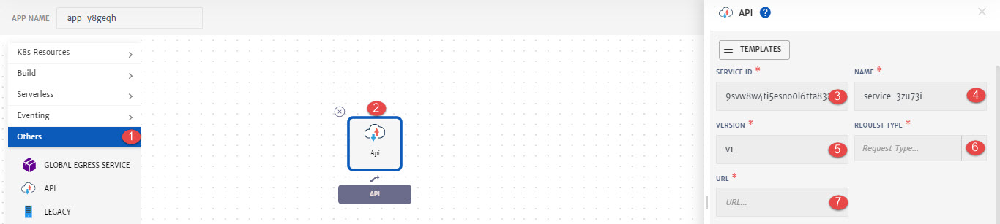
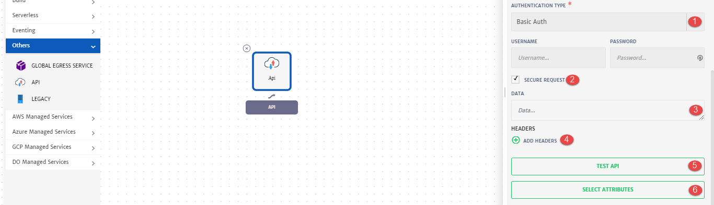

# API Service

API service can be used to configure and test an API using CloudPlex. 

Details of the configurations that can be done for API Service are explained below and also highlighted in the image.

1. **Others**: Drop-down to add API service.
2. **API Icon**: Click the icon to configure service.
3. **Service ID:** Id of the service. System will automatically assign id to the service but user can customize it.
4. **Name**: Name for the service.
5. **Version**: Version of the service.
6. **Request Type:** API request type i.e. Get, Post.
7. **URL:** To specify API URL/endpoint.

1. **Authentication Type:** Select API authentication type from drop-down i.e. Basic or No Auth.
   **(For Basic Auth)** specify the Username and Password.
2. **Secure Request:** To secure the API request.
3. **Data:** Specify the data.
4. **Headers:** To add headers in the form of Key Value pairs. You can add more than one headers as well.
5. **Test API:** To test the API connection.
6. **Select Attributes:** To select/pass any dynamic attributes.