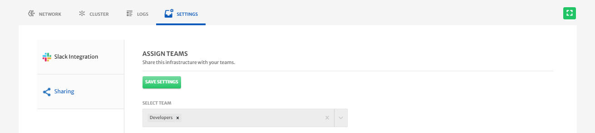

# Application Sharing

Most of the time within a company, different teams work on different applications as part of their responsibilities. Using CloudPlex [Access Management](/pages/user-guide/components/access-management/access-management) module, admins can create different teams with different access level based on their roles and responsibilities within a company. 

Based on their teams, users will only be able to access certain modules in CloudPlex. 

Application sharing module was developed to share resources with different teams. That way teams can easily share their infrastructures or resources with other teams for collaborations purposes etc. 

> Super-user will be able to access all the resources and infrastructure irrespective of the access level. 

## How to Share Infrastructure

To share Infrastructure with different teams:

1. Navigate to the **Infrastructure** menu from the left pane and select the **Infrastructure** you want to share.

   

2. Go to the **Settings** tab, select **Sharing** from left column, select **Team** from drop-down and click **Save Settings** button to share the application with the other team.

   > You can select more than one teams as well.

   