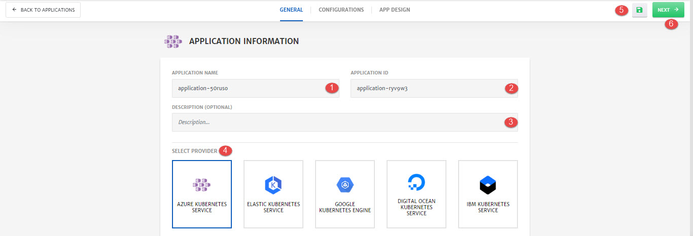

# Provider Managed - New Kubernetes Cluster

Details of the configurations that can be done at an Application Level (**General**) are explained below and also highlighted in the image.

1. **Application Name:** Name of the Application
2. **Application ID:** Unique id of the Application.
3. **Description:** Any description related to the application. 
4. **Select Provider:** Cloud provider on which the managed kubernetes cluster will be created e.g. AKS, GKS etc. 
5. **Save:** To save the Application as a template.
6. **Next:** To navigate to the **Next** step of application creation. 

1. **Profile Type:** Use any existing credential profile to access cloud resources or create a new one. 

   > To know more about credential profiles, click [here](/pages/user-guide/components/credentials-profile/credentials-profile).

2. **Profile Name:** Name of the profile to save in CloudPlex.

3. Specify **Client ID**, **Client Secret**, **Subscription ID** and **Tenant ID** of your Azure account. 

   > Credentials required to access cloud resources will be different based on which cloud is selected.
   >
   > It is necessary to use credentials of an account with necessary access level of cloud resources. To know more about the level of access required, click [here](/pages/user-guide/components/cloud-authorization-level/cloud-authorization-level).

4. **Save Profile:** To save credentials as a credential profile in CloudPlex.

   > For an end to end process on how to deploy an application on provider managed new kubernetes cluster, check out our getting started guide [here](/pages/user-guide/getting-started/pm-new-cluster/pm-new-cluster).