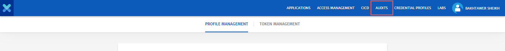
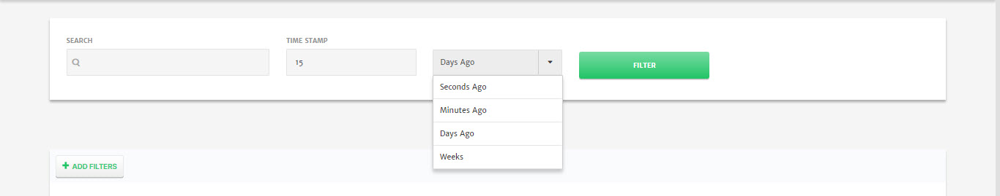
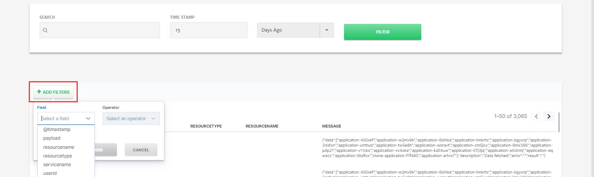
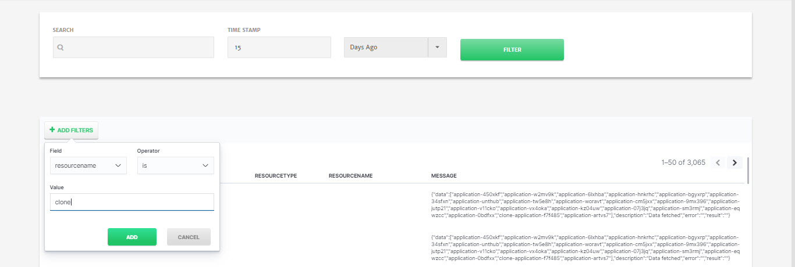
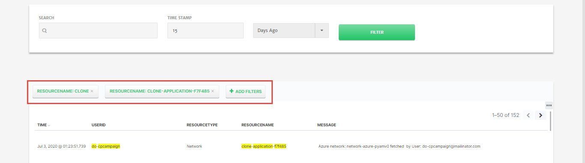
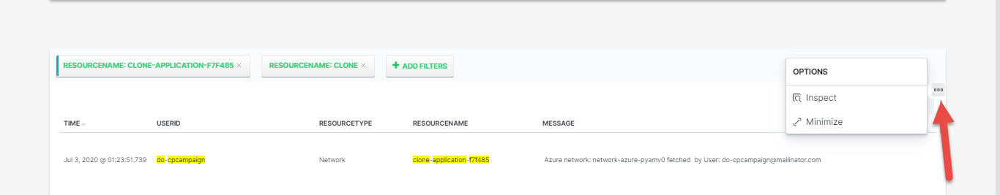
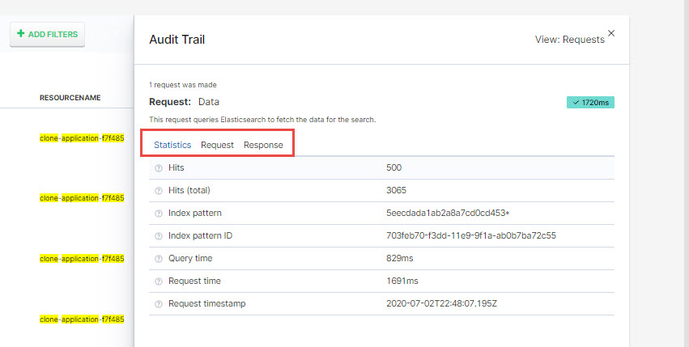

# Audits

Audit module is an in-depth search functionality for the CloudPlex Application module. It also provides detailed audit trails of all the activities inside CloudPlex which helps in tracking the changes or activities performed by all the users of a company e.g. network creation, service creation, application deployment etc. Using audit module, companies can keep a check on all the resources that are getting utilized by the users of the company. 

As part of Audit module, CloudPlex not only provides data filtration based on timestamp but also provides multiple options based on which data can be fetched or sorted e.g. userid, service name etc. 

For audits, Kibana is integrated inside the platform which is an applications that sits on top of Elastic Stack and provides seamless search functionalities for data indexed in Elasticsearch. 

> Only super-user will have access of Audit module.

## How to Use Audits

1. Navigate to the **Audits** module from the top bar. 

   

2. Enter the keyword to **search**, specify **Time Stamp**, select time stamp unit from drop-down and click **Filter** button to get all the data of that time period. 

   > Leaving the **Search** field blank will fetch all the data of that time period.
   >
   > Keyword can be userid, resource name, service name etc. 

   

3. Once you have the data, click **Add Filters** to apply additional filters on the data. 

   

   - Select the **Field** from drop-down based on which you want to filter the data.

   - Select **Operation** from drop-down to narrow the search e.g. is, is not etc. 

   - Specify the **Value** and click **Add** to get the data.

     

   - You can also click on resource value to add that as a filter e.g. if you click on **clone-application-f7f485** system will add that as a filter and fetch data of those particular resources.

   

4. To edit any filter, simply click on the filter to get the drop-down and **Edit Filter**. 

   

5. Click the small button on the right side of the screen to change the size of data window or to get the detailed Audit Trails.

   

   - You can check search **Statistics**, **Request**, **Response** using Audit Trails. 

     