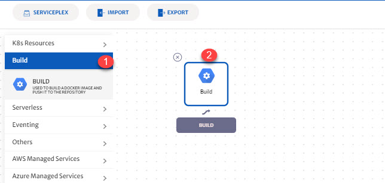
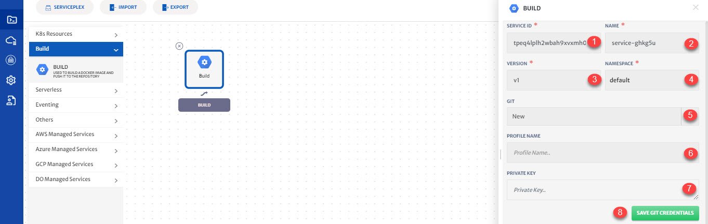
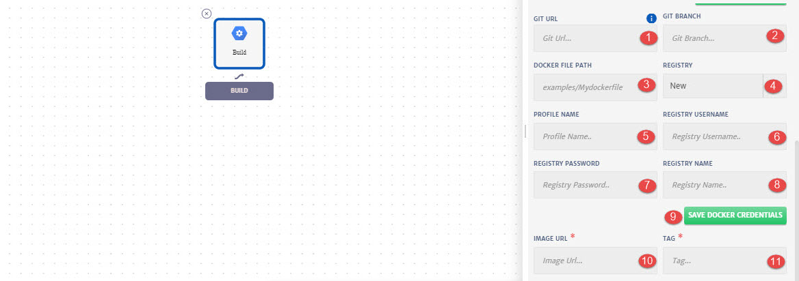

# Build Service

Build service can be used to build a docker image and push it to the repository. 

Details of the configurations that can be done for Build service are explained below and also highlighted in the image.

1. **Build:** Drop-down to add build service in canvas.
2. **Build Icon:** Drag and drop the service icon to add in canvas. Click on icon to configure the service.

1. **Templates:** To reuse any existing service template.
2. **Service ID:** Id of the service. System will automatically assign id to the service but user can customize it.
3. **Name:** Name for the service.
4. **Version:** Version of the service
5. **Namespace:** Namespace for the service.
6. **GIT:** Drop-down to select Git profile. You can use any existing/saved profile or a new profile. (Using new Git profile for this guide)
7. **(For New Profile)** **Profile Name:** Profile name for Git.
8. **Private Key:** Private Key of Git.
9. **Save Git Credentials:** To store the Git profile for future use.

1. Specify **Git Url**.

2. Specify **Git Branch.**

3. Specify **Docker File Path.**

   > Docker file path should contain file name as well.

4. **Registry**: Drop-down to use a New docker registry or any existing one. (Using new registry for this guide)

5. **Profile Name:** Profile name to save the registry credentials for future use. 

6. **Username** of the registry.

7. **Password** of the registry.

8. **Registry Name**: Can also be considered as image repository name. 

9. **Save Docker Credentials**: To save docker registry credentials for future use.

10. Specify **Image URL**, where the image will be pushed.

11. Specify **Registry Tag**.
