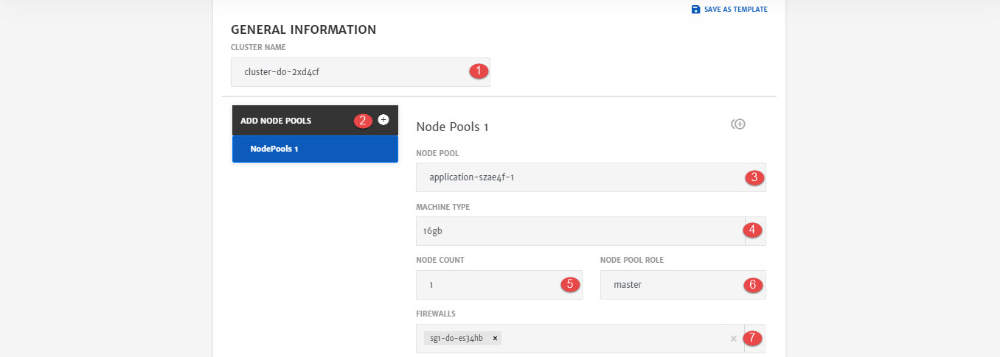

# Digital Ocean

1. Name of the **Cluster**. Cluster is a group of node pools. 
2. **Add Mode Pools:** To add another node pool. Cluster can have 1 or multiple node pools.
3. **Name** of the Node Pool.
   Node pool is pool of machines/droplets and complete configurations for that droplet. 1st node pool will always be Master node pool
4. **Machine Type**: Droplet type based on Cloud Provider selected. (To know more about pricing of droplets click [here](https://www.digitalocean.com/pricing/#Compute))
5. **Node Count**: Number of droplets in the node pool.
6. **Node Pool Role**: Role of node pool i.e. Master or Slave. (First Node Pool will always be master)
7. **Firewall**: Firewall to associate with the machine depending on network.

1. **Credential Type:** Credential to SSH into droplet. Currently only Key is supported. 
2. **Key Type**: Whether to use Existing key or generate a New one.
3. **Enter Key Name**: In case New Key Type is selected.
4. **Generate**: To generate a new key and use for SSH.

1. **Image ID**: Image id of droplet image. 
2. **Image Slug**: Image slug of a droplet image.
3. **Docker Data Volume**: To add docker data volume as well.
4. **Volume Size:** Volume of attached docker storage.