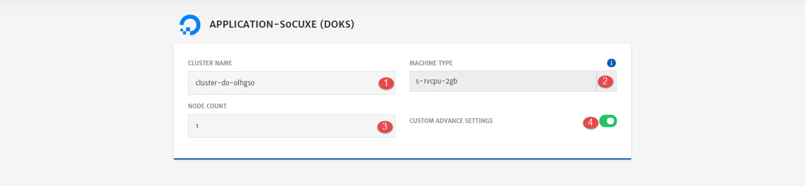
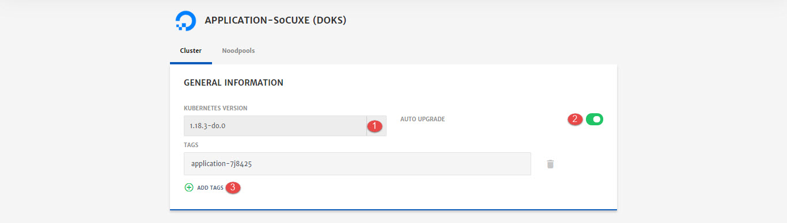
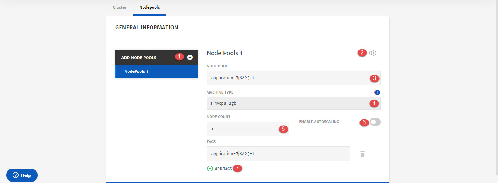

# DOKS Cluster

DigitalOcean Kubernetes (DOKS) is a managed Kubernetes service that lets you deploy Kubernetes clusters without the complexities of handling the control plane and containerized infrastructure. Clusters are compatible with standard Kubernetes toolchains and integrate natively with DigitalOcean Load Balancers and block storage volumes. To know more about DOKS, click [here](https://www.digitalocean.com/products/kubernetes/).

Here are the configurations option that will be available to user while configuring DOKS for Application deployment. 

1. **Cluster Name:** Name of the cluster. CloudPlex provides default values but user can also customize it.

2. **Machine Type:** Select machine type/droplets from drop-down.
   To know more about machines/droplets, click [here](https://www.digitalocean.com/products/droplets).

   > Minimum 4 CPU droplet is required for deployment.

3. **Node Count:** Specify the number of nodes in node pool. 

4. **Custom Advance Settings:** To enable advanced settings related to Cluster and Node Pools.

   > If custom advanced settings are not enabled system will navigate to the **App Design** menu instead of Advanced Settings

**Advanced Settings  - Cluster**

1. **Kubernetes Version:** Select Kubernetes Version from drop-down to install on cluster.
2. **Auto Upgrade:** To enable auto upgrade of a cluster. 
   Automatic updates trigger on new patch versions of Kubernetes and new point releases of DigitalOcean Kubernetes subsystems.
3. **Add Tags:** To attach tags with cluster. You can add more than one tag as well. 

**Advanced Settings  - Nodepools**

1. **Add Node Pools:** To add more node pools in the cluster. 

2. **Clone:** To clone the current node pool and create new one.

3. **Node Pool:** Name of the node pool.

4. **Machine Type:** Select machine type/droplet from drop-down.

   > Minimum 4 CPU droplet is required for deployment.

5. **Node Count:** Specify the number of nodes in node pool. 

6. **Enable Auto Scaling:** To enable Auto Scaling for this node pool.

   > To know more about this, check out our detailed Auto Scaling guide [here](/pages/user-guide/components/scaling/scaling). 

7. **Add Tags:** To attach tags with node pools. You can attach more than one tag as well.