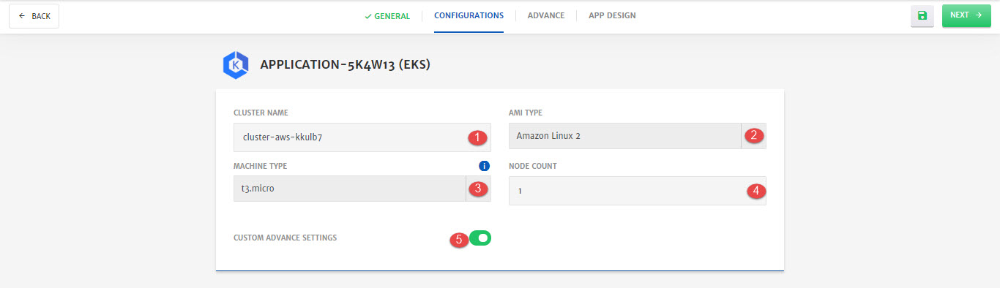
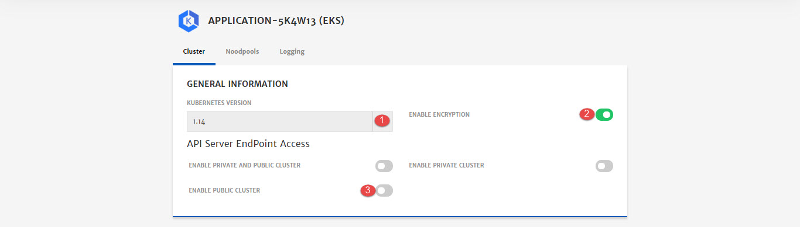
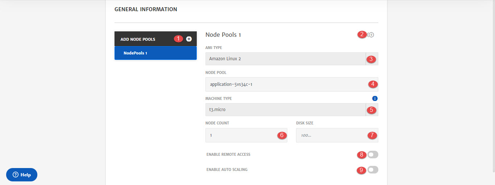
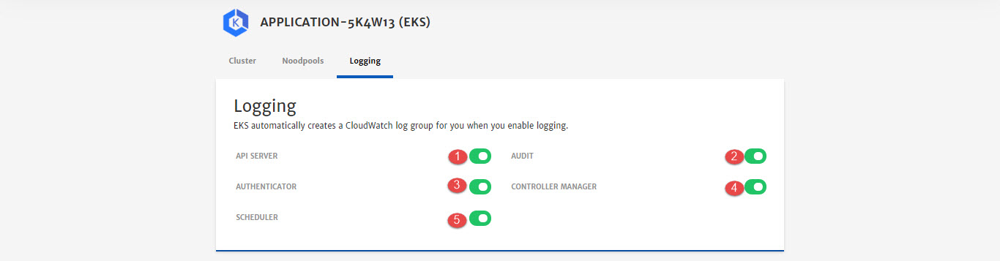

# EKS Cluster

Amazon EKS is a managed service that makes it easy for you to run Kubernetes on AWS without needing to install and operate your own Kubernetes control plane or worker nodes. To know more about EKS, click [here](https://aws.amazon.com/eks/). 

Here are the configurations option that will be available to user while configuring EKS for Application deployment. 

1. **Cluster Name:** Name of the cluster. CloudPlex provides default values but user can also customize it.

2. **AMI Type:** Select AMI type from drop-down.
   Amazon EKS provides a specialized Amazon Machine Image (AMI) called the Amazon EKS-optimized AMI. This AMI is built on top of Amazon Linux 2, and is configured to serve as the base image for Amazon EKS worker nodes.

3. **Machine Type:** Select machine type from drop-down.
   To know more about instance types, click [here](https://aws.amazon.com/ec2/instance-types/).

   > Minimum 4 CPU machine is required for deployment. 

4. **Node Count:** Specify the number of nodes in node pool. 

5. **Custom Advance Settings:** To enable advanced settings related to Cluster, Node Pools, and Logging. 

   > If custom advanced settings are not enabled system will navigate to the **App Design** menu instead of Advanced Settings

**Advanced Settings  - Cluster**

1. **Kubernetes Version:** Select Kubernetes Version from drop-down to install on cluster.

2. **Enable Encryption:** To enable KMS encryption for this cluster. (To know more about KMS, click [here](https://aws.amazon.com/kms/))

3. **Enable Private and Public Cluster:** This field will remain disabled as currently private cluster is not supported by CloudPlex. 

   > Support for private cluster will be added soon 

4. **Enable Private Cluster:** To enable public cluster. You will also have to provide IP addresses in CIDR Notation.

**Advanced Settings - Nodepools**

1. **Add Node Pools:** To add more node pools in the cluster. 

2. **Clone:** To clone the current node pool and create new one.

3. **AMI Type:** Select EKS optimized AMI from drop-down

4. **Node Pool:** Name of the node pool.

5. **Machine Type:** Select machine type from drop-down.

   > Minimum 4 CPU machine is required for deployment.

6. **Node Count:** Specify the number of nodes in node pool. 

7. **Disk Size:** Specify size of the root volume disk in GBs

8. **Enable Remote Access:** To enable remote access of this node pool.

9. **Enable Auto Scaling:** To enable Auto Scaling for this node pool.

   > To know more about this, check out our detailed Auto Scaling guide [here](/pages/user-guide/components/scaling/scaling). 

**Advanced Settings - Logging**

1. **API Server:** To enable API server.
   API server validates and configures data for the api objects which include pods, services, replicationcontrollers, and others.
2. **Audit:** To enable audit.
   Auditing provides a security-relevant chronological set of records documenting the sequence of activities that have affected system by individual users, administrators or other components of the system.
3. **Authenticator:** To enable authenticator. (To know more about authenticator, click [here](https://kubernetes.io/docs/reference/access-authn-authz/authentication/))
4. **Controller Manager:** To enable controller manager.
   Controller manager is a daemon that embeds the core control loops shipped with Kubernetes
5. **Scheduler:** To enable scheduler. 
   A scheduler watches for newly created Pods that have no Node assigned. For every Pod that the scheduler discovers, the scheduler becomes responsible for finding the best Node for that Pod to run on.