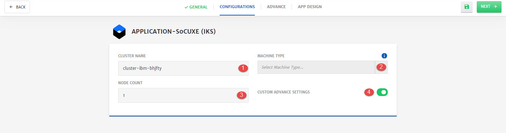
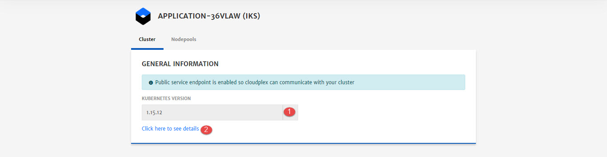
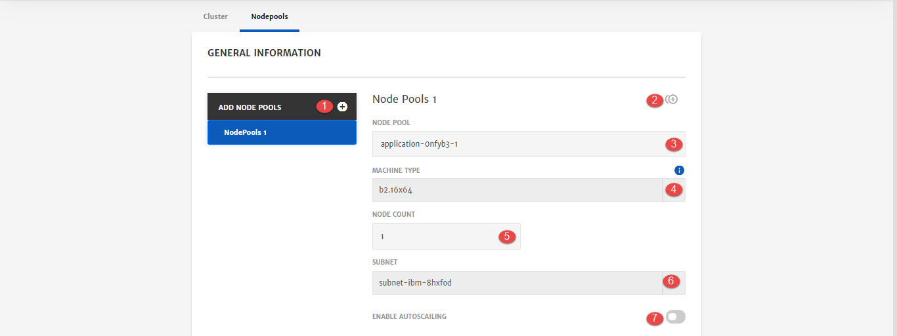

# IKS Cluster

IBM Cloud Kubernetes Service (IKS) creates a cluster of compute hosts and deploys highly available containers. A Kubernetes cluster lets you securely manage the resources that you need to quickly deploy, update, and scale applications. To know more about IKS, click [here](https://www.ibm.com/cloud/container-service/).

Here are the configurations option that will be available to user while configuring IKS for Application deployment. 

1. **Cluster Name:** Name of the cluster. CloudPlex provides default values but user can also customize it.

2. **Machine Type:** Select machine type from drop-down.
   To know more about machine types, click [here](https://www.ibm.com/cloud/virtual-servers).

   > Minimum 4 CPU machine is required for deployment.

3. **Node Count:** Specify the number of nodes in node pool. 

4. **Custom Advance Settings:** To enable advanced settings related to Cluster and Node Pools.

   > If custom advanced settings are not enabled system will navigate to the **App Design** menu instead of Advanced Settings

**Advanced Settings  - Cluster**

1. **Kubernetes Version:** Select Kubernetes Version from drop-down to install on cluster.
2. To learn more about how to setup public service endpoint for the cluster. 

**Advanced Settings  - Nodepools**

1. **Add Node Pools:** To add more node pools in the cluster. 

2. **Clone:** To clone the current node pool and create new one.

3. **Node Pool:** Name of the node pool.

4. **Machine Type:** Select machine type from drop-down.

   > Minimum 4 CPU droplet is required for deployment.

5. **Node Count:** Specify the number of nodes in node pool. 

6. **Subnet:** Select subnet from drop-down.

7. **Enable Auto Scaling:** To enable Auto Scaling for this node pool.

   > To know more about this, check out our detailed Auto Scaling guide [here](/pages/user-guide/components/scaling/scaling). 