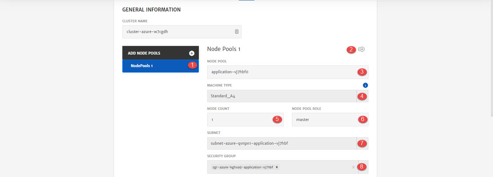

# Azure

A cluster is a group of machines instances or nodes on which the services can be deployed. On Azure, these a machines are called Virtual Machines (VM). Azure Virtual Machines (VM) is one of several types of on-demand, scalable computing resources that Azure offers. It gives you the flexibility of virtualization without having to buy and maintain the physical hardware that runs it. To know more about Azure VM, click [here](https://docs.microsoft.com/en-us/azure/virtual-machines/windows/overview).

Here are the configurations option that will be available to user while configuring cluster for Application deployment. 

1. **Node Pool**: Pool of nodes and complete configurations for that node. User can add more than 1 Node Pools as well by clicking the **+** icon. 1st node pool will always be Master node pool. All the other node pools will be slave/worker node pools. 

   > Platform provides default values for Master node pools. All the other node pools will need to be configured by the users. 

2. **Clone:** To clone the configurations of current node pool and create another one similar to it. 

3. **Machine Type**: Machine type based on Cloud Provider selected.  (To know more about machine types, click [here](https://azure.microsoft.com/en-us/pricing/details/virtual-machines/series))

4. **Node Count**: Number of Nodes in the node pool.

5. **Node Pool Role**: Role of node pool i.e. Master or Slave. (First Node Pool will always be master)

6. **Subnet**: Subnet to associate with the machine depending on network.

7. **Security Group**: Security Group to associate with the machine depending on network.

1. **Disk Type:** Storage disk type i.e. Standard HDD etc. 
2. **Credential Type:** Credential to SSH into nodes. Currently only Key is supported. 
3. **Key Type**: Whether to use Existing key or generate a New one.
4. **Enter Key Name**: In case New Key Type is selected.
5. **Generate**: To generate a new key and use for SSH.

1. **Username**: Specify Username for image.
2. **Image Offer**: Group of related images created by a publisher e.g. WindowsServer. 
3. **Image Publisher:** Publisher Name of that Image e.g. MicrosoftWindowsServer
4. **Image SKU:** SKU is like an instance of an offer, such as a major release of a distribution e.g. 2016-Datacenter.
5. **Image Version:**  Version number of an image SKU.
6. **Enable Boot Diagnostics:** To enable and store in Storage Account. 
7. **New Storage Account:** To attach new storage account with node or you can use any existing Storage Account by providing the **Storage Account Id.**
8. **Docker Data Volume**: To add docker data volume as well.