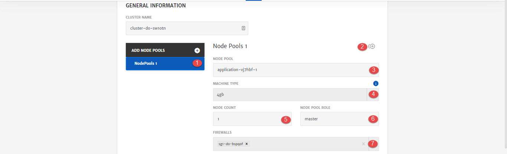

# Digital Ocean

A cluster is a group of machines instances or nodes on which the services can be deployed. On Digital Ocean, these machines are called Droplets. DigitalOcean Droplets are Linux-based virtual machines (VMs) that run on top of virtualized hardware. To know more about DO Droplets, click [here](https://www.digitalocean.com/products/droplets/).

Here are the configurations option that will be available to user while configuring cluster for Application deployment. 

1. **Node Pool**: Pool of nodes and complete configurations for that node. User can add more than 1 Node Pools as well by clicking the **+** icon. 1st node pool will always be Master node pool. All the other node pools will be slave/worker node pools. 

   > Platform provides default values for Master node pools. All the other node pools will need to be configured by the users. 

2. **Clone:** To clone the configurations of current node pool and create another one similar to it. 

3. **Name** of the Node Pool.
   Node pool is pool of machines/droplets and complete configurations for that droplet. 1st node pool will always be Master node pool

4. **Machine Type**: Droplet type based on Cloud Provider selected. (To know more about droplets click [here](https://www.digitalocean.com/products/droplets)

5. **Node Count**: Number of droplets in the node pool.

6. **Node Pool Role**: Role of node pool i.e. Master or Slave. (First Node Pool will always be master)

7. **Firewall**: Firewall to associate with the machine depending on network.

1. **Credential Type:** Credential to SSH into droplet. Currently only Key is supported. 
2. **Key Type**: Whether to use Existing key or generate a New one.
3. **Enter Key Name**: In case New Key Type is selected.
4. **Generate**: To generate a new key and use for SSH.

1. **Image ID**: Image id of droplet image. 
2. **Image Slug**: Image slug of a droplet image.
3. **Docker Data Volume**: To add docker data volume as well.
4. **Volume Size:** Volume of attached docker storage.