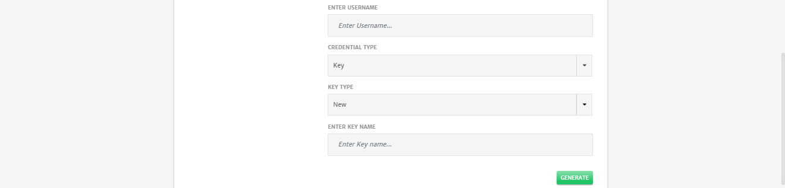

# GCP

A cluster is a group of machines instances or nodes on which the services can be deployed. On GCP, these machines are called Compute Engine instances. An instance is a virtual machine (VM) hosted on Google's infrastructure. To know more about GCP Compute, click [here](https://cloud.google.com/compute).

Here are the configurations option that will be available to user while configuring cluster for Application deployment. 

1. **Node Pool**: Pool of nodes and complete configurations for that node. User can add more than 1 Node Pools as well by clicking the **+** icon. 1st node pool will always be Master node pool. All the other node pools will be slave/worker node pools. 

   > Platform provides default values for Master node pools. All the other node pools will need to be configured by the users. 

2. **Clone:** To clone the configurations of current node pool and create another one similar to it. 

3. Name of the **Node Pool**.

4. **Machine Type**: Machine type based on Cloud Provider selected.  (To know more about machine types, click [here](https://cloud.google.com/compute/docs/machine-types).)

5. **Node Count**: Number of Nodes in the node pool.

6. **Node Pool Role**: Role of node pool i.e. Master or Slave. (First Node Pool will always be master)

7. **Subnet**: Subnet to associate with the machine depending on network.

1. **Enter Username**: Username for the image
2. **Credential Type:** Credential to SSH into nodes. Currently only Key is supported. 
3. **Key Type**: Whether to use Existing key or generate a New one.
4. **Enter Key Name**: In case New Key Type is selected.
5. **Generate**: To generate a new key and use for SSH.

1. **Image Family**: Will be listed based on the GCP account used to create cluster. 

2. **Image Project**: Will be listed based on the image family selected.

3. **Service Account Email:** Will be listed based on the GCP account used. It needs to have required access level as shown in info message in screenshot above. 

4. **Tags**: Tags attached with the cluster. They can be attached while configuring network. 

5. **Disk Type:** Type of the disk for root volume e.g. Persistent SSD.

6. **Disk Size**: Size for the root volume disk.

7. **Docker Data Volume**: To add docker data volume as well.

   > A data volume is a specially-designated directory within one or more containers that bypasses the Union File System. Data volumes provide several useful features for persistent or shared data.Volumes are initialized when a container is created.