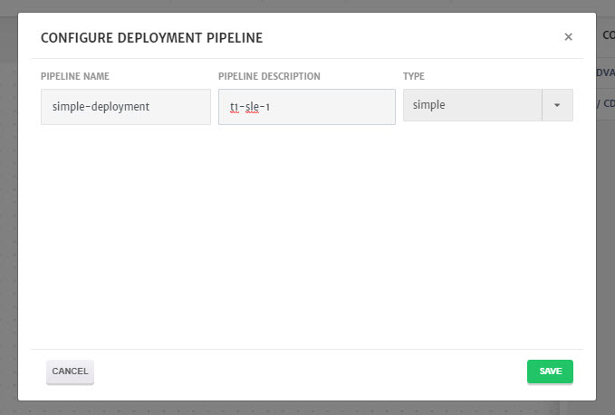

# Simple Deployment

This guide explains step by step process of setting up a simple deployment.

1. Go the **App Design** tab while configuring an **Application** and add container.

2. Select container to configure it, go to the **Advanced Settings** and select **CI/CD**.

   

3. **Enable CI/CD** and click **Configure Pipeline**. 

   > Web hooks can also be used for CI/CD.

   

4. Enter **Pipeline Name**, **Pipeline Description** and select the **Type** from drop-down i.e. **simple**. 

   

5. Once done, click **Save**.

