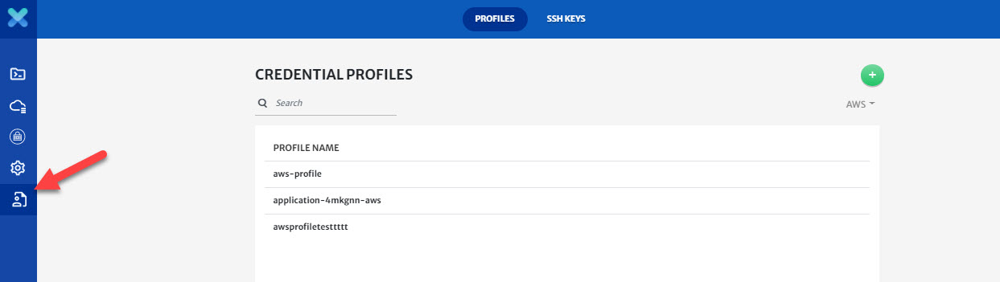
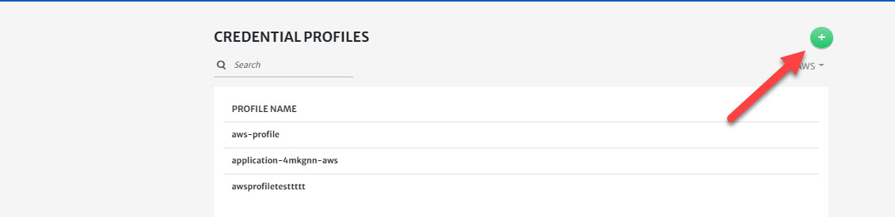
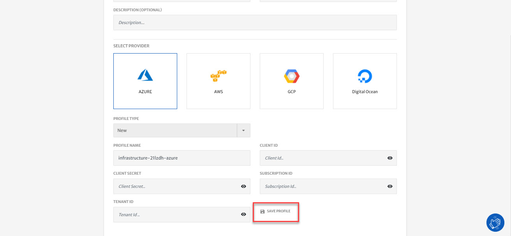
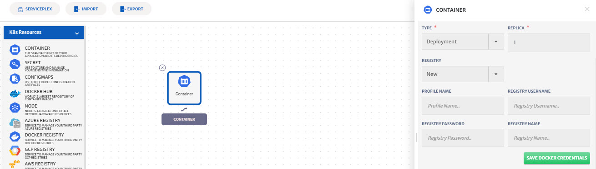

## Credentials Profile

Credential profile menu lets you save your credentials for AWS, Azure, GCP and other credentials that might be needed to setup project and for deployment. You can save your credentials for docker registry, APIs etc. These stored credentials can then be later used to configure a project or solution.

Purpose of this is to make it as easy as possible for the user to deploy the project. CloudPlex aims to provide a seamless experience of deployment. By storing the credentials, user won't have to manually provide the credentials to gain the access of resource everytime and be done with deployment in under 5 minutes. 

Different type of Credentials can be saved and fetched while configuring different modules in the platform. Explained below is the process of storing credentials in platform. 

## How to Store Credentials

1. Navigate to the credentials profile menu from the top bar. 

   

2. Click on the **+** icon and select the profile from drop-down you want to save a credential for. 

   

   > Process of storing a credentials is very simple and same for all the profiles, as part of this guide we will be creating a credential profile for AWS.

3. Enter **Profile Name** for future use, and specify your **AWS Access** and **Secret Key**. 

4. Select **Team** to share this profile with team members in CloudPlex.

   

5. Click **Save Profile**.

   > You can follow the same process to save credentials for other clouds as well. 

6. Use buttons highlighted in the image below to edit or delete your saved credential profile. 

   

## Other Ways to Save Profile

In order to provide seamless deployment experience, users can also save their profiles for future use while configuring the applications. That way they will not have to navigate to the credentials profile menu to save their credentials. 

Cloud Profile can be saved while configuring the Basic Info/General tab of  the application configuration process.

1. Select the **Cloud Provider** e.g. AWS.

2. Select **New** from **Profile Type** drop-down.

3. Enter **Profile Name**.

4. Specify **Access Key** and **Secret Key** for AWS account.

   > Different credentials will be needed for each cloud provider.

5. Click **Save Profile**.

   

6. **Template Name** will get populated automatically. 

7. Select **Team** from drop-down to share access of this profile.

8. Click **Save**. You will now be able to select this profile from drop-down for future applications. 

   

## Docker Registry

Docker registry credentials can be saved while configuring the container service. 

1. Select **New** from **Registry** drop-down.

2. Enter **Profile Name**.

3. Specify the **Registry Username** and **Password**. 

4. Enter **Registry Name**.

5. Click **Save Docker Credentials** button. You will now be able to select these credentials from drop-down to configure other container services.

   

6. Select **Team** from drop-down to share access of this profile.

7. Click **Save**. You will now be able to select this profile from drop-down for future applications. 

   
