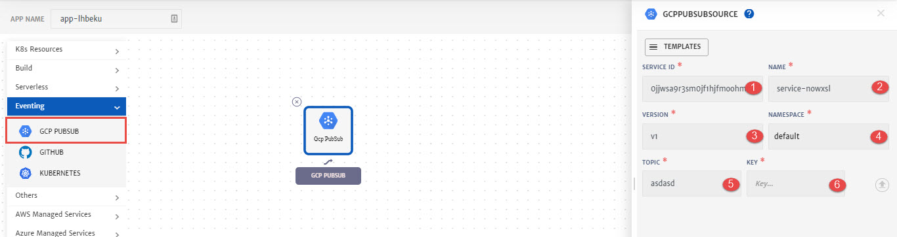

# GCP Pub/Sub

Pub/Sub is a fully-managed real-time messaging service that allows you to send and receive messages between independent applications. To know more about Pub/Sub, click [here](https://cloud.google.com/pubsub). 

While configuring Application, drag and drop **GCP PubSub** from left pallet (**Eventing** drop-down) and in to the canvas to configure it.

1. **Service ID:** Id of the service. System will automatically assign id to the service but user can customize it.
2. **Name**: Name for the service.
3. **Version**: Version of the service.
4. **Namespace**: Namespace for the service.
5. **Topic**: Specfic pubsub topic. 
   Topic is a named resource to which messages are sent by publishers. A publisher application creates and sends messages to a topic.
6. **Key:** Specify Service account key for subscription login. You can also upload the key using upload button at the right, 