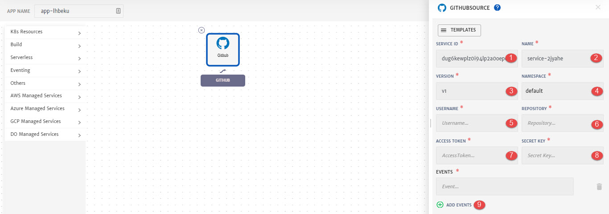

# Github

On CloudPlex, Github source can also be used to deliver events to the services which then in turn must react to those events. 

While configuring Application, drag and drop **Github** from left pallet (**Eventing** drop-down) and in to the canvas to configure it.

1. **Service ID:** Id of the service. System will automatically assign id to the service but user can customize it.
2. **Name**: Name for the service.
3. **Version**: Version of the service.
4. **Namespace**: Namespace for the service.
5. **Username:** Specify username of the Github account
6. **Repository**: Specify Github repository name. 
7. **Access Token:** Specify the personal access token for Github. GitHub source will use this to register webhooks with the GitHub API. (Process of generating a token is explained [here](https://github.com/settings/tokens))
8. **Secret Key:** Specify the secret key that your code will use to authenticate the incoming webhooks from GitHub. 
9. **Add Events:** To specify the type of events needed i.e secrets, cronjon, crd etc. You can add more than one event as well. (For a list of events, click [here](https://knative.dev/docs/eventing/sources/))