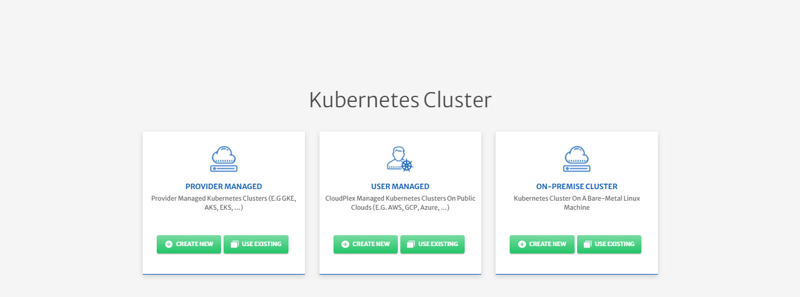
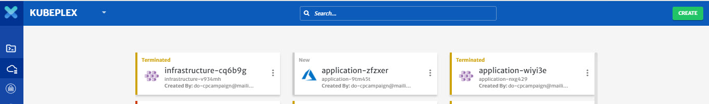

# Infrastructure

Infrastructure is where all the other modules cluster, network, and kubernetes will be configured together. Once this is done Applications will then be deployed on the Infratructure. The purpose of the Infrastructure is to use the cluster, network and then have the microservices deployed on it after detailed configuration. 

CloudPlex offers 3 ways of Infrastructure creation on the cloud, based on the requirements and expertise level of the user. 

1. Provider Managed
   To setup a cloud provider (AWS, Azure etc) managed Kubernetes cluster on CloudPlex.

   - Create New Kubernetes Cluster
     To create new provider managed Kubernetes cluster from scratch

   - Use Existing Kubernetes Cluster

     This option can be used for the following 2 use cases

     1. To manage and deploy apps on any existing provider managed kubernetes cluster using CloudPlex
     2. To migrate application from any existing kubernetes cluster to CloudPlex. User can then add new services to the application or migrate that to any other cloud.

2. User Managed
   To build whole infrastructure and Kubernetes from scratch using CloudPlex intuitive user interface.

   - Create New Kubernetes Cluster
     To setup a new infrastructure and kubernetes cluster from scratch.
   - Create New On-Premise Kubernetes Cluster
     To use On-Premise machines to create a Kubernetes cluster.

3. Use Existing On-Premise Kubernetes Cluster
   This feature is recommended when the users want to deploy an application using On-Premise (Bare Metal) Kubernetes cluster.

Please click the relevant link below for details of the configurations that can be done at an Application level (Basic Info/General) for different application types.

1. [Provider Managed - New Kubernetes Cluster](/pages/user-guide/components/infrastructure/pm-new-cluster/pm-new-cluster)
2. [Provider Managed - Existing Kubernetes Cluster](/pages/user-guide/components/infrastructure/pm-existing-cluster/pm-existing-cluster)
3. [User Managed - New Kubernetes Cluster](/pages/user-guide/components/infrastructure/um-new-cluster/um-new-cluster)
4. [User Managed - New On-Premise Kubernetes Cluster](/pages/user-guide/components/infrastructure/um-new-op-cluster/um-new-op-cluster)

## Infrastructure Deletion

On CloudPlex, as part of Infrastructure creation process user will need to configure Cluster, Network, and Kubernetes. At any stage of the process, user can save the Infrastructure template as **Draft**. Completed Infrastructure template will have **New** status as shown in image below. 

Once the Infrastructure is in **New** state, user can then Deploy an application. CloudPlex keeps on updating status during the deployment process for the user to understand better at which phase of the deployment an application is in. Instrastructure can have following statuses. 

1. Draft
2. New
3. Cluster Created
4. Cluster Teminated
5. Network Created
6. Network Terminated
7. App Deployed
8. Terminated

User can delete the Infrastructure at any stage except the **App Deployed** by clicking the 3 dot icon on every Infrastructure card. To delete Infrastructure on which applications are already Deployed, user will first need to terminate those applications.  

> **Deleting** an Infrastructure won't terminate resources from Cloud, it will just deleted the data from CloudPlex. It is always recommended that user **Terminate** the Infrastructure in CloudPlex to terminate all the resources on Cloud.

