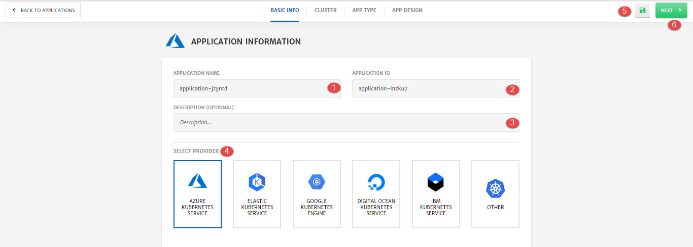

# Provider Managed - Existing Kubernetes Cluster

Details of the configurations that can be done at an Application Level (**Basic Info**) are explained below and also highlighted in the image.

1. **Application Name:** Name of the Application

2. **Application ID:** Unique id of the Application.

3. **Description:** Any description related to the application. 

4. **Select Provider:** Cloud provider with existing kubernetes cluster which will be managed through CloudPlex. e.g. AKS, GKS etc. 

5. **Save:** To save the Application as a template.

6. **Next:** To navigate to the **Next** step of application creation. 

   > For an end to end process on how to deploy an application on provider managed existing kubernetes cluster, check out our getting started guide [here](/pages/user-guide/getting-started/pm-existing-cluster/pm-existing-cluster).