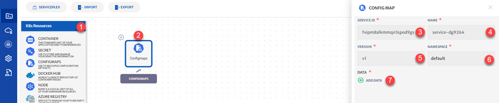

# Config Maps

Allow to decouple configuration artifacts from image content to keep containerized applications portable. ConfigMap stores configuration data as key-value pairs. The data can be consumed in pods or provide the configurations for system components such as controllers. ConfigMap is similar to Secrets, but provides a means of working with strings that don’t contain sensitive information. Users and system components alike can store configuration data in ConfigMap.

Details of the configurations that can be done for Config Maps are explained below and also highlighted in the image.

1. **K8s Resource**: Drop-down to add K8s resources. 

2. **Configmaps Icon**: Click the icon to configure config maps. 

3. **Name**: Name for the service.

4. **Version:** Version of the service.

5. **Namespace**: Namespace for the service.

6. **Add Data**: Directory, file, or literal value to draw the data from.

   > **Key**: File name or the key you provided on the command line.
   >
   > **Value**: File contents or the literal value you provided on the command line.