# Container

A container is a standard unit of software that packages all its dependencies and code so that your application runs reliably from one computing environment to another. Docker is a lightweight and standalone executable package that contains all the things needed to run a containerized applications i.e. code, system tools, libraries, runtime etc. Container images become containers on runtime and in case of docker containers, images becomes containers when they run on Docker engine. 

Details of the configurations that can be done for Kubernetes Containers are explained below and also highlighted in the image. 

> **Note:** For every section in the guide below, images are followed by description of the fields highlighted in the image.

1. **K8s Resource**: Drop-down to add K8s resources. 

2. **Container Icon**: Click the icon to configure container. 

3. **Service Id:** Id of the service. System will automatically assign id to the service but user can customize it.

4. **Name**: Name for the service.

5. **Version:** Version of the service.

6. **Namespace**: Namespace for the service. 

7. **Type**: Type of Pod or Controller i.e. Deployment, StatefulSet, DaemonSet, CronJob, Job.

   > **Deployment:** A Deployment controller provides declarative updates for Pods and ReplicaSets. It changes the actual state to the desired state at a controlled rate. You can define Deployments to create new ReplicaSets, or to remove existing Deployments and adopt all their resources with new Deployments.
   >
   > **StatefulSet:** StatefulSet is the workload API object used to manage stateful applications. Manages the deployment and scaling of a set of Pods , and provides guarantees about the ordering and uniqueness of these Pods. Like a Deployment , a StatefulSet manages Pods that are based on an identical container spec. Unlike a Deployment, a StatefulSet maintains a sticky identity for each of their Pods. These pods are created from the same spec, but are not interchangeable: each has a persistent identifier that it maintains across any rescheduling.
   >
   > **DaemonSet:** A DaemonSet ensures that all (or some) Nodes run a copy of a Pod. As nodes are added to the cluster, Pods are added to them. As nodes are removed from the cluster, those Pods are garbage collected. Deleting a DaemonSet will clean up the Pods it created.
   >
   > **Job:** A Job creates one or more Pods and ensures that a specified number of them successfully terminate. As pods successfully complete, the Job tracks the successful completions. When a specified number of successful completions is reached, the task is complete. Deleting a Job will clean up the Pods it created.
   >
   > **CronJob:** A Cron Job creates Jobs on a time-based schedule. It runs a job periodically on a given schedule, written in Cron format.

8. **Replica:** To set number of container replicas. 

9. **Registry**: Select any saved docker registry from drop-down or create a new one. 

10. **Profile Name**: Profile Name to save registry for future use. 

11. **Registry Username** of docker registry.

12. **Registry Password** of docker registry. 

13. **Registry Name:** Specify Name of the registry. 

14. **Save Docker Credentials**: To save credentials for future use. 

1. **Image Name**: Name of the docker image. 
2. **Tag**: Tag of the docker image.
3. **Container Name:** Name of the container. 
4. **Enable INIT Container**: Specialized containers that run before app containers in a Pod . Init containers can contain utilities or setup scripts not present in an app image.

**To Configure Environment Variables:**

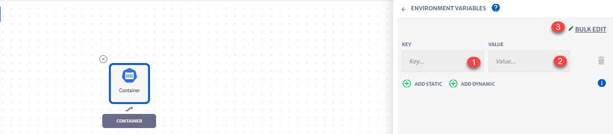

1. **Add Static**: To add static environment variable. Only Key, Value pair will be needed
2. **Add Dynamic:** To add dynamic variable. For getting the values dynamically on run time from other services in the application.
3. **Bulk Edit:** To bulk edit multiple variables at once.  

**To Configure Ports:**

1. **Ports**: To add Ports. You can also add multiple ports. Name, Host and Container will be needed.

**To Configure Ingress:**

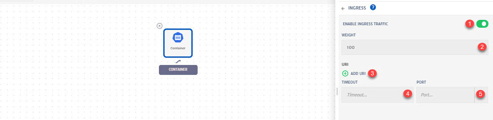

1. **Enable Ingress Traffic:** To enable ingress traffic for an Istio service application.
   Ingress exposes HTTP and HTTPS routes from outside the cluster to services within the cluster. Traffic routing is controlled by rules defined on the Ingress resource
2. **Weight:** Weight of the service. 
3. **AddURLs:** To add URLs. You can add more than one URL.
4. **Timeout:** Timeout for http requests. 
5. **Port**: Select the port from the drop-down.

## Advanced Configurations

**To Configure Command And Arguments:**

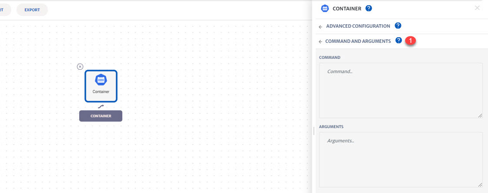

1. **Command And Arguments**: To add command and arguments in the fields provided.

**To Configure CI/CD:**

1. **Enable CI/CD**: To enable CI/CD
3. **Configure Pipeline**: To configure deployment pipeline. For detailed guide on this, [click here](/pages/user-guide/tutorials/continuous-delivery/continuous-delivery). 

**To Configure Container Volumes:**

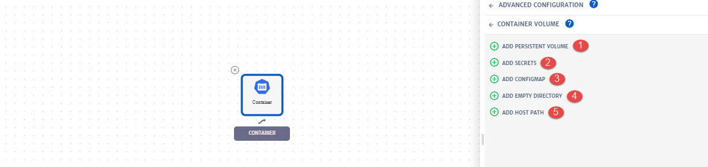

1. **Add Volume:** For detailed guide on how to configure **Persistent Volume**, click [here](/pages/user-guide/components/persistent-volume/persistent-volume).
2. **Add Secret:** For detailed guide on how to configure Kubernetes secret, click [here](/pages/user-guide/components/k8s-resources/kubernetes-secret/kubernetes-secret).
3. **Add ConfigMap:** For detailed guide on how to configure ConfigMap, click [here](/pages/user-guide/components/k8s-resources/config-maps/config-maps). 
4. **Add Empty Directory:** This volume gets created when a Pod is assigned to a Node, and exists as long as that Pod is running on that node.  When a Pod is removed from a node the data in the empty directory gets deleted forever. To know more about Empty Directory, click [here](https://kubernetes.io/docs/concepts/storage/volumes/#emptydir).
5. **Add Host Path:** A hostPath volume mounts a file or directory from the host node's filesystem into the Pod. Host path offers powerful escape hatch for some applications. To know more about host path, click [here](https://kubernetes.io/docs/concepts/storage/volumes/#hostpath).
   **Mount Path**: Once the volumes are configured, click on volume bar and specify mount path. Mount Path is destination inside the Pod, where a volume gets mounted to.

**To Configure Resource Quota:**

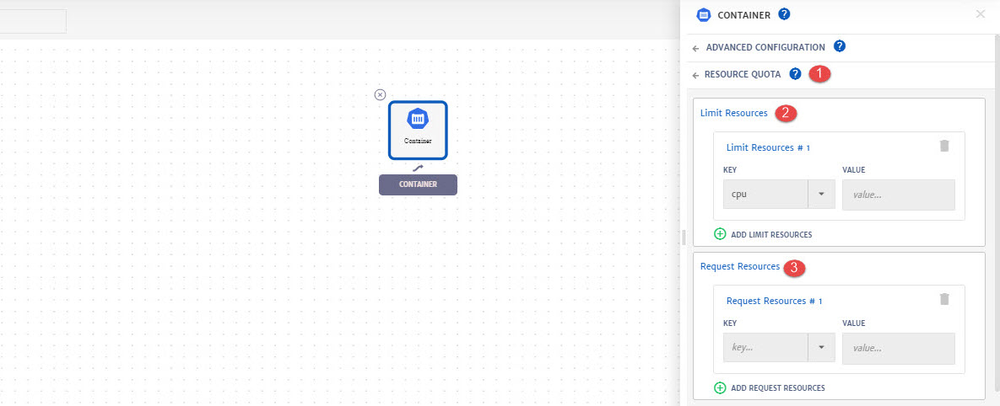

1. **Resource Quota**: A resource quota provides constraints that limit resource consumption. It can limit the quantity of objects that can be created as well as the total amount of compute resources that may be consumed by resources. Using resource quota, you can specify how much of each resource a Container needs. To know more about about resource quota, click [here](https://kubernetes.io/docs/concepts/configuration/manage-resources-containers/).

   > Currently, CPU and Memory resource quota is supported.
   >
   > When allocating compute resources, each container may specify a request and a limit value for either CPU or memory. 

   Supporting unites for CPU resources and memory are:

   - Limits and requests for CPU resources are measured in cpu units. One cpu, in Kubernetes, is equivalent to 1 vCPU/Core for cloud providers and 1 hyperthread on bare-metal Intel processors.
   - Limits and requests for memory are measured in bytes. You can express memory as a plain integer or as a fixed-point integer using one of these suffixes: E, P, T, G, M, K. You can also use the power-of-two equivalents: Ei, Pi, Ti, Gi, Mi, Ki

2. **Limit Resources:** If the quota has a value specified for limits.cpu or limits.memory, then it requires that every incoming container specifies an explicit limit for those resources.

   - Limits CPU: Across all pods in a non-terminal state, the sum of CPU limits cannot exceed this value.

   - Limits Memory: Across all pods in a non-terminal state, the sum of memory limits cannot exceed this value.

     > A container will never be allowed to use more than its resource limit.

3. **Request Resources:** If the quota has a value specified for requests.cpu or requests.memory, then it requires that every incoming container makes an explicit request for those resources.

   - Requests CPU: Across all pods in a non-terminal state, the sum of CPU requests cannot exceed this value.

   - Requests Memory: Across all pods in a non-terminal state, the sum of memory requests cannot exceed this value.

     > If the node where a Pod is running has enough of a resource available, it's possible (and allowed) for a container to use more resource than its request for that resource specifies.

**To Configure Probing:**

1. **Probe**: To configure Liveness and Readiness probes. 

   > **Liveness:** The kubelet uses liveness probes to know when to restart a Container. For example, liveness probes could catch a deadlock, where an application is running, but unable to make progress. Restarting a Container in such a state can help to make the application more available despite bugs
   >
   > **Readiness:** The kubelet uses readiness probes to know when a Container is ready to start accepting traffic. A Pod is considered ready when all of its Containers are ready. One use of this signal is to control which Pods are used as backends for Services. 

1. **Handler:** Handler for probe i.e. Exec, Http Get, TCP Socket. 
2. **Initial Delay Seconds**: Number of seconds after the container has started before liveness or readiness probes are initiated. 
3. **Timeout Seconds:** Number of seconds after which the probe times out.
4. **Period Seconds:** How often (in seconds) to perform the probe.
5. **Success Threshold:**  Minimum consecutive successes for the probe to be considered successful after having failed. 
6. **Failure Threshold:** When a Pod starts and the probe fails, Kubernetes will try Failure Threshold times before giving up. Giving up in case of liveness probe means restarting the Pod. In case of readiness probe the Pod will be marked Unready. Defaults to 3. Minimum value is 1.

**To Configure Resiliency**:

1. **Fault Injection:** To configure fault injection.

   > To inject faults to test the resiliency of application. Fault injection is a system testing method which involves the deliberate introduction of faults and errors into a system. It can be used to identify design or configuration weaknesses and to ensure that the system is able the handle faults and recover from error conditions. 

2. **Fault Injection Abort**: Aborts are crash failures. They mimic failures in upstream services. Aborts usually manifest in the form of HTTP error codes or TCP connection failures.

3. **Percentage**: Percent of requests to stimulate a failure for.

4. **HTTP Status:** HTTP status code e.g. 400

5. **Fault Injection Delay:** Delays are timing failures. They mimic increased network latency or an overloaded upstream service.

   > It can delay requests before forwarding, emulating various failures such as network issues, an overloaded upstream service, etc.

6. **Percentage:** Percent of requests to introduce a delay for. 

7. **Delay:** Delay in seconds.

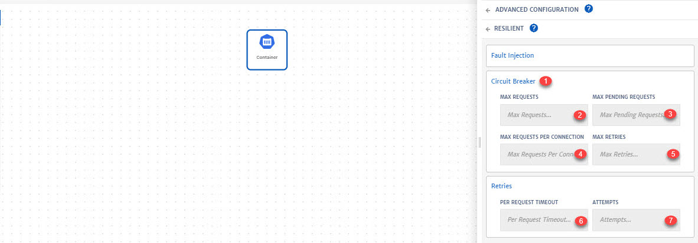

1. **Circuit Breaker:** To configure circuit breaker. 

   > **Circuit breaking** is an important pattern for creating resilient microservice applications. It allows to write applications that limit the impact of failures, latency spikes, and other undesirable effects of network peculiarities. To know more about Istio Circuit Breaker, click [here](https://developers.redhat.com/blog/2018/03/27/istio-circuit-breaker-when-failure-is-an-option/).

2. **Max Request:** Maximum number of requests to a backend. 

3. **Max Pending Requests:** Maximum number of pending HTTP requests to a destination. 

4. **Max Requests Per Connection:** Maximum number of requests per connection to a backend. Setting this parameter to 1 disables keep alive.

5. **Max Retries:** Maximum number of retries that can be outstanding to all hosts in a cluster at a given time.

6. **Per Request Timeout:** Timeout period of the request in seconds. 

7. **Attempts:** Number of requests attempts to be made.

   > One of the use case for Timeout and Attempts is the network reliability issue. In case if there is no response from a service, we can set a timeout period of a request and number of tries after which the system will stop sending requests to the service. 

**To Configure Scaling:**

1. **Scaling**: To setup scaling, check our detailed scaling guide [here](/pages/user-guide/components/scaling/scaling).

**To Configure RBAC:**

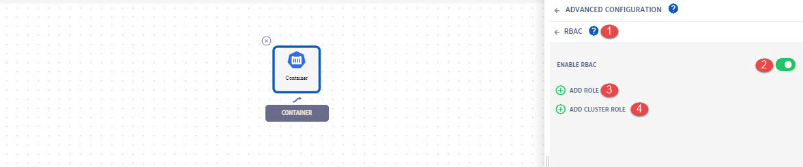

1. **RBAC:** Authorization mechanism for managing permissions around Kubernetes resources. RBAC allows configuration of flexible authorization policies that can be updated without restarting clusters.

2. **Enable RBAC**: To enable and configure Role Based Access Control for the service. 

3. **Add Role: ** To add access roles. This option will define the namespace level access/restriction roles.

4. **Add Cluster Role:** To add cluster level access roles.

   > Resource based rules can be configured at container and cluster level. Process explained below is same for cluster and container. 

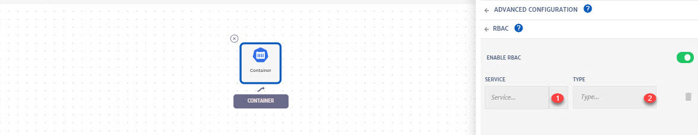

1. **Service**: Select any existing service from drop-down or create **New**.
2. **Type**: Specify Mount Path, which is a destination inside the Pod, where a volume gets mounted to.

1. **Add Resource Based Roles**: To add resource based roles. You can add more than one as well.
2. **Resource Name:** Select resource from drop-down e.g. Endpoints, Nodes etc. Resources are on which we want to give access to this role. Click **+** button to add a new resource.
3. **Action**: Actions allowed for the resource selected e.g. Create, Update etc. You can can select more than one action as well.
4. **AddAPI Groups**: To add API group. You can add more than one API group. It is that specific API which will have access. 

   > Use Case: If you set **secret** as resource name and **list** as action then you will be able to get the list of list of secrets as shown below.

**To Configure Security Context:**

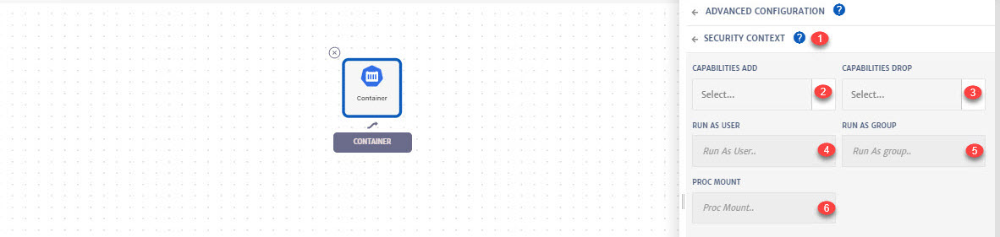

1. **Security Context:** A security context defines privilege and access control settings for a Pod or Container.
2. **Capabilities Add:** With Linux capabilities, you can grant certain privileges to a process without granting all the privileges of the root user. To add Linux capabilities for a Container, select the capabilities from the drop-down
3. **Capabilities Drop:** To drop Linux capabilities for a Container, select the capabilities from the drop-down.
4. **Run As User:** Run As User field specifies the user ID that all processes will run with for any Containers in the Pod. 
5. **Run As Group:** Run As Group field specifies the primary group ID for all processes within any containers of the Pod. If this field is omitted, the primary group ID of the containers will be root(0).
6. **Proc Mount:** Allowed ProcMount types e.g. Unmasked. 

1. **Run as NonRoot:** Require the container to run without root privileges.
2. **Read Only FileSystem:** Requires that containers must run with a read-only root filesystem (i.e. no writable layer)
3. **Privileged**: It determines if any container in a pod can enable privileged mode. By default a container is not allowed to access any devices on the host, but a privileged container is given access to all devices on the host.
4. **Allow Privilege Escalation:** Gates whether or not a user is allowed to set the security context of a container to allowPrivilegeEscalation=true. Setting it to false, i.e. unchecked radio button, ensures that no child process of a container can gain more privileges than its parent.
5. **SE Linux Options:**  Linux kernel security module that provides a mechanism for supporting access control security policies.
6. **Users:**  Name of the user. 
7. **Role**: Name of the role.
8. **Type**: Type of option. 
9. **Level**: SE Linux security levels.

**To Configure Node Selector:**

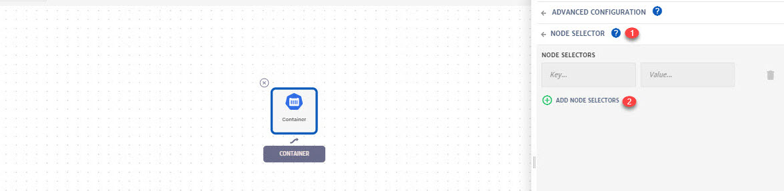

1. **Node Selector:** Node Selector specifies a map of key value pairs. For the pod to be eligible to run on a node, the node must have each of the indicated key-value pairs as labels (it can have additional labels as well).
2. **AddNode Selectors:** To add node selectors i.e. Key, Value.

**To Configure Label Selector:**

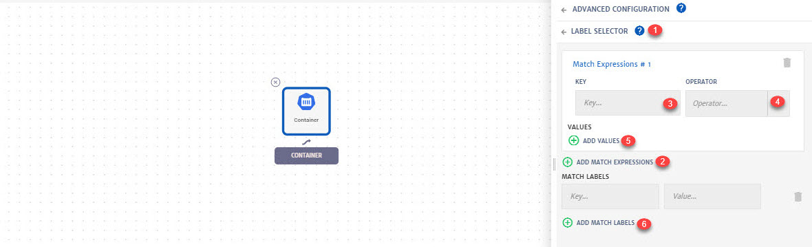

1. **Label Selector:** To configure label selector and to add match expressions or labels.

   > Using a label selector, the client/user can identify a set of objects. The label selector is the core grouping primitive in Kubernetes.

2. **Add Match Expression:** To add match expressions. 

3. **Key:** Key for match expression.

4. **Operator:** Operator for match expression e.g. Exists, In etc. 

5. **AddValues:** To add other values if needed.

6. **AddMatch Labels**: To add match labels. The key to be attached with node for the match label.

**To Configure Labels**:

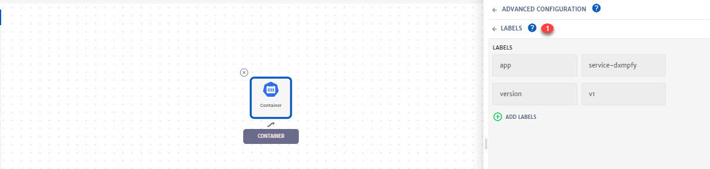

1. **Labels:** Labels are key/value pairs that are attached to Kubernetes objects. Labels are intended to be used to specify identifying attributes of objects that are meaningful and relevant to users.

**To Configure Annotations:**

1. **Annotations:** Annotations can be used to attach arbitrary non-identifying metadata to objects. Clients such as tools and libraries can retrieve this metadata.

**To Configure Hooks:**

1. **Hooks:** Hooks allows developer, an opportunity to perform operations at strategic points in a release lifecycle e.g. hooks can be used to load a ConfigMap or Secret during install before any other services are deployed.

2. **Add Hooks:** To add hooks, you can add multiple hooks as well. 

3. **Service:** Select service from drop-down on which the hook will be applied. Only the services with some kind of dependency with particular service (in the screenshot above only the services having dependency with **Product** service) will be listed in the drop-down. 

4. **Hook Type:** Select hook type from drop-down. You can select multiple hooks as well. 

   > To know more about hook types. click [here](https://helm.sh/docs/topics/charts_hooks/).
   > For services with inward arrow toward **Product** service, only **Pre** hook types will be listed.
   >
   > For services with outward arrow from **Product** service, only **Post** hook types will be listed.

5. **Weight:** Specify weight of that hook. 

   > Hook weights can be positive or negative numbers. When the system starts the execution cycle of hooks of a particular Kind it will sort those hooks in ascending order.

 