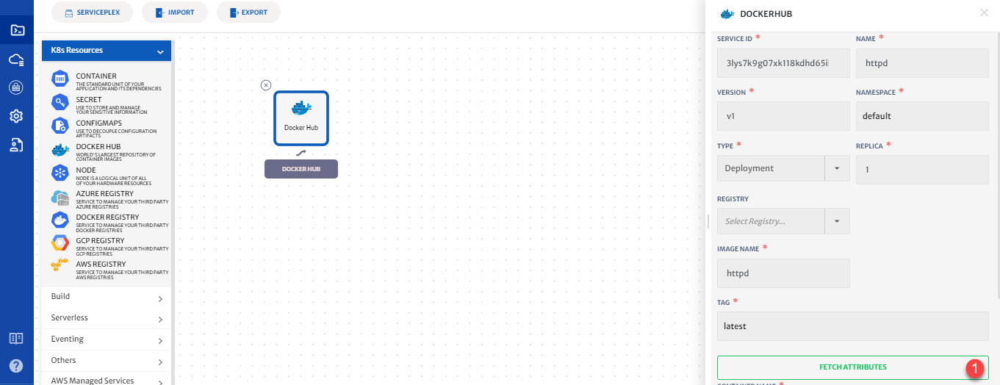

# Docker Hub

World’s largest repository of container images with an array of content sources including community developers, open source projects and independent software vendors building and distributing their code in containers. Users can get access to free public repositories for storing and sharing images or can choose subscription plan for private repos.

Details of the configurations that can be done for Docker Hub are explained below and also highlighted in the image.

1. **K8s Resource**: Drop-down to add K8s resources. 
2. **Docker Hub**: Click the icon to configure Docker Hub. 
3. **Search:** Search for the required images using search field and click search to get the list. 
   Select the required image from the list and configure it. 

1. **Fetch Attributes:** Click on the button to fetch latest attributes for the image.

   > Most of the attributes will become populated on fetching the attributes, but you can also update them as per your requirements. For detailed guide on configuration options available in platform, click [here](/pages/user-guide/components/k8s-resources/container/container).