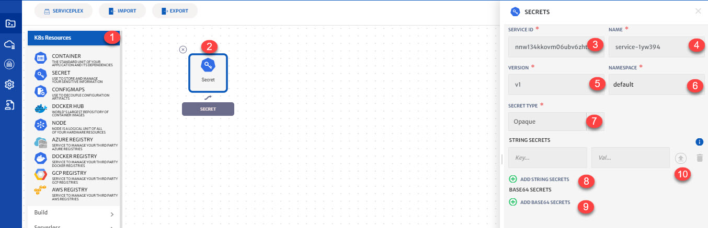

# Kubernetes Secret

Objects that let user store and manage sensitive information e.g. passwords, OAuth, ssh keys etc. Storing all this private information in a secret is a much more secure and flexible way than putting it verbatim in Pod definition or in a container image. It also reduces the risk of accidental exposure. To use secret, pod must reference the secret. 

Details of the configurations that can be done for Kubernetes Secret are explained below and also highlighted in the image.

1. **K8s Resource**: Drop-down to add K8s resources. 
2. **Secret Icon**: Click the icon to configure Secret. 
3. **Service Id:** Id of the service. System will automatically assign id to the service but user can customize it.
4. **Name**: Name for the service.
5. **Version:** Version of the service.
6. **Namespace**: Namespace for the service.
7. **Type**: Type of secret i.e. Opaque or TLS.
8. **Add String Secrets**: To add string secrets. You can add more than one string secrets. 
9. **Add Base64 Secrets**: To add Base64 secrets. You can add more than one base64 secrets.
10. **Upload**: To upload a file for Value. 