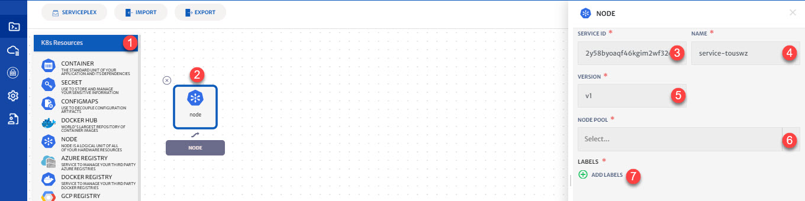

# Node

Using node service, you can apply multiple labels on nodes poles. These labels, applied on node poles, will then later be used as node selector while configuring the container service.

Details of the configurations that can be done for Kubernetes Containers are explained below and also highlighted in the image. 

1. **K8s Resource**: Drop-down to add K8s resources. 
2. **Node Icon**: Click the icon to configure node service. 
3. **Service Id:** Id of the service. System will automatically assign id to the service but user can customize it.
4. **Name**: Name for the service.
5. **Version:** Version of the service.
6. **Node Pool**: Select the Node Pool from drop-down. You can select multiple node pools as well
7. **Add Labels:** Labels are key/value pairs that are attached to Kubernetes objects. Labels are intended to be used to specify identifying attributes of objects that are meaningful and relevant to users.