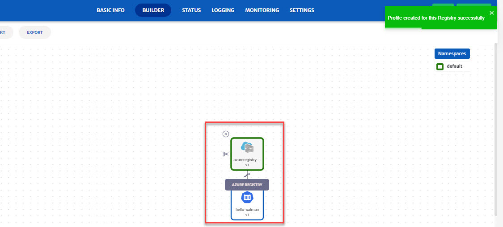

# Registry Services

Registry services can be used to fetch the image details from the respective cloud repo e.g. AWS ECR. Registry service can be used to:

1. Fetch image details from registry and deploy the container using CloudPlex
2. Fetch image details from cloud registry and migrate to any other cloud.

Details of how the image can be fetched from registry are explained below and also highlighted in the image. (For this guide, we have fetched image details from Azure registry)

>  For every section in the guide below, images are followed by description of the fields highlighted in the image.

 

1. **K8s Resource**: Drop-down to add K8s resources. 
2. **Azure Registry**: Click the icon to fetch image details from Azure registry.
3. **Profile:** Select credential profile from the drop-down. (To know more about Credentials Profile menu, click [here](/pages/user-guide/components/credentials-profile/credentials-profile).)

   > For AWS registry, you will also have to select Region. 
4. **Search:** To fetch container registries from that profile. 
5. **Registry:** Select registry to get the list of repositories.

   > For some cloud providers, system will give an option to select repository. 

1. **Select Repository:** Select repository to fetch the image details.

   > User can also change the configurations of the fetched image.
   >
   > You can also get more than one image from single registry. Simply click on the same registry icon and follow the same process as explained above to get the 2nd image. (Picture attached below)

