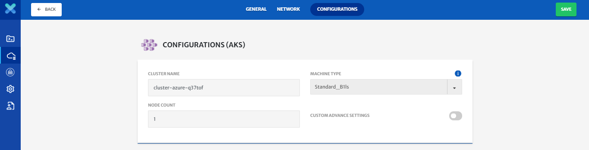

# KubePlex

Using KubePlex, user can visually deploy and manage kubernetes clusters on all public clouds and on-premises. CloudPlex provides support for a user managed cluster or provider managed cluster such as GKE, AKS, EKS, IKS, and DOKS. You can create new kubernetes clusters or use your existing kubernetes clusters. CloudPlex also supports on-premise kubernetes clusters.

Now lets take you through the step by step process of how you can get the best out of KubePlex. For video guide, please click [here](https://www.youtube.com/watch?v=K9CtEKrq7qk). 

To deploy an application, you need to create and configure your infrastructure. CloudPlex gives you 6 infrastructure options using KubePlex.

1. Create a new provider-managed Kubernetes cluster.
2. Import your existing provider-managed Kubernetes cluster.
3. Create a user managed Kubernetes cluster in any public cloud.
4. Import your existing user managed Kubernetes cluster.
5. Create an On-Premise Kubernetes Cluster.
6. Import your existing on-premise kubernetes cluster.

Let us take you through all these infrastructure types.

## Create a New Provider Managed Cluster

1. CloudPlex supports all major managed Kubernetes Clusters such as EKS, AKS, GKE, DOKS, IKS, and gives you an option to start a provider-managed cluster without worrying about advanced configurations. The platform automatically fills all the configuration parameters, which you can override.

   

2. CloudPlex gives you three levels of configuration options, “simple”, “advanced”, and “expert”. 

   1. In simple mode, CloudPlex requires machine type and number of nodes from the user and the rest of the configuration will be populated by the platform.

      

   2. In advanced mode, you are able to customize your Kubernetes cluster including addition of multiple node pools, selection of Kubernetes version, and other features. Details vary from cloud to cloud.

      > For an in depth guide on this, click [here](/pages/user-guide/components/cluster/pm-new-cluster/aks-cluster/aks-cluster?id=aks-cluster).

      

   3. In expert mode, you are also able to customize networking and other complex features. Details vary from cloud to cloud.

      > For an in depth guide on this, click [here](/pages/user-guide/components/cluster/pm-new-cluster/aks-cluster/aks-cluster?id=aks-cluster).

      

## Import Existing Provider Managed Cluster

For existing provider-managed Kubernetes cluster on any public cloud, you can import those clusters onto the Platform with one click and use an intuitive drag-n-drop canvas to deploy and manage your applications on those clusters. 

> For more details click [here](/pages/user-guide/getting-started/pm-existing-cluster/pm-existing-cluster?id=provider-managed-existing-kubernetes-cluster).

## Create your own Kubernetes Cluster

1. If you want more control over the provisioning and administration of your Kubernetes cluster, you can provision it with the CloudPlex Platform using **User Managed Cluster**.

   

2. CloudPlex gives you a User-Managed Cluster option with which you can deploy Production grade Kubernetes clusters. It provides you a consistent and simplified way to provision, manage, diagnose, and monitor your Kubernetes cluster.

   > For more details click [here](/pages/user-guide/getting-started/um-new-cluster/um-new-cluster?id=user-managed-new-kubernetes-cluster).

3. You can also import your existing user managed clusters.

## Create On-Premise Kubernetes Cluster

1. CloudPlex gives you an option to deploy the Kubernetes Cluster on-premise. It provides you a consistent and simplified way to provision, manage, diagnose, and monitor your on-premise Kubernetes cluster.

   > For more details click [here](/pages/user-guide/getting-started/um-new-op-cluster/um-new-op-cluster?id=user-managed-new-on-premise-kubernetes-cluster).

   

2. You can also import your existing on-premise cluster. 

**Conclusion**

Now we have seen all of the infrastructure options available using KubePlex, hopefully now you are on your way to configure, provision, and manage your kubernetes clusters with CloudPlex, the Kubernetes Application Platform for Developers. 