# AWS

Details of the configurations that can be done for different AWS services at **Application** level are explained below and also highlighted in the image.

## S3

Amazon S3 is object storage built to store and retrieve any amount of data from anywhere on the Internet. It’s a simple storage service that offers an extremely durable, highly available, and infinitely scalable data storage infrastructure at very low costs. To know more about S3, click [here](https://aws.amazon.com/s3/).

While configuring Application, drag and drop **AWS S3** from left pallet and in to the canvas to configure it.

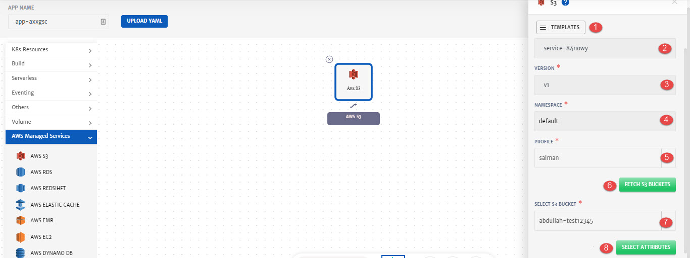

1. **Templates**: To reuse any existing service template.
2. **Service ID:** Id of the service. System will automatically assign id to the service but user can customize it.
3. **Name**: Name for the service.
4. **Version**: Version of the service.
5. **Profile**: Profile to use to fetch the service. 
6. **Fetch S3 Buckets**: To fetch all the buckets of the selected profile. 
7. **Select S3 Bucket**: Bucket to fetch the attributes from.
8. **Select Attributes**: To select attributes of the services that will be used as dynamic parameters.

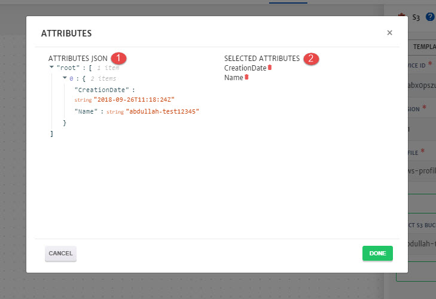

1. **Attributes JSON**: Available Attributes that can be added as dynamic parameters. 
2. **Selected Attributes**: Attributes added that are required as dynamic parameters. Click on the attribute name to add it.

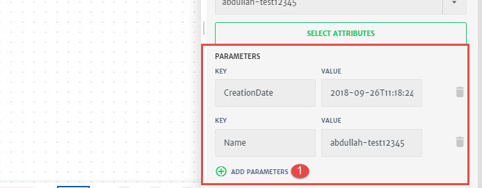

1. **Add Parameters**: To add any static parameter. 

## RDS

Amazon Relational Database Service (Amazon RDS) is a managed service that makes it easy to set up, operate, and scale a relational database in the cloud. It provides cost-efficient and resizable capacity, while managing time-consuming database administration tasks, freeing you up to focus on your applications and business. To know more about RDS, click [here](https://aws.amazon.com/rds/).

While configuring Application, drag and drop **AWS RDS** from left pallet and in to the canvas to configure it.

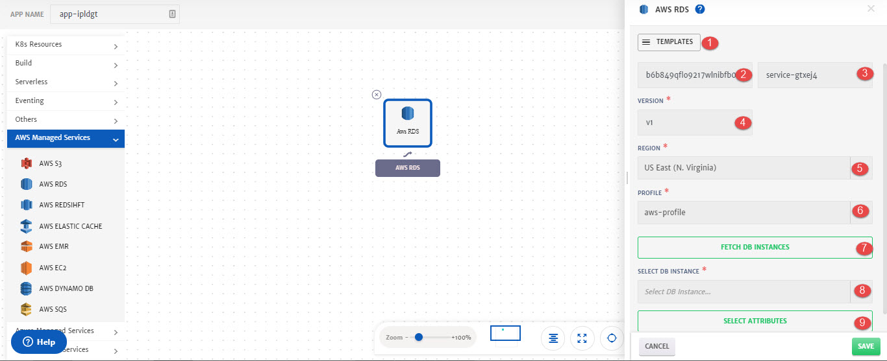

1. **Templates**: To reuse any existing service template.
2. **Service ID:** Id of the service. System will automatically assign id to the service but user can customize it.
3. **Name**: Name for the service.
4. **Version**: Version of the service.
5. **Region:** Region of the instance.
6. **Profile**: Profile to use to fetch the service. 
7. **Fetch DB Instances**: To fetch all the instances of the selected profile. 
8. **Select DB Instance**: Instance to fetch the attributes from.
9. **Select Attributes**: To select attributes of the services that will be used as dynamic parameters.

1. **Attributes JSON**: Available Attributes that can be added as dynamic parameters. 
2. **Selected Attributes**: Attributes added that are required as dynamic parameters. Click on the attribute name to add it.

1. **Add Parameters**: To add any static parameter. 

## RedShift

Amazon Redshift is a fast, fully managed cloud data warehouse that makes it simple and cost-effective to analyze all your data using standard SQL and your existing Business Intelligence (BI) tools. It allows you to run complex analytic queries against terabytes to petabytes of structured data, using sophisticated query optimization, columnar storage on high-performance storage, and massively parallel query execution. To know more about RedShift, click [here](https://aws.amazon.com/redshift/).

While configuring Application, drag and drop **AWS RedShift** from left pallet and in to the canvas to configure it.

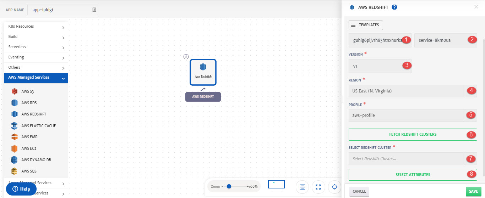

1. **Service ID:** Id of the service. System will automatically assign id to the service but user can customize it.
2. **Name**: Name for the service.
3. **Version**: Version of the service.
4. **Region:** Region of the cluster.
5. **Profile**: Profile to use to fetch the service. 
6. **Fetch RedShift Clusters**: To fetch all the instances of the selected profile. 
7. **Select RedShift Cluster**: Instance to fetch the attributes from.
8. **Select Attributes**: To select attributes of the services that will be used as dynamic parameters.

1. **Attributes JSON**: Available Attributes that can be added as dynamic parameters. 
2. **Selected Attributes**: Attributes added that are required as dynamic parameters. Click on the attribute name to add it.

1. **Add Parameters**: To add any static parameter. 

## Elastic Cache

Amazon ElastiCache is a web service that makes it easy to deploy and run Memcached or Redis protocol-compliant server nodes in the cloud. Amazon ElastiCache improves the performance of web applications by allowing you to retrieve information from a fast, managed, in-memory system, instead of relying entirely on slower disk-based databases. To know more about Elastic Cache, click [here](https://aws.amazon.com/elasticache/).

While configuring Application, drag and drop **AWS Elastic Cache** from left pallet and in to the canvas to configure it.

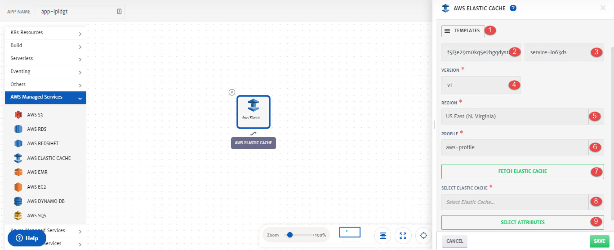

1. **Templates**: To reuse any existing service template.
2. **Service ID:** Id of the service. System will automatically assign id to the service but user can customize it.
3. **Name**: Name for the service.
4. **Version**: Version of the service.
5. **Region:** Region of the Elastic Cache.
6. **Profile**: Profile to use to fetch the service. 
7. **Fetch Elastic Cache**: To fetch all the Elastic Cache of the selected profile. 
8. **Select Elastic Cache**: Elastic Cache to fetch the attributes from.
9. **Select Attributes**: To select attributes of the services that will be used as dynamic parameters.

1. **Attributes JSON**: Available Attributes that can be added as dynamic parameters. 
2. **Selected Attributes**: Attributes added that are required as dynamic parameters. Click on the attribute name to add it.

1. **Add Parameters**: To add any static parameter. 

## EMR

Amazon EMR is a web service that enables businesses, researchers, data analysts, and developers to easily and cost-effectively process vast amounts of data. It utilizes a hosted Hadoop framework running on the web-scale infrastructure of Amazon Elastic Compute Cloud (Amazon EC2) and Amazon Simple Storage Service (Amazon S3). To know more about EMR, click [here](https://aws.amazon.com/emr).

While configuring Application, drag and drop **AWS EMR** from left pallet and in to the canvas to configure it.

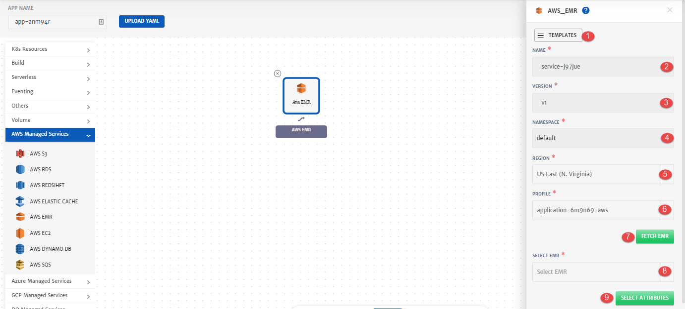

1. **Templates**: To reuse any existing service template.
2. **Service ID:** Id of the service. System will automatically assign id to the service but user can customize it.
3. **Name**: Name for the service.
4. **Version**: Version of the service.
5. **Region:** Region of the cluster.
6. **Profile**: Profile to use to fetch the service. 
7. **Fetch EMR**: To fetch all the EMR clusters of the selected profile. 
8. **Select EMR**: EMR to fetch the attributes from.
9. **Select Attributes**: To select attributes of the services that will be used as dynamic parameters.

1. **Attributes JSON**: Available Attributes that can be added as dynamic parameters. 
2. **Selected Attributes**: Attributes added that are required as dynamic parameters. Click on the attribute name to add it.

1. **Add Parameters**: To add any static parameter. 

## EC2

Amazon Elastic Compute Cloud (Amazon EC2) is a web service that provides resizable compute capacity in the cloud. It is designed to make web-scale computing easier for developers. To know more about EC2, click [here](https://aws.amazon.com/ec2/).

While configuring Application, drag and drop **AWS EC2** from left pallet and in to the canvas to configure it.

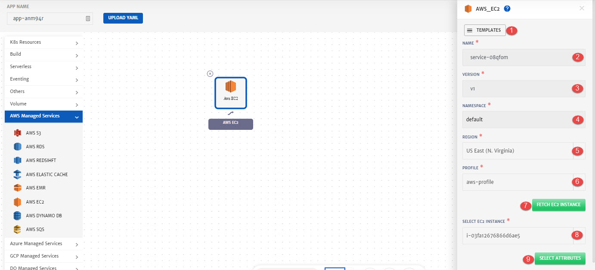

1. **Templates**: To reuse any existing service template.
2. **Service ID:** Id of the service. System will automatically assign id to the service but user can customize it.
3. **Name**: Name for the service.
4. **Version**: Version of the service.
5. **Region:** Region of the cluster.
6. **Profile**: Profile to use to fetch the service. 
7. **Fetch EC2 Instance**: To fetch all the EC2 Instances of the selected profile. 
8. **Select EC2 Instance**: Instance to fetch the attributes from.
9. **Select Attributes**: To select attributes of the services that will be used as dynamic parameters.

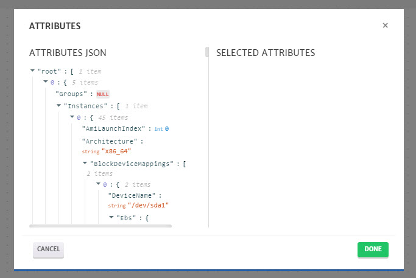

1. **Attributes JSON**: Available Attributes that can be added as dynamic parameters. 
2. **Selected Attributes**: Attributes added that are required as dynamic parameters. Click on the attribute name to add it.

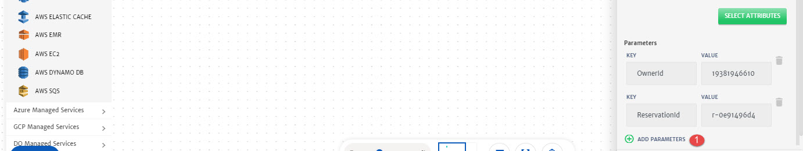

1. **Add Parameters**: To add any static parameter. 

## Dynamo DB

DynamoDB is a fast and flexible nonrelational database service for any scale. DynamoDB enables customers to offload the administrative burdens of operating and scaling distributed databases to AWS so that they don’t have to worry about hardware provisioning, setup and configuration, throughput capacity planning, replication, software patching, or cluster scaling. To know more about Dynamo DB, click [here](https://aws.amazon.com/dynamodb/).

While configuring Application, drag and drop **AWS Dynamo DB** from left pallet and in to the canvas to configure it.

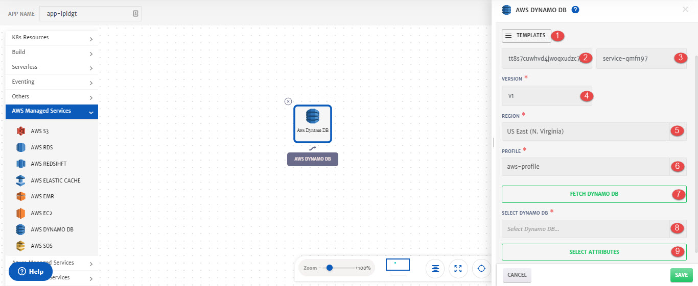

1. **Templates**: To reuse any existing service template.
2. **Service ID:** Id of the service. System will automatically assign id to the service but user can customize it.
3. **Name**: Name for the service.
4. **Version**: Version of the service.
5. **Region:** Region of the DB.
6. **Profile**: Profile to use to fetch the service. 
7. **Fetch Dynamo DB**: To fetch all the Dynamo DB of the selected profile. 
8. **Select Dynamo DB**: Dynamo DB to fetch the attributes from.
9. **Select Attributes**: To select attributes of the services that will be used as dynamic parameters.

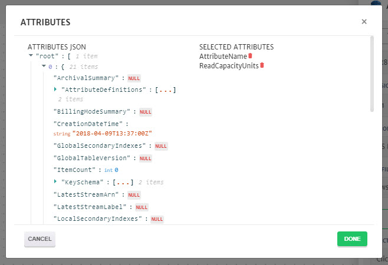

1. **Attributes JSON**: Available Attributes that can be added as dynamic parameters. 
2. **Selected Attributes**: Attributes added that are required as dynamic parameters. Click on the attribute name to add it.

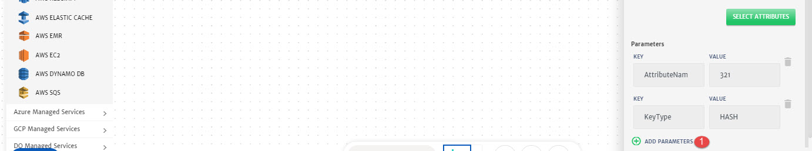

1. **Add Parameters**: To add any static parameter. 

## SQS

Amazon Simple Queue Service (SQS) is a fully managed message queuing service that enables you to decouple and scale microservices, distributed systems, and serverless applications. SQS eliminates the complexity and overhead associated with managing and operating message oriented middleware, and empowers developers to focus on differentiating work. To know more about SQS, click [here](https://aws.amazon.com/sqs/).

While configuring Application, drag and drop **AWS SQS** from left pallet and in to the canvas to configure it.

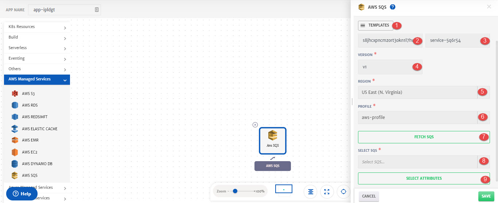

1. **Templates**: To reuse any existing service template.
2. **Service ID:** Id of the service. System will automatically assign id to the service but user can customize it.
3. **Name**: Name for the service.
4. **Version**: Version of the service.
5. **Region:** Region of the service.
6. **Profile**: Profile to use to fetch the service. 
7. **Fetch SQS**: To fetch all the SQS of the selected profile. 
8. **Select SQS**: SQS to fetch the attributes from.
9. **Select Attributes**: To select attributes of the services that will be used as dynamic parameters.

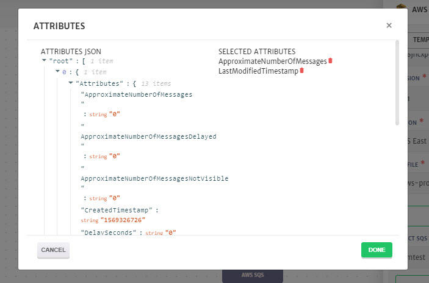

1. **Attributes JSON**: Available Attributes that can be added as dynamic parameters. 
2. **Selected Attributes**: Attributes added that are required as dynamic parameters. Click on the attribute name to add it.

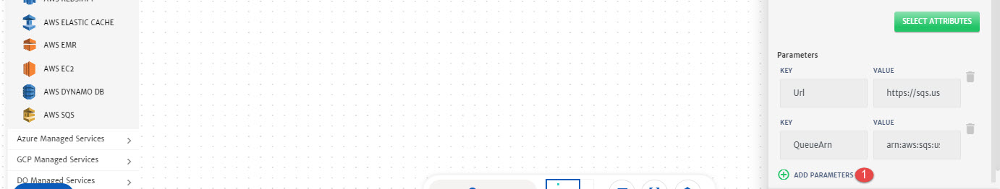

1. **Add Parameters**: To add any static parameter. 