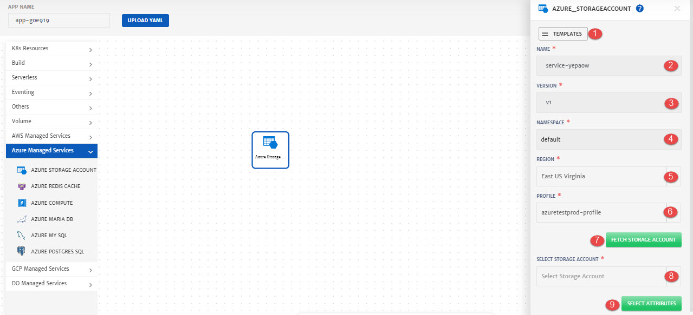
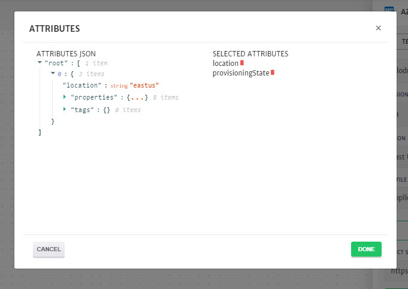
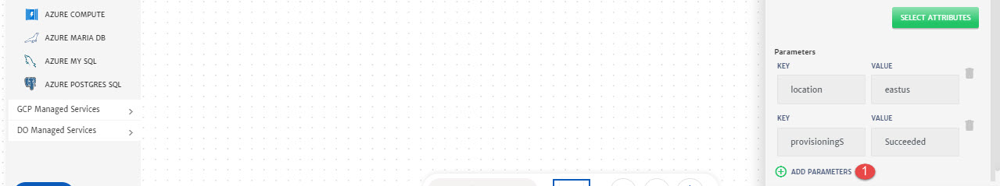
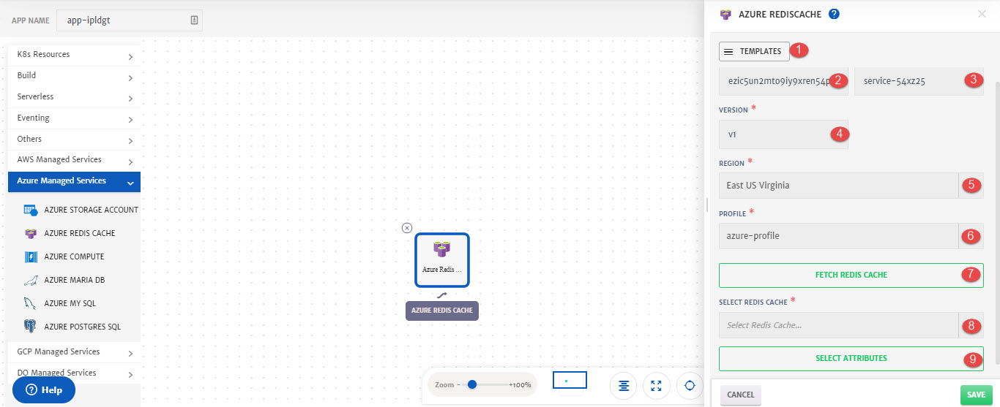
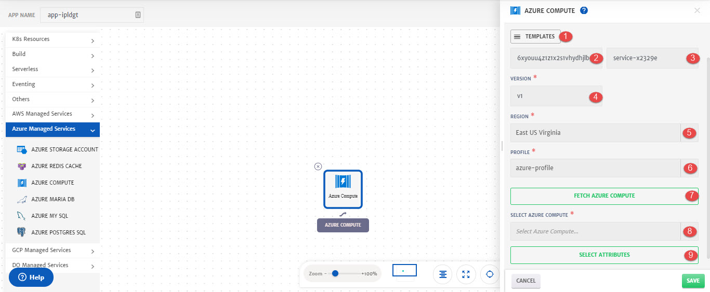
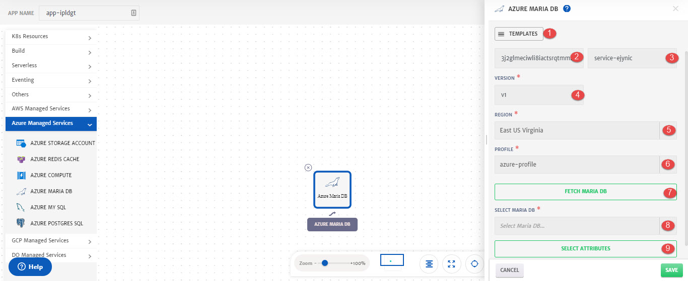
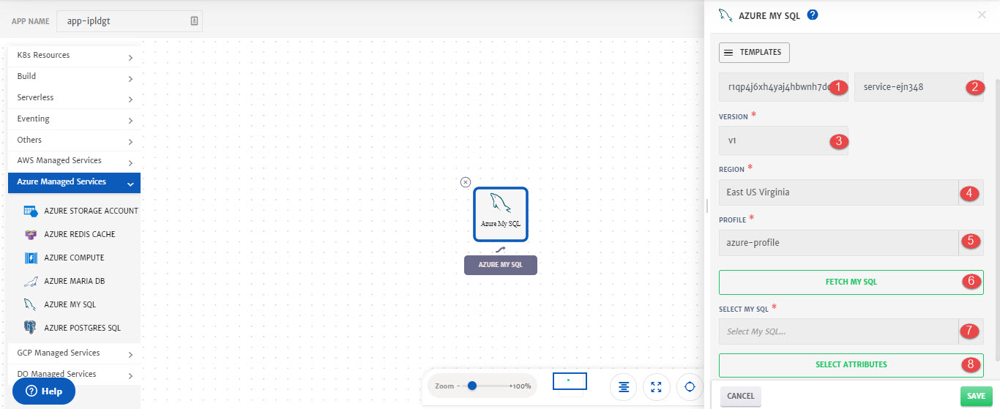
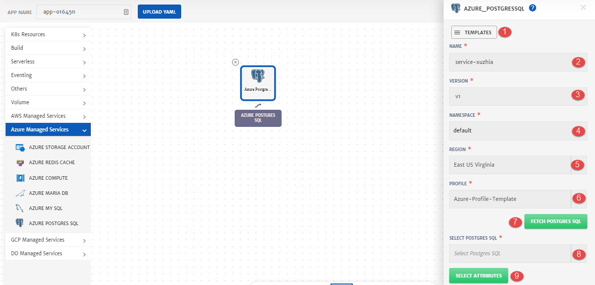

# Azure

Details of the configurations that can be done for different Azure services are explained below and also highlighted in the image.

## Storage Account

An Azure storage account contains all Azure Storage data objects: blobs, files, queues, tables, and disks. The storage account provides a unique namespace for Azure Storage data that is accessible from anywhere in the world over HTTP or HTTPS. To know more about Azure Storage, click [here](https://azure.microsoft.com/en-us/services/storage/).

While configuring Application, drag and drop **Azure Storage Account** from left pallet and in to the canvas to configure it.

1. **Templates**: To reuse any existing service template.
2. **Service ID:** Id of the service. System will automatically assign id to the service but user can customize it.
3. **Name**: Name for the service.
4. **Version**: Version of the service.
5. **Region:** Region of the Storage Account.
6. **Profile**: Profile to use to fetch the service. 
7. **Fetch Storage Account**: To fetch all the Storage Accounts of the selected profile. 
8. **Select Storage Account**: Storage Account to fetch the attributes from.
9. **Select Attributes**: To select attributes of the services that will be used as dynamic parameters.

1. **Attributes JSON**: Available Attributes that can be added as dynamic parameters. 
2. **Selected Attributes**: Attributes added that are required as dynamic parameters. Click on the attribute name to add it.

1. **Add Parameters**: To add any static parameter. 

## Redis Cache

Azure Cache for Redis provides an in-memory data store based on the open-source software Redis. When used as a cache, Redis improves the performance and scalability of systems that rely heavily on backend data stores. To know more about Azure Cache for Redis, click [here](https://azure.microsoft.com/en-us/services/cache/).

While configuring Application, drag and drop **Azure Redis Cache** from left pallet and in to the canvas to configure it.

1. **Templates**: To reuse any existing service template.
2. **Service ID:** Id of the service. System will automatically assign id to the service but user can customize it.
3. **Name**: Name for the service.
4. **Version**: Version of the service.
5. **Region:** Region of the Redis Cache.
6. **Profile**: Profile to use to fetch the service. 
7. **Fetch Redis Cache**: To fetch all the Redis Cache of the selected profile. 
8. **Select Redis Cache**: Redis Cache to fetch the attributes from.
9. **Select Attributes**: To select attributes of the services that will be used as dynamic parameters.

1. **Attributes JSON**: Available Attributes that can be added as dynamic parameters. 
2. **Selected Attributes**: Attributes added that are required as dynamic parameters. Click on the attribute name to add it.

1. **Add Parameters**: To add any static parameter. 

## Azure Compute

Azure offers a number of ways to host your application code. The term compute refers to the hosting model for the computing resources that your application runs on. To know more about Azure Compute, click [here](https://docs.microsoft.com/en-us/azure/architecture/).

While configuring Application, drag and drop **Azure Compute** from left pallet and in to the canvas to configure it.

1. **Templates**: To reuse any existing service template.
2. **Service ID:** Id of the service. System will automatically assign id to the service but user can customize it.
3. **Name**: Name for the service.
4. **Version**: Version of the service.
5. **Region:** Region of the Azure Compute.
6. **Profile**: Profile to use to fetch the service. 
7. **Fetch Azure Compute**: To fetch all the Azure Compute of the selected profile. 
8. **Select Azure Compute**: Azure Compute to fetch the attributes from.
9. **Select Attributes**: To select attributes of the services that will be used as dynamic parameters.

1. **Attributes JSON**: Available Attributes that can be added as dynamic parameters. 
2. **Selected Attributes**: Attributes added that are required as dynamic parameters. Click on the attribute name to add it.

1. **Add Parameters**: To add any static parameter. 

## Maria DB

Azure Database for MariaDB is a relational database service based on the open-source MariaDB Server engine. It's a fully managed database as a service offering that can handle mission-critical workloads with predictable performance and dynamic scalability. To know more about Maria DB, click [here](https://azure.microsoft.com/en-us/services/mariadb/). 

While configuring Application, drag and drop **Azure Maria DB** from left pallet and in to the canvas to configure it.

1. **Templates**: To reuse any existing service template.
2. **Service ID:** Id of the service. System will automatically assign id to the service but user can customize it.
3. **Name**: Name for the service.
4. **Version**: Version of the service.
5. **Region:** Region of the Maria DB.
6. **Profile**: Profile to use to fetch the service. 
7. **Fetch Maria DB**: To fetch all the Maria DB of the selected profile. 
8. **Select Maria DB**: Maria DB to fetch the attributes from.
9. **Select Attributes**: To select attributes of the services that will be used as dynamic parameters.

1. **Attributes JSON**: Available Attributes that can be added as dynamic parameters. 
2. **Selected Attributes**: Attributes added that are required as dynamic parameters. Click on the attribute name to add it.

1. **Add Parameters**: To add any static parameter. 

## My SQL

Azure Database for MySQL is a relational database service powered by the MySQL community edition. It's a fully managed database as a service offering that can handle mission-critical workloads with predictable performance and dynamic scalability. To know more about My SQL, click [here](https://azure.microsoft.com/en-us/services/mysql/).

While configuring Application, drag and drop **Azure My SQL** from left pallet and in to the canvas to configure it.

1. **Service ID:** Id of the service. System will automatically assign id to the service but user can customize it.
2. **Name**: Name for the service.
3. **Version**: Version of the service.
4. **Region:** Region of My SQL.
5. **Profile**: Profile to use to fetch the service. 
6. **Fetch My SQL**: To fetch all the My SQL of the selected profile. 
7. **Select My SQL**: My SQL to fetch the attributes from.
8. **Select Attributes**: To select attributes of the services that will be used as dynamic parameters.

1. **Attributes JSON**: Available Attributes that can be added as dynamic parameters. 
2. **Selected Attributes**: Attributes added that are required as dynamic parameters. Click on the attribute name to add it.

1. **Add Parameters**: To add any static parameter. 

## Postgres SQL

Azure Database for PostgreSQL is a relational database service based on the open-source Postgres database engine. It's a fully managed database-as-a-service offering that can handle mission-critical workloads with predictable performance, security, high availability, and dynamic scalability. To know more about Postgres SQL, click [here](https://azure.microsoft.com/en-us/services/postgresql).

While configuring Application, drag and drop **Azure Postgres SQL** from left pallet and in to the canvas to configure it.

1. **Templates**: To reuse any existing service template.
2. **Service ID:** Id of the service. System will automatically assign id to the service but user can customize it.
3. **Name**: Name for the service.
4. **Version**: Version of the service.
5. **Region:** Region of the Postgres SQL.
6. **Profile**: Profile to use to fetch the service. 
7. **Fetch Postgres SQL**: To fetch all the Postgres SQL of the selected profile. 
8. **Select Postgres SQL**: Postgres SQL to fetch the attributes from.
9. **Select Attributes**: To select attributes of the services that will be used as dynamic parameters.

1. **Attributes JSON**: Available Attributes that can be added as dynamic parameters. 
2. **Selected Attributes**: Attributes added that are required as dynamic parameters. Click on the attribute name to add it.

1. **Add Parameters**: To add any static parameter. 