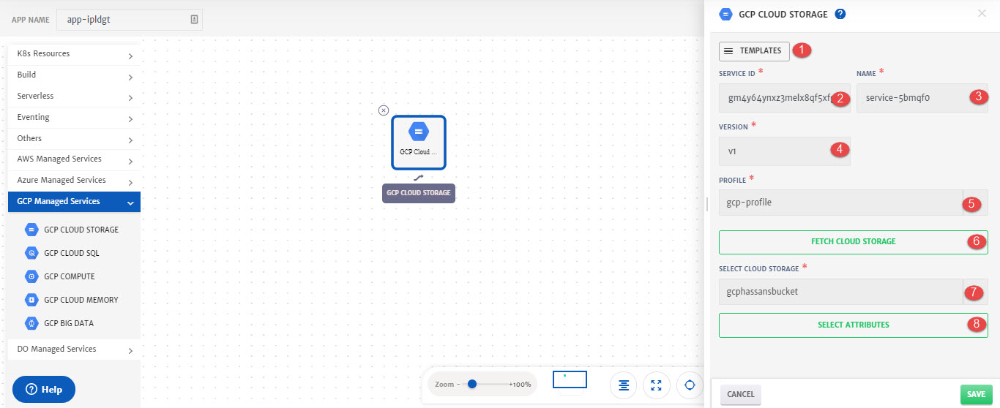
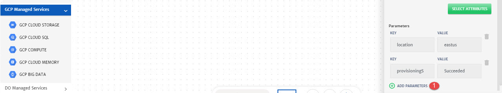
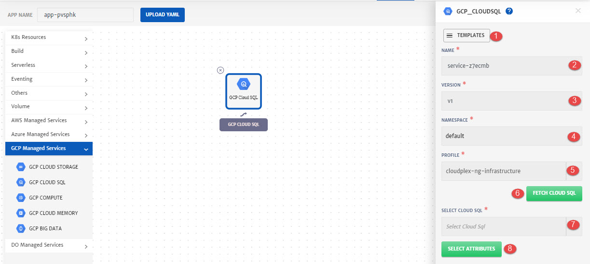
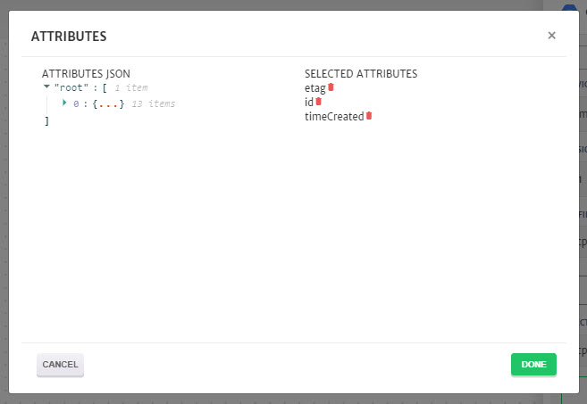
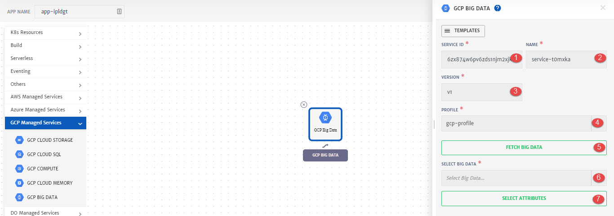

# GCP

Details of the configurations that can be done for different GCP services are explained below and also highlighted in the image.

## Cloud Storage

Drag and drop **GCP Cloud Storage** from left pallet and in to the canvas to configure it.

1. **Templates**: To reuse any existing service template.
2. **Name**: Name for the service.
3. **Version**: Version of the service.
4. **Namespace:** Namespace for the service.
5. **Profile**: Profile to use to fetch the service. 
6. **Fetch Cloud Storage**: To fetch all the Cloud Storage of the selected profile. 
7. **Select Cloud Storage**: Cloud Storage to fetch the attributes from.
8. **Select Attributes**: To select attributes of the services that will be used as dynamic parameters.

1. **Attributes JSON**: Available Attributes that can be added as dynamic parameters. 
2. **Selected Attributes**: Attributes added that are required as dynamic parameters. Click on the attribute name to add it.

1. **Add Parameters**: To add any static parameter. 

## Cloud SQL

Drag and drop **GCP Cloud SQL** from left pallet and in to the canvas to configure it.

1. **Templates**: To reuse any existing service template.
2. **Name**: Name for the service.
3. **Version**: Version of the service.
4. **Namespace:** Namespace for the service.
5. **Profile**: Profile to use to fetch the service. 
6. **Fetch Cloud SQL**: To fetch all the Cloud SQL of the selected profile. 
7. **Select Cloud SQL**: Cloud SQL to fetch the attributes from.
8. **Select Attributes**: To select attributes of the services that will be used as dynamic parameters.

1. **Attributes JSON**: Available Attributes that can be added as dynamic parameters. 
2. **Selected Attributes**: Attributes added that are required as dynamic parameters. Click on the attribute name to add it.

1. **Add Parameters**: To add any static parameter. 

## Big Data

Drag and drop **GCP Big Data** from left pallet and in to the canvas to configure it.

1. **Templates**: To reuse any existing service template.
2. **Name**: Name for the service.
3. **Version**: Version of the service.
4. **Namespace:** Namespace for the service.
5. **Profile**: Profile to use to fetch the service. 
6. **Fetch Big Data**: To fetch all the Big Data of the selected profile. 
7. **Select Big Data**: Big Data to fetch the attributes from.
8. **Select Attributes**: To select attributes of the services that will be used as dynamic parameters.

1. **Attributes JSON**: Available Attributes that can be added as dynamic parameters. 
2. **Selected Attributes**: Attributes added that are required as dynamic parameters. Click on the attribute name to add it.

1. **Add Parameters**: To add any static parameter. 