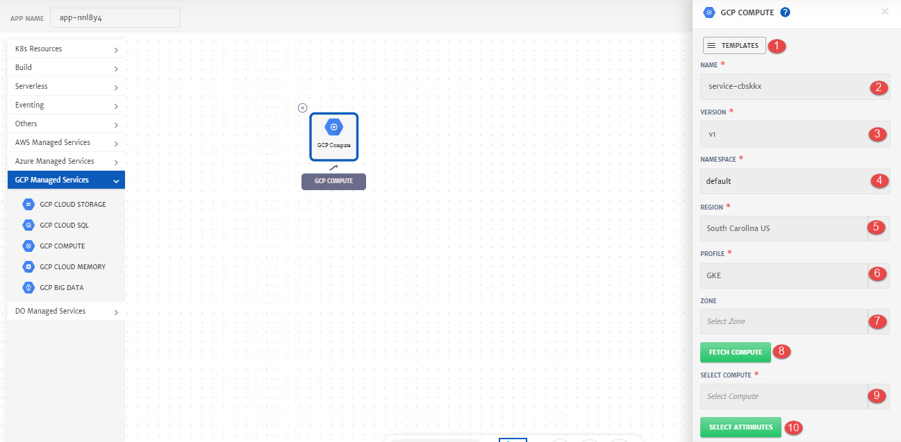
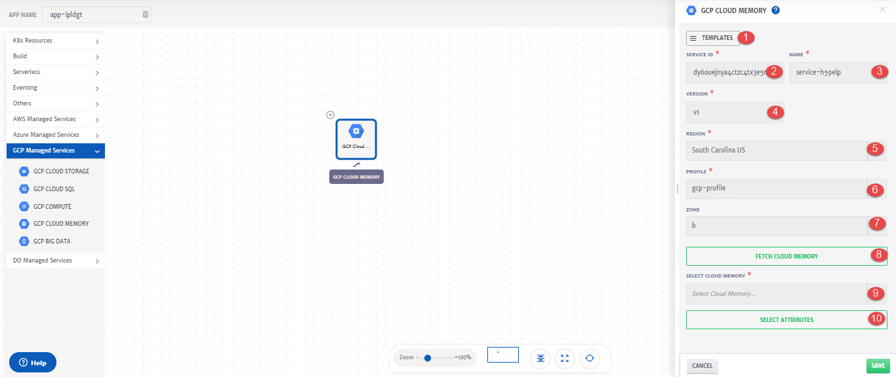

# GCP

Details of the configurations that can be done for different GCP services are explained below and also highlighted in the image.

## Cloud Storage

Cloud Storage is a service for storing your objects in Google Cloud. An object is an immutable piece of data consisting of a file of any format. To know more about GCP Storage, click [here](https://cloud.google.com/storage). 

While configuring Application, drag and drop **GCP Cloud Storage** from left pallet and in to the canvas to configure it.

1. **Templates**: To reuse any existing service template.
2. **Service ID:** Id of the service. System will automatically assign id to the service but user can customize it.
3. **Name**: Name for the service.
4. **Version**: Version of the service.
5. **Profile**: Profile to use to fetch the service. 
6. **Fetch Cloud Storage**: To fetch all the Cloud Storage of the selected profile. 
7. **Select Cloud Storage**: Cloud Storage to fetch the attributes from.
8. **Select Attributes**: To select attributes of the services that will be used as dynamic parameters.

1. **Attributes JSON**: Available Attributes that can be added as dynamic parameters. 
2. **Selected Attributes**: Attributes added that are required as dynamic parameters. Click on the attribute name to add it.

1. **Add Parameters**: To add any static parameter. 

## Cloud SQL

Cloud SQL is a fully-managed database service that makes it easy to set up, maintain, manage, and administer your relational databases on Google Cloud Platform. You can use Cloud SQL with MySQL, PostgreSQL, or SQL Server. To know more about Cloud SQL, click [here](https://cloud.google.com/sql). 

While configuring Application, drag and drop **GCP Cloud SQL** from left pallet and in to the canvas to configure it.

1. **Templates**: To reuse any existing service template.
2. **Service ID:** Id of the service. System will automatically assign id to the service but user can customize it.
3. **Name**: Name for the service.
4. **Version**: Version of the service.
5. **Profile**: Profile to use to fetch the service. 
6. **Fetch Cloud SQL**: To fetch all the Cloud SQL of the selected profile. 
7. **Select Cloud SQL**: Cloud SQL to fetch the attributes from.
8. **Select Attributes**: To select attributes of the services that will be used as dynamic parameters.

1. **Attributes JSON**: Available Attributes that can be added as dynamic parameters. 
2. **Selected Attributes**: Attributes added that are required as dynamic parameters. Click on the attribute name to add it.

1. **Add Parameters**: To add any static parameter. 

## GCP Compute

Compute Engine lets you create and run virtual machines on Google infrastructure. Compute Engine offers scale, performance, and value that lets you easily launch large compute clusters on Google's infrastructure. To know more about, GCP Compute, click [here](https://cloud.google.com/compute).

While configuring Application, drag and drop **GCP Compute** from left pallet and in to the canvas to configure it.

1. **Templates**: To reuse any existing service template.
2. **Service ID:** Id of the service. System will automatically assign id to the service but user can customize it.
3. **Name**: Name for the service.
4. **Version**: Version of the service.
5. **Region:** Region of the service.
6. **Profile**: Profile to use to fetch the service. 
7. **Zone:** Select zone in the region from drop-down.
8. **Fetch Compute**: To fetch all the GCP compute of the selected profile. 
9. **Select Compute**: GCP Compute to fetch the attributes from.
10. **Select Attributes**: To select attributes of the services that will be used as dynamic parameters.

1. **Attributes JSON**: Available Attributes that can be added as dynamic parameters. 
2. **Selected Attributes**: Attributes added that are required as dynamic parameters. Click on the attribute name to add it.

1. **Add Parameters**: To add any static parameter. 

## Cloud Memory

Cloud Memory/Memorystore for Redis provides a fully-managed service that is powered by the Redis in-memory data store to build application caches that provide sub-millisecond data access. To know more about Cloud Memory, click [here](https://cloud.google.com/memorystore).

While configuring Application, drag and drop **GCP Cloud Memory** from left pallet and in to the canvas to configure it.

1. **Templates**: To reuse any existing service template.
2. **Service ID:** Id of the service. System will automatically assign id to the service but user can customize it.
3. **Name**: Name for the service.
4. **Version**: Version of the service.
5. **Region:** Region of the service.
6. **Profile**: Profile to use to fetch the service. 
7. **Zone:** Select zone in the region from drop-down.
8. **Fetch Cloud Memory**: To fetch all the GCP Cloud Memory of the selected profile. 
9. **Select Cloud Memory**: GCP Cloud Memory to fetch the attributes from.
10. **Select Attributes**: To select attributes of the services that will be used as dynamic parameters.

1. **Attributes JSON**: Available Attributes that can be added as dynamic parameters. 
2. **Selected Attributes**: Attributes added that are required as dynamic parameters. Click on the attribute name to add it.

1. **Add Parameters**: To add any static parameter. 

## Big Data

While configuring Application, drag and drop **GCP Big Data** from left pallet and in to the canvas to configure it.

1. **Service ID:** Id of the service. System will automatically assign id to the service but user can customize it.
2. **Name**: Name for the service.
3. **Version**: Version of the service.
4. **Profile**: Profile to use to fetch the service. 
5. **Fetch Big Data**: To fetch all the Big Data of the selected profile. 
6. **Select Big Data**: Big Data to fetch the attributes from.
7. **Select Attributes**: To select attributes of the services that will be used as dynamic parameters.

1. **Attributes JSON**: Available Attributes that can be added as dynamic parameters. 
2. **Selected Attributes**: Attributes added that are required as dynamic parameters. Click on the attribute name to add it.

1. **Add Parameters**: To add any static parameter. 