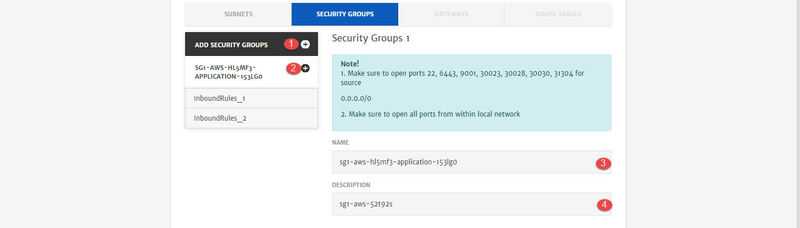
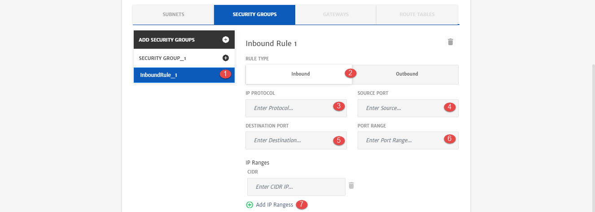

# AWS

Amazon VPC provision a logically isolated section of the Amazon Web Services (AWS) cloud where user can launch AWS resources in a virtual network. User can have complete control over virtual networking environment, including selection of IP address ranges, creation of subnets, and configuration of route tables and network gateways. 

> It is recommended to have good knowledge of networking components before configuring it. To learn more, click [here](https://aws.amazon.com/vpc/).

Here are the configurations option that will be available to user while configuring network cluster for Application deployment. 

1. **Network Name**: Name of the network. 

2. **Virtual Private Cloud**: VPC to be used for the project. You can use any existing VPC created on cloud or create a new one. 

3. **VPC Name**: Unique name of the virtual private cloud where resources will be launched.

4. **CIDR**: IPv4 address in the form of a CIDR block.

5. **Private IP:** To configure private IP.

6. **Subnets**: Tab to configure subnet settings. Subnet is a logical subdivision of a VPC.

7. **Security Groups**: Tab to configure security groups settings. A security group acts as a virtual firewall for your instance to control inbound and outbound traffic.

8. **Gateway:** Tab to configure Internet Gateway.

9. **Route Tables:** Tab to configure Route Tables.

   > Support for Gateway and Route Tables will be added soon in the platform.

1. **Add Subnets**: To add subnets. VPC can have multiple subnets.
2. **Name**: Name of the subnet. 
3. **CIDR**: IPv4 address in the form of a CIDR block.

1. **Add Security Groups**: To add security groups. Network can have multiple security groups.
2. **Security Group**: This button will add Inbound/Outbound traffic rules for security group. 
3. **Name**: Name of the security group
4. **Description**: Description about the security group e.g. traffic details.

1. **InboundRule_1**: Configurations of traffic rules.
2. **Rule Type**: Traffic rule type i.e. Inbound/Outbound.
3. **IP Protocol**: Rule protocol i.e. TCP, UDP,ICMP etc. 
4. **Source Port**: To specify the source port.
5. **Destination Port:** To specify the destination port.
6. **Port Range**: Ports that will be exposed to traffic.
7. **IP Ranges**: To add range of IP in CIDR notation. 
