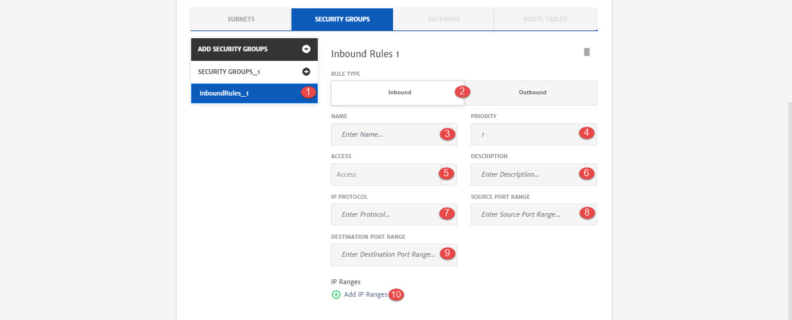

# Azure

Azure Virtual Network (VNet) is the fundamental building block for private network in Azure. VNet enables many types of Azure resources, such as Azure Virtual Machines (VM), to securely communicate with each other, the internet, and on-premises networks.

> It is recommended to have good knowledge of network components before configuring it. To learn more, click [here](https://azure.microsoft.com/en-us/services/virtual-network/).

Here are the configurations option that will be available to user while configuring network cluster for Application deployment. 

1. **Network Name**: Name of the network.
2. **Virtual Private Cloud**: VPC to be used for the project. You can use any existing VPC created on cloud or create a new one. 
3. **VPC Name**: Name of the VPC.
4. **CIDR**: IPv4 address in the form of a CIDR block.
5. **Private IP:** To configure private IP.
6. **Subnets**: Tab to configure subnet settings.
7. **Security Groups**: Tab to configure security groups settings.
8. **Gateway:** Tab to configure Internet Gateway.
9. **Route Tables:** Tab to configure Route Tables.

1. **Add Subnets**: To Add subnets. VPC can have multiple subnets.
2. **Name**: Name of the subnet. 
3. **CIDR**: IPv4 address in the form of a CIDR block.

1. **Add Security Groups**: To add security groups. Network can have multiple security groups.
2. **Security Group_1**: This button will add Inbound/Outbound traffic rules for security group. 
3. **Name**: Name of the security group.

1. **InboundRule_1**: Configurations of traffic rules.
2. **Rule Type**: Traffic rule type i.e. Inbound/Outbound.
3. **Name:** Name for the rule.
4. **Priority:** Priority of the rule. It should be greater than or equal to 100.
5. **Access:** Access of the rule i.e. Allow, Deny.
6. **Description:** Description related to rule. 
7. **IP Protocol**: Rule protocol i.e. TCP, UDP etc. 
8. **Source Port Range**: To specify the source ports.
9. **Destination Port Range:** To specify the destination ports.
10. **IP Ranges**: To add range of IP in CIDR notation. 