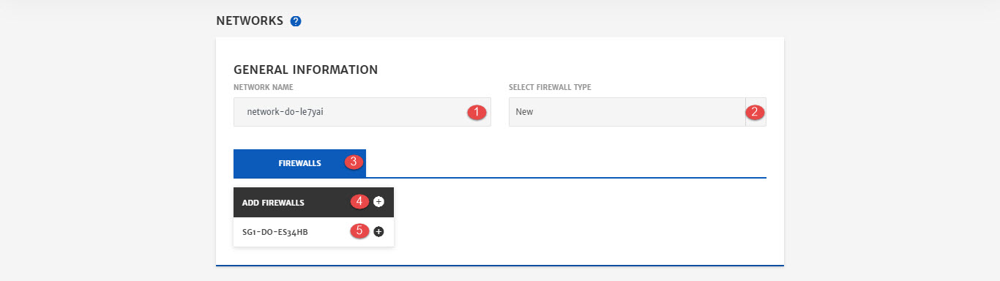
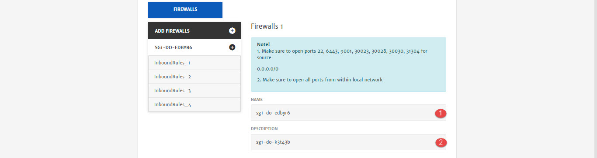
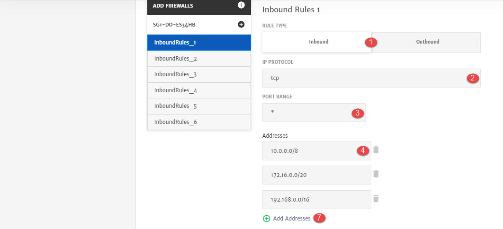

# Digital Ocean

Digital Ocean network secures and controls the traffic to the applications with private networking, traffic filtering, and load balancing.

> It is recommended to have good knowledge of networking components before configuring it. To learn more, click [here](https://www.digitalocean.com/products/networking/).

Here are the configurations option that will be available to user while configuring network cluster for Application deployment. 

1. **Network Name**: Name of the network. 
2. **Virtual Firewall Type**: Whether you want to setup a new farewell or use any existing firewall.. 
3. **Firewalls**: Cloud firewalls to block all traffic that isn't expressly permitted by a rule
4. **Add Firewalls**: Button to add and configure firewall.
5. **Traffic Rules**: Button to add and configure traffic rule. (Rules will be added by default but you can also edit them.)

1. **Name:** Set a firewall name. 
2. **Description**: Description related to firewall.

1. **Rule Type**: Traffic rule type i.e. Inbound/Outbound.
2. **IP Protocol:** Rule protocol i.e. TCP, UDP etc. 
3. **Port Range:** Traffic port range.
4. **Address:** IP address in CIDR notation.
5. **Add Addresses:** To add another IP address.