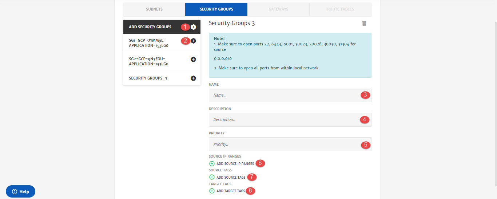

# GCP

1. **Network Name**: Name of the network.
2. **Templates**: To get the list of existing network templates stored in platform
3. **Virtual Private Cloud**: VPC to be used for the project. You can use any existing VPC created on cloud or create a new one. 
4. **VPC Name**: Name of the VPC.
5. **Subnets**: Tab to configure subnet settings.
6. **Security Groups**: Tab to configure security groups settings.

1. **Add Subnets**: To add subnets. VPC can have multiple subnets.
2. **Name**: Name of the subnet. 
3. **CIDR**: IPv4 address in the form of a CIDR block.

1. **Add Security Groups**: To add security groups. Network can have multiple security groups.
2. **Security Group_1**: This button will add Inbound/Outbound traffic rules for security group. 
3. **Name**: Name of the security group.
4. **Description:** Description related to security group.
5. **Priority:** Priority of the security group.
6. **Add Source IP Ranges:** Source IP range in CIDR notation. 
7. **Add Source Tags:** Source tags that will appear at cluster level
8. **Add Target Tags:** Target tags that will appear at cluster level.

1. **InboundRule_1**: Configurations of traffic rules.
2. **Rule Type**: Traffic rule type i.e. Inbound/Outbound.
3. **Protocol:** Rule protocol i.e. TCP, UDP etc. 
4. **Port Range:** Traffic port range.
5. **Access:** Access of the rule i.e. Allowed, Denied.