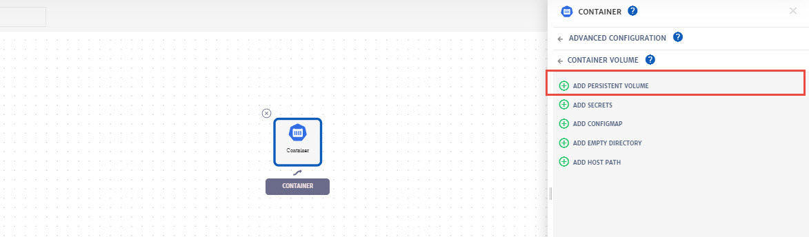
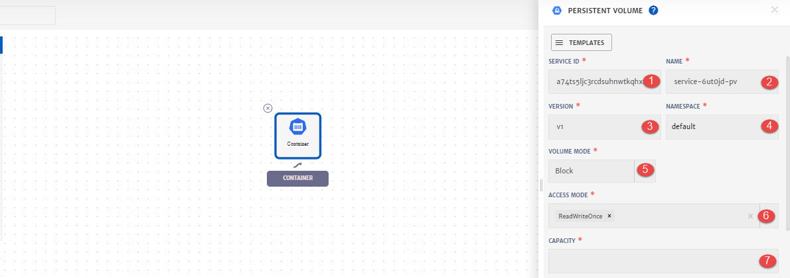
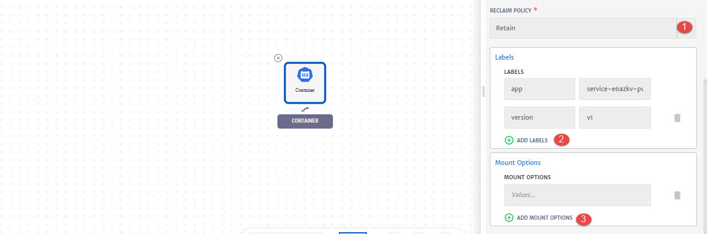

# Persistent Volume

A Persistent Volume (PV) is a piece of storage in the cluster that gets provisioned by an administrator or dynamically provisioned using Storage Classes. It is a resource in the cluster just like a node is a cluster resource. PVs are volume plugins like Volumes, but have a lifecycle independent of any individual Pod that uses the PV. To know more about PV, click [here](https://kubernetes.io/docs/concepts/storage/persistent-volumes/).

> PV can be attached with container. To configure PV, go to the App Design section while configuring **Application**, add container, go to the Advanced Configurations and then **Container Volumes** to **Add Persistent Volume**.

Details of the configurations that can be done for PV are explained below and also highlighted in the image.

1. **Service:** Select any existing PV from drop-down or select **New**. 
2. **(For Existing PV)** **Mouth Path:** Mount Path is a destination inside the Pod, where a volume gets mounted to.

**For New PV:**

1. **Service ID:** Id of the service. System will automatically assign id to the service but user can customize it.

2. **Name**: Name for the service.

3. **Version**: Version of the service.

4. **Namespace:** Namespace for the service.

5. **Volume Mode:** Select volume mode from drop-down i.e. Block or Filesystem.

   > **Filesystem:** A volume is mounted into Pods into a directory. If the volume is backed by a block device and the device is empty, Kuberneretes creates a filesystem on the device before mounting it for the first time.
   >
   > **Block:** A volume is presented into a Pod as a block device, without any filesystem on it. This mode is useful to provide a Pod the fastest possible way to access a volume, without any filesystem layer between the Pod and the volume

6. **Access Mode:** Select access mode for the PV from drop-down. A PersistentVolume can be mounted on a host in any way supported by the resource provider.

   > **ReadWriteOnce**: The volume can be mounted as read-write by a single node
   > **ReadOnlyMany**: The volume can be mounted read-only by many nodes
   > **ReadWriteMany**: The volume can be mounted as read-write by many nodes

7. **Capacity:** Specify the storage capacity, it should be between 10 and 2000 Gi. 

1. **Reclaim Policy:** Select reclaim policy from drop-down. The reclaim policy tells the cluster what to do with the volume after it has been released of its claim. Volumes can either be Retained or Deleted.

   > **Retain:** The Retain reclaim policy allows for manual reclamation of the resource. 
   >
   > **Delete:** Delete reclaim policy removes both the Persistent Volume object from Kubernetes, as well as the associated storage asset in the external infrastructure, such as an AWS etc. 

2. (Optional) **Add Labels:** Labels can be attached to filer a set of volumes if needed. User can add multiple Key Value pairs as labels. 

3. (Optional) **Add Mount Options:** To specify additional mount options for when a Persistent Volume is mounted on a node.

   > Not all volume types support mount options, for complete list, click [here](https://kubernetes.io/docs/concepts/storage/persistent-volumes/#mount-options).