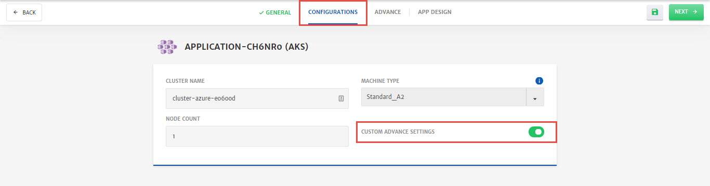
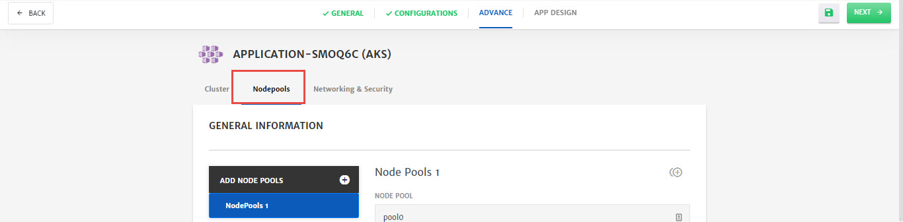
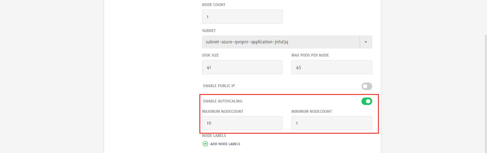
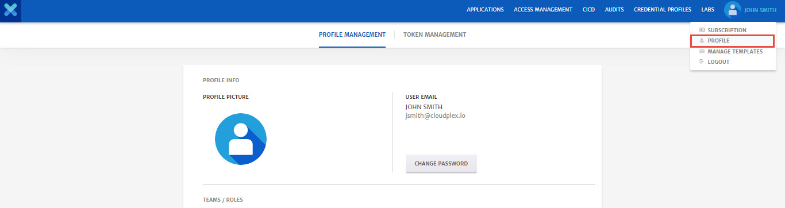
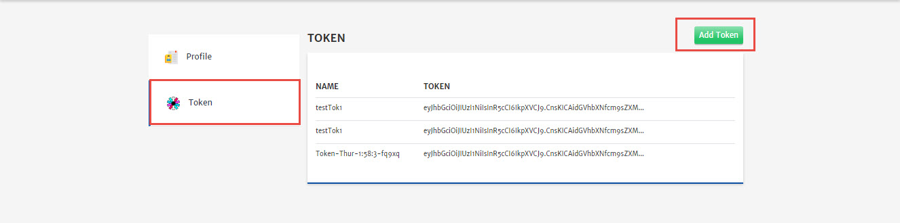

# Scaling

As CloudPlex is a cloud management platform, it provides all the necessary cloud solutions and features to its users. In the IT world, it is difficult to predict the growth of applications and storage capacity with time. To maintain consistent performance of different workloads over time, it is necessary that IT managers keep the resources requirements in check. Keeping this use case in mind, CloudPlex have provided the feature of Auto Scaling to their users. Now in order to keep up with the workload, you can easily scale up/down your resources as per requirements.

CloudPlex provides a comprehensive auto-scaling solution. It has the ability to scale infrastructure dynamically by continuously monitoring the applications, keeping track of resource consumption and adjusting the capacity of resources for high performance. 

CloudPlex provides an interactive and easy to navigate UI to define auto scaling policy. 

There are two types of scaling supported in platform:

1. [Container Scaling](/pages/user-guide/components/scaling/scaling?id=container-scaling)
2. [Node Scaling](/pages/user-guide/components/scaling/scaling?id=node-scaling)

Below are the details of the configurations required to setup auto scaling in platform.

## Container Scaling

Whenever the resources consumption of the container gets too high or low (based on threshold set), scaling action will be performed. For each container service, users will be able to configure policy configuration. 

**Configurations**

Whenever the threshold of chosen metric is reached, number of replicas will automatically adjust in the range defined by the user.

User can configure scaling using multiple metrics. Following metrics are available in platform.

- CPU
- Memory 
- Storage

Threshold value of chosen metrics in can be defined in two forms

- Average Value
- Average Utilization

User can also provide the range of number of replicas using following attributes. 

- MIN
- MAX 

Whenever the threshold of chosen metric is reached, number of replicas will automatically adjust in the range defined by the user.

User can define only one container policy for each container service in the Application.

Now, let’s move to step by step process on how to setup Container scaling.

**Container Scaling**

1. Go to the **App Design** tab while configuring application, drag and drop **Container** on canvas, go to **Advanced Settings** (last menu in side bar), select **Scaling** menu and **Enable Scaling**.

   

2. Specify **MIN** and **MAX** number for container replicas. 

   

3. Click **Add Metrics** and configure the threshold for scaling. (You can add more than 1 metrics as well)

   - Select **Target Value Kind** from drop-down i.e. **Utilization** % of resource, Value, Average. 
   - Specify the **Target Value** for the **Kind** selected above.
   - Select the **Target Value Unit** e.g. Mega, Giga etc. 
   - Select **Resource Kind** e.g. CPU, Memory etc. If the threshold is reached for this resource scaling will be initiated. 

   

4. Click **Save** to save scaling configurations.

## Node Scaling

If any pod gets into pending state due to insufficient capacity in the cluster or if the nodes in the clusters are underutilized due to low number of running containers, In these cases, CloudPlex will automatically scale up (launch a new node) or scale down (terminate the idle node) the nodes on the cloud.

Process of setting up node autoscaling differ based on the application type selected. 

> To know more about different type of applications provided by CloudPlex, check out our guide on application [here](/pages/user-guide/components/application/application).

Now let’s move to step by step process on how to setup Node autoscaling.

1. [Provider Managed - New Cluster](/pages/user-guide/components/scaling/scaling?id=provider-managed-new-cluster)
2. [User Managed - New Cluster](/pages/user-guide/components/scaling/scaling?id=user-managed-new-cluster)

> Whenever a new node gets launched by autoscaling, CP will fetch its details and show it in Application. It will also clean up the details of terminated node from the Application UI.

### Provider Managed - New Cluster

Now let’s move to step by step process on how to setup Node autoscaling for provider managed cluster.

1. Create new **Provider Managed - New Kubernetes Cluster** Application, navigate to the **Configurations** tab and **Enable Custom Advance Settings**.

   

2. Navigate to the **Nodepools** tab.

   

3. Scroll down, Enable Autoscaling and specify **Maximum** and **Minimum Nodecount**. 
   Autoscaling will now dynamically create or delete nodes while staying within the provided limits.

   

### **User Managed - New Cluster**

Node scaling can be defined for all Node Pools in the cluster other than the Master Pool (First Node Pool). 

Now let’s move to step by step process on how to setup Node autoscaling for user managed cluster

1. Once container scaling is enabled and configured, click **Configure NodePool Auto Scaling** to configure node scaling.

   

2. Select the Token from drop-down.

   > **Note:** Token is necessary for the access level required to provision the nodes.
   >
   > **Note:** Process to create a Token is explained at the end of this guide. 

3. Select the Node Pool **Name** from drop-down for scaling. 

   > **Note**: 1st node pool is always Master Pool and user can’t define a scaling on it.

4. Specify the **Max Scaling Group Size** i.e. the number that pool can be scaled to in case of resource requirement and click **Update**. (Conditions will be set at container level scaling)

   Similarly, you can set scaling for other node pools as well by selecting the pool from drop-down and clicking update.

   

# Token

This section allows you to generate a token with no expiry to provide necessary access control for long running process i.e AutoScaling.

In Autoscaling this allows Kubernertes cluster to communicate with the CloudPlex.

Using this token, CloudPlex authenticates and registers newly provisioned node into already deployed Kubernetes cluster.

To generate a token.

1. Click the username at top right to get the drop-down and go to **Profile** menu. 

   

2. Go to the **Token Management** menu and click **Add Token** button. A Token will now be generated and appear in the drop-down while configuring scaling. 

   