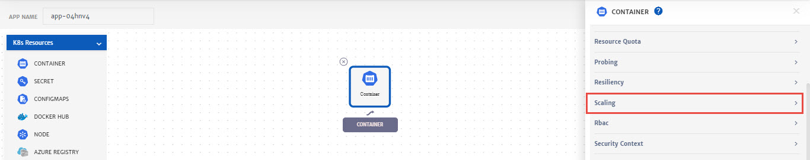
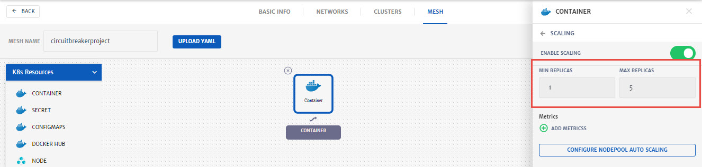
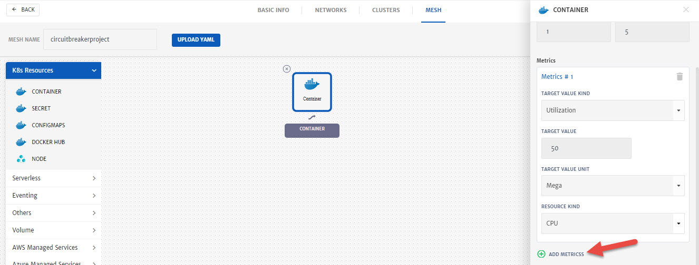
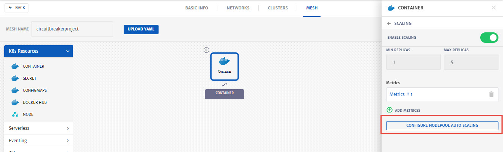
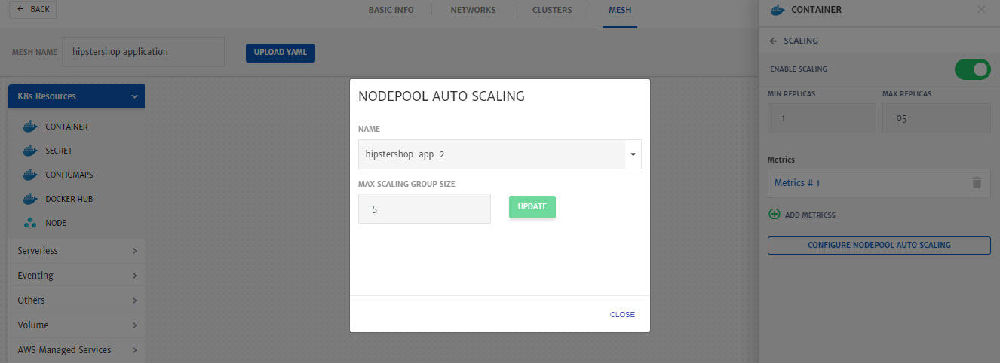

# Scaling

As MegaMesh is a cloud management platform, it provides all the necessary cloud solutions and features to its users. In the IT world it is difficult to predict the growth of applications, storage capacity with time. To maintain consistent performance of different workloads over time, it is necessary that IT managers keep the resource requirement in check. Keeping this use case in mind, CloudPlex have provided the feature of Scaling to their users. Now in order to keep up with the workload, you can easily scale up/down your resources as per requirements.

MegaMesh provides a comprehensive auto-scaling solution. It has the ability to scale infrastructure dynamically by continuously monitoring the applications, keeping track of resource consumption and adjusting the capacity of resources for high performance. 

MegaMesh provides an interactive and easy to navigate UI to define scaling policy. 

There are two types of scaling supported in platform:

1. Container Scaling
2. Node Scaling

Below are the details of the configurations required to setup scaling in platform.

## Container Scaling

Whenever the resources consumption of the container gets too high or low (based on threshold set), scaling action will be performed. For each container service, users will be able to configure policy configuration. 

**Configurations**

User can configure scaling using multiple metrics. Following metrics are available in platform.

- CPU
- Memory 
- Storage

Threshold value of chosen metrics in can be defined in two forms

- Average Value
- Average Utilization

User can also define the MIN and MAX value for number of replicas of running containers. Whenever the threshold is reached, number of replicas will automatically adjust in the range defined by the user.

User can define only one container policy for each container service in the Project.

Now let’s move to step by step process on how to setup Container scaling.

**Container Scaling**

1. Go to the **Solution** tab, configure **Container**, click **Advance Settings** and **Enable Scaling**.

   

2. Specify MIN and MAX number for container replicas. 

   

3. Click **Add Metrics** and configure the threshold for scaling

   - Select **Target Value Kind** from drop-down i.e. **Utilization** % of resource, Value, Average. 
   - Specify the **Target Value** for the **Kind** selected above.
   - Select the **Target Value Unit** e.g. Mega, Giga etc. 
   - Select **Resource Kind** e.g. CPU, Memory etc. If the threshold is reached for this resource scaling will be initiated. 

   

4. Click **Save** to save container configurations.

## Node Scaling

If any pod gets into pending state due to insufficient capacity in the cluster or if the nodes in the clusters are underutilized due to low number of running containers, In these cases, MegaMesh will automatically scale up (launch a new node) and scale down (terminate the idle node) respectively on Cloud provider selected by the user in the Project.

**Configuration** 

User can define the MIN and MAX number of nodes.

Whenever a new node gets launched by autoscaling, CP will fetch its details and show it in Project. It will also clean up the details of terminated node from the Project UI.

Node scaling can only be defined on Project level

User can’t define scaling on Master pool.

Now let’s move to step by step process on how to setup Node scaling.

**Node Scaling**

1. Start a Project creation wizard and go to the **Cluster** configuration.

2. Add a 2nd node pool.
   **Note**: 1st node pool is always Master Pool and user can’t define a scaling on it.

   

3. Scroll down and use the radio button to enable scaling.

4. Specify the **Max Scaling Group Size** i.e. the number that node can be scaled to in case of resource requirement. (Conditions will be set at container level scaling)

   