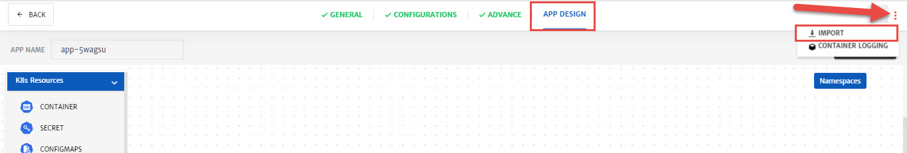
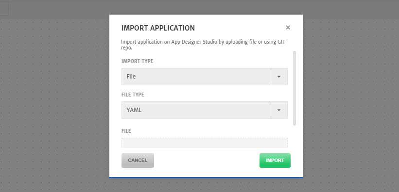

# Service Import

Service import feature can be used to import pre-configured services to CloudPlex. CloudPlex makes it easy for the users to manage different clouds using easy to use drag-n-drop interface. Using service import feature, rather than configuring services like container etc. from scratch, user can import pre-configured services to the CloudPlex and make them part of an Application. Once they are part of an application, services can easily be deployed on the cloud provider of their choice. 

Let's move to the step by step process of importing a service on CloudPlex.

> It is recommended that user get a feel of CloudPlex service creation process interface interface before importing a service. Check out our getting guide started [here](/pages/user-guide/getting-started/getting-started) for a hands-on experience of application deployment using CloudPlex.

1. While configuring Application, navigate to the **App Design** tab, click **Three Dots Icon** on the right side of the screen and select **Import**. 

   

2. Select **Import Type** from drop-down. You can import the service using **File Upload** or from **Git** repository.

   > For Git import, only public repository can be used. 

   

3. Select **File Type** from drop-down. **YAML** and **HELM** are the supported files types to import the service. 
   You can upload more than one file as well.

4. Click **Import**.

   