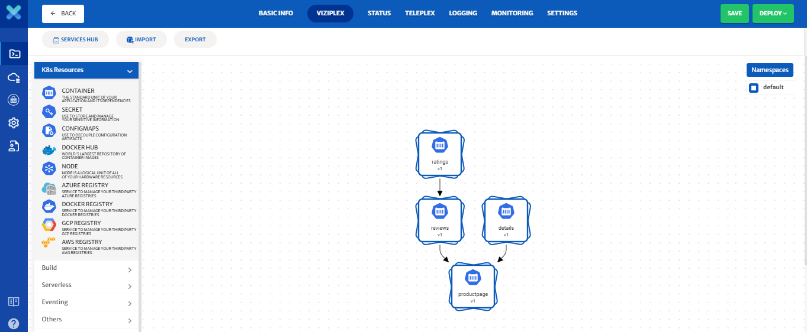
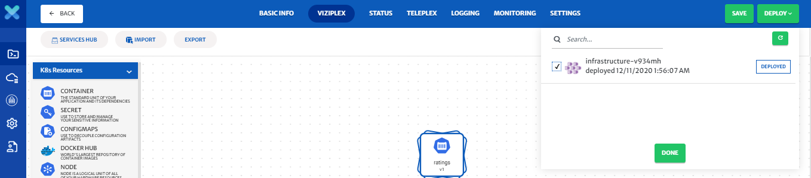
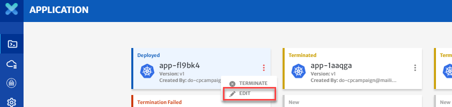
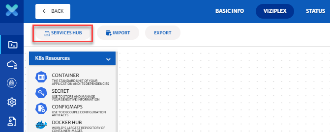
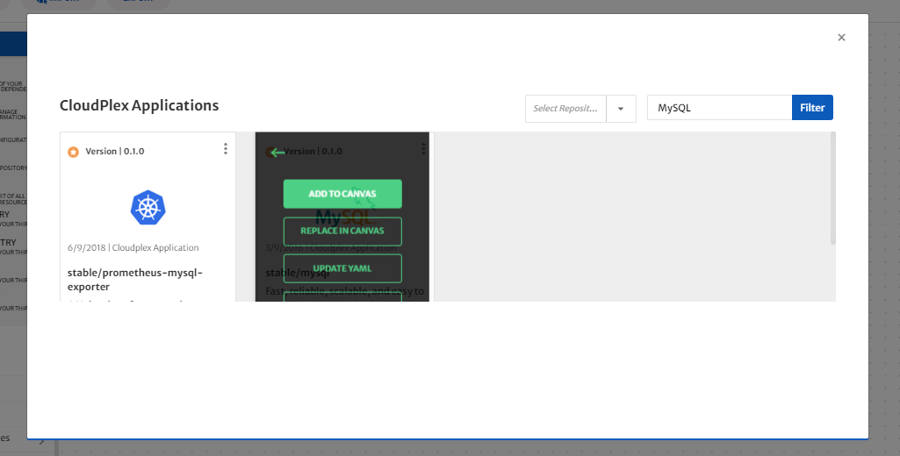
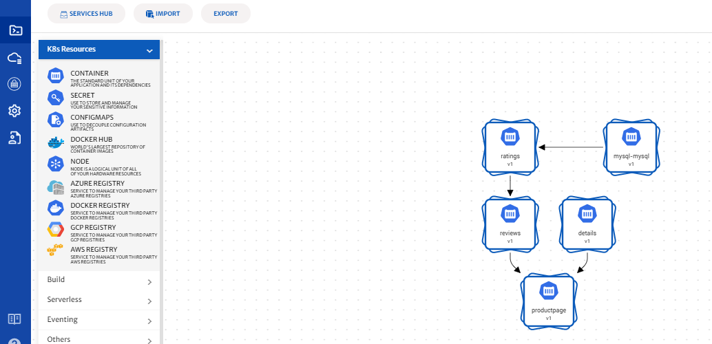
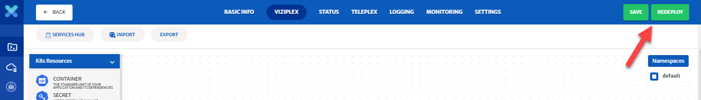
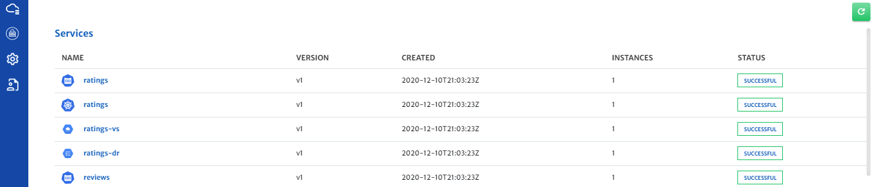
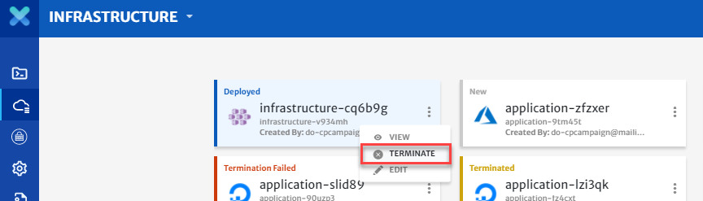

# ServicePlex

ServicePlex is a part of [ViziPlex](/pages/user-guide/components/viziplex/viziplex?id=viziplex). With ServicePlex, user can add Kubernetes-ready services to the applications in seconds. User can choose from 1000s of kubernetes-ready reusable components in the ServicePlex hub and simply drop them in the application. CloudPlex takes care of the all the integration heavy-lifting. 

Purpose of this guide is to show how a user can use ServicePlex to add a service to a deployed application and redeploy it with the added service. For video guide on this, click [here](https://www.youtube.com/watch?v=GCX0BQJTSrE).

1. We will start with the book info application. To build this application, see our [guide](/pages/user-guide/getting-started/how-to-build-application-with-cloudplex/how-to-build-application-with-cloudplex?id=how-to-build-application-with-cloudplex) on how to build your first application with CloudPlex.

2. Now that you have configured your application let’s deploy it in the cloud.

   

3. Click on the **Deploy** button to select infrastructures on which you want to deploy your application. You may select one or more infrastructures. 

   

4. Now that the application has been deployed, let’s edit the deployed application

   

5. Click on the app tab and then on the **Edit** button to open the application. 

6. Click on the **Next** button to get to ViziPlex.

7. Open up ServicePlex by clicking on the **Service Hub** button.

   

8. Type **MySQL** in the search bar and click on the filter button

9. Scroll down and select the **stable/mysql** service.

   

10. Click on the options and select **Add To Canvas** to add the service to your application.

11. Back on the design canvas in ViziPlex you can drag the service to a more convenient location.

12. Now let’s create a dependency between the services. Drag an arrow from the MySQL service and drop it on the **Ratings** service. 

    

13. Now that your application has been reconfigured, it is time to redeploy it. 

14. Click on the **Redeploy** button to redeploy your application.

    

15. You will be redirected to logging.

16. Once the application redeploys you can check the status of your application by clicking on the status tab where you can see the real-time status of your services, including the new services you just added. 

    

17. You can see the application you just deployed by copying the Ingress IP address from the status tab 

18. Open a new browser tab and paste the ingress IP address. You will see your application deployed on the Kubernetes cluster you created with KubePlex. 

19. Do not forget to terminate your application when you are done.

20. Click on the terminate button for application to delete all your resources from your infrastructure.

    

21. Do not forget to terminate your infrastructure when you are done with it as well. 

    > You will not be able to terminate your infrastructure until all applications deployed on it are terminated first. 

**Conclusion**

You just used ServicePlex to add MySQL to a deployed application using CloudPlex, the Kubernetes Application Platform for Developers