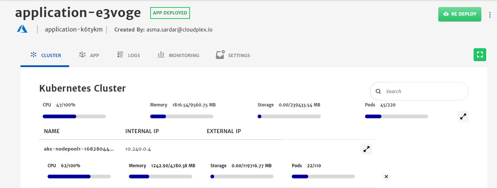
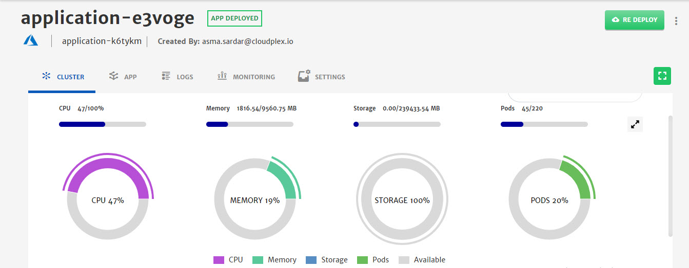

# Live Cluster Health

Live cluster health generates and provides all the data live related to the cluster, e.g. CPU usage, memory usage, running pod, in the form of visual dashboard. Cluster health makes it easier for the developers to make changes to the cluster while spending less time on analysis or performance of the application. 

>  Live cluster health will only be available for the deployed (Status: App Deployed) Applications. 

To check cluster health of any application, go to the Application tab from the top bar and select any application with status **App Deployed**.

You can also expand the view to get different visual experience as per your liking. 

