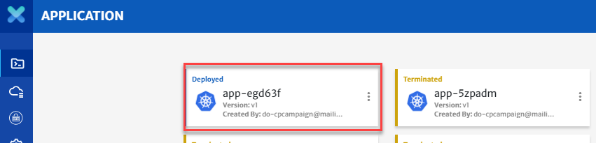
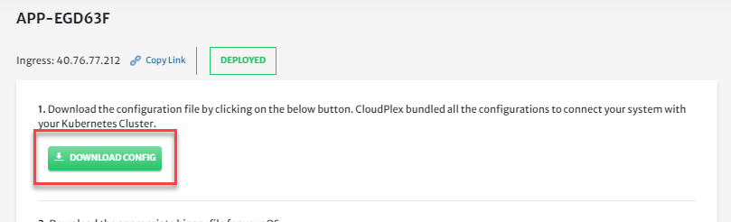
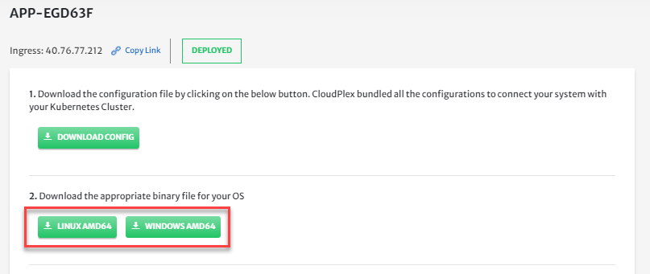
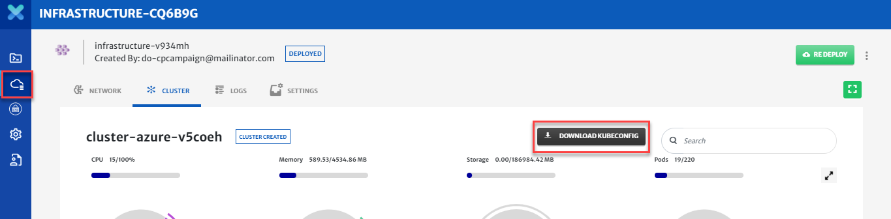
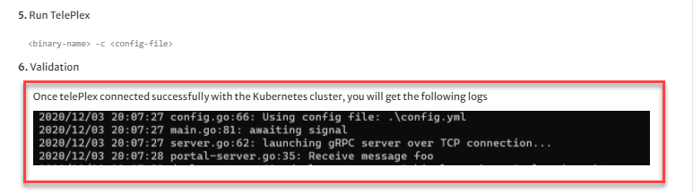
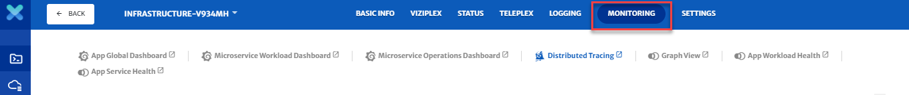

# TelePlex

TelePlex is the X-Ray glasses for your cloud applications, and allows you to debug directly from IntelliJ, VS Code, or other IDEs into the Kubernetes Cluster.

All the other components of CloudPlex are involved with creating and configuring infrastructure and applications. TelePlex is concerned with testing, troubleshooting, and debugging your applications once deployed. 

Once an application is designed, configured, built, and deployed on the dev cloud, users can test and debug their application using TelePlex. CloudPlex provides a comprehensive set of troubleshooting, debugging and diagnostics dashboards.

Now lets take you through the step by step process of how you can get the best out of TelePlex. For video guide, please click [here](https://drive.google.com/file/d/1i7X0hV3CpuBD6UjchLDWWeCFdRqXxyb7/view?usp=sharing).

1. Make sure your application is **Deployed** and click on the application. (Check out our guide on how to build application [here](/pages/user-guide/getting-started/build-application-with-cloudplex/build-application-with-cloudplex?id=build-application-with-cloudplex))

   

2. Navigate to **TelePlex**.
   
   
   
3. Now you need to download and install the TelePlex proxy.
   
   1. Download the configuration file.
   
      
   
   2. Download the correct binary file for your operating system.
   
      
   
   3. Now go to Infrastructure, download the Kubeconfig file of your kubernetes cluster and add the path of your file with the kubeconfig parameter in the downloaded configurations file as shown in the video.
   
      
   
   4. Run TelePlex using the command **./portal.exe -c config.yml**
   
   5. Once this validates you will see the logs shown. Now we are ready to test and debug our application.
   
      
   
4. Developers can test and debug the application directly from their IDEs to the cloud without repeatedly pushing, building, and deploying code to a kubernetes cluster. 

5. You can trace through the debugging dashboards to visually debug your application.

   

6. TelePlex provides a comprehensive set of troubleshooting, debugging and diagnostics dashboards.using Grafana, Prometheus, Jaeger, and Kiali.

7. With **Graph view,** you can visualize the topology of your application and provide visibility into features like request routing, circuit breakers, request rates, latency, and more.

8. With the **Microservices dashboard,** you can diagnose from where the request is coming and where the request is going. This way you can identify latency, request and response sizes, etc.

9. CloudPlex monitoring dashboards provide multiple views to troubleshoot, debug, and diagnose your application.

**Conclusion**

Hopefully, you now have a better understanding of TelePlex and you are on your way to debug and troubleshoot your applications with CloudPlex, the Kubernetes Application Platform for Developers. 