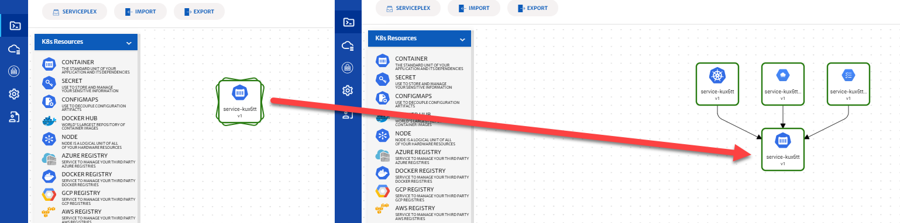
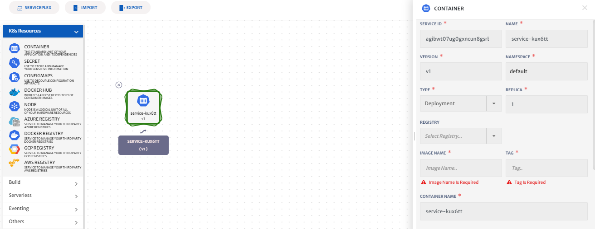

# ViziPlex

CloudPlex provides a drag-n-drop Application Designer to design and configure your applications called ViziPlex. It is divided into 3 parts.

1. Services Palette
2. Design Canvas
3. Configuration Panel

## Services Palette

CloudPlex has organized the services in categories such as K8s Resources, Serverless, Managed services. You can select services from the palette and drag them onto the design canvas to design and configure your application.

CloudPlex provides default configurations for all Kubernetes parameters out of the box. Developers only need to provide minimal Kubernetes configurations but always have the option to override any configuration parameter.

Here is what CloudPlex has inside different service categories:

### K8s Resources

1. Container
  If you have all the information about your docker image, and you don’t need to search for it in a registry, use the container service. This service allows you to run your images as Kubernetes workload, such as Deployment, or StatefulSet.

2. Secret
  CloudPlex platform provides a secret management service that provides the ability to store sensitive data such as passwords, tokens, and certificates in Cloudplex. 

  Any data entered in this service is stored in a secure vault with at-rest encryption. This eventually becomes a Kubernetes secret at the time of deployment in the application.

3. ConfigMap
ConfigMap is similar to Secrets but provides a means of working with data that does not contain sensitive information. It allows you to decouple configuration artifacts from image content to keep containerized applications portable. The data can be consumed in pods. 

4. Searchable Registries
  This searchable registries allow you to search any image from any public or private docker registry, and add them to your application.

  1. Public Registry
    CloudPlex has integrated with DockerHub where 2.4 Million images are available. Once you select your desired image, CloudPlex automatically pulls the metadata from the registry and fills out the configuration parameters accordingly. 
  2. Private Registry
    CloudPlex provides you support for all private docker registries such as ACR, GCR, ECR, JFrog, Harbor. You can search any image from your registry and CloudPlex will automatically pull the metadata from the registry and fill out the configuration parameters accordingly.

## Design Canvas

CloudPlex gives you an intuitive visual experience where you can drag-n-drop services from the palette onto the canvas. Once you drop services from the palette you can configure your services, and create dependencies between them.

CloudPlex makes it very easy to visualize your services with different colors for different namespaces. The icons represent the type of service. For instance, Container, Kubernetes service, ConfigMap, etc. are represented by different icons. 

To provide a clean and elegant view of services, CloudPlex introduced the concept of grouping services. All the relevant services are grouped and shown as a group icon on the Canvas. Double-clicking on the group icon will expand it and show all the services available in the group. For example, when you configure a container, and attach a persistent volume, CloudPlex will automatically create a group icon for Container, Kubernetes Service, Persistent Volume Claim, StorageClass, etc. 

## Configurations Panel

Configuration panel appears on the right side when you click on a service in the Design Canvas. CloudPlex populates default values of configurations for each service, which the user can override. 

CloudPlex divides configurations into two categories:  Basic and Advanced. If you are new to Kubernetes artifacts you can simply select Basic and let the platform provide all configurations. 

More advanced configuration parameters such as  Probing, Volumes, Resource Quota, Deployment strategy, Security, Scaling, etc. are available under the Advance category, for users who are more familiar with Kubernetes. 

## Conclusion

Once you application has been configured you have 3 options. You can save your application, export it as a helm chart, or you can deploy it directly to any deployed infrastructure right from the platform. 