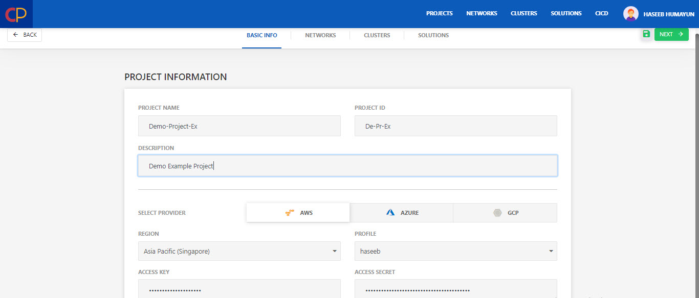
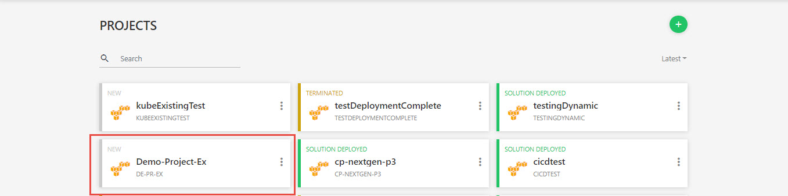

# Lab 1 (Deployment Using Saved Templates)

1. Login to Mega Mesh and click the green **+** icon to start the project creation wizard. 

   

2. Configure the **Basic Info** tab.

   - Enter **Project Name** and **Project ID**.
   - Enter **Description**.
   - Select the **Cloud Provider** and specify necessary account details for the account.
   - Select **Region** as per requirements.
   - Select any saved **Profile** from the drop-down or enter the credentials manually. 

   

3. Click **Next**.

4. Configure **Networks**.

   - Click **Templates** button to get the list of saved templates.

   

   - Select any saved template and click **Apply**.

   

   - Now that template is selected, click **Next**.

   

5. Configure **Clusters**.

   - Click **Templates** button to get the list of saved templates.

   

   - Select any saved template and click **Apply**.

   

   - Now that template is selected, click **Next**.

   

6. Configure **Solutions**.

   - Click **Templates** button to get the list of saved templates.

   

   - Select any saved template and click **Apply**.

   

   - Now that template is selected, click **Save** (green floppy icon at the top right) to save project.

   

7. Click the Project, you just created. 

   

8. Click **Start** to deploy the project

   

9. Go to the **Logs** tab to check logs related to the deployment.

   

10. To check the status of **Cluster**, **Network**, and **Solution**, go to the relevant tab.

    

    

11. Once the solution is deployed, go to the **Monitoring** tab to see detailed graphs related to Mesh performance.

    

    # Lab 2 (Deployment Using New Templates)

    1. Login to Mega Mesh and click the green **+** icon to start the project creation wizard. 

       

    2. Configure the **Basic Info** tab.

       - Enter **Project Name** and **Project ID**.
       - Enter **Description**.
       - Select the **Cloud Provider** and specify necessary account details for the account.
       - Select **Region** as per requirements.
       - Select any saved **Profile** from the drop-down or enter the credentials manually. 

       

    3. Click **Next**.

    4. Configure **Networks**.

       - Enter **Network Name**.

       - Select **Virtual Private Cloud** from dropdown i.e. **New** or some existing network. (Existing networks will be listed based on account selected)

         > **Note:** This guide explains the process of New Network Creation, for existing you just need to select Subnet etc from drop-down.

       - Enter **VPC Name**. 

       - Specify **VPC CIDR**.

       

       - To add Subnet, go to the **Subnets** tab, click **+** icon and specify the **Subnet Name** and **CIDR**.

       

       - To add Security Group (SG), go to the **Security Groups** tab.
       - Specify the **SG Name** and **Description**.
         - Click the **+** icon on the **TEST-SG** button to add Traffic Rules. (You can add multiple rules as well)
         - Select the **Rule Type** as per requirement i.e. **Inbound** or **Outbound**.
         - Specify the rule **Protocol** i.e. TCP, UDP etc. 
         - Specify **Source**. e.g. 0.0.0.0/0. 
           The Source can be an IPv4 addresses or range of IPv4 addresses in CIDR notation.
         - Specify the **Ports** that will be exposed to traffic. 
         - Select the rule **Type** from dropdown e.g. Custom TCP, Custom UDP etc.

       

    5. Click **Next**.

    6. Configure **Clusters**.

       - Enter **Cluster Name** and click **Add Node Pools** button. 
       - Enter **Node Pool Name**.
       - Specify **Node Count** and **Machine Type** from the dropdown.

       

       - Select **Subnet** and **Security Groups** from dropdown.
       - Select **Key Type** from dropdown i.e. **Existing** in this case.
       - Specify the **AMI ID** and **AMI Username**.
       - For **Root Volume** of node, select **Volume Type** from drop-down.
       - Specify the **Volume Size** and **IOPS** for volume. 

       

       - (Optional) Use to toggle button to use **Docker Data Volume** and select the **Volume Type**, **Volume Size** and **IOPS**.
         - Check **Delete on Termination** to delete the volume on Project termination. 

       

    7. Click **Next**.

    8. Configure **Solutions**.

       - Drag and drop the **Container** in the package canvas from left column.

       - Click on **Container** icon to configure the settings.

         - Enter the **Name** and **Version**.
         - Enter **Namespace** or select any existing from drop-down.
         - Select the **Type** from drop-down i.e. **Deployment** in this case.

         

         - From **Registry** drop-down, click **New** and specify **Registry Name, Username** and **Password**. (Click **Save Docker Credentials** to use for future projects)

         

         - Specify **Image Name** and **Tag**.
         - Add **Environment Variable**. It is necessary to add at least one which in our case is **MYSQL_ROOT_PASSWORD**

         

         - Click **Add Port +** button and specify the port for Traffic i.e. **8080**

         

         - Click **Save.**

    9. Click **Save** (green floppy icon at the top right) to save the project.

       

    10. Click the Project, you just created. 

        

    11. Click **Start** to deploy the project

        