# Attach Persistent Volume with Application

The purpose of this guide is to take user through the process of attaching a persistent volume with application and deployment. For a video guide, please click [here](https://drive.google.com/file/d/129MO_dYTHKg4AuchSQ4TkAp5TI4LqEzV/view?usp=sharing).

**Configure the Persistent Volume with MySQL Container**

Here is how we can attach a persistent volume with MySQL application.

1. Click on the **Create** new application button.

   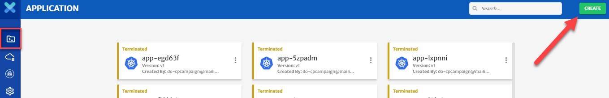

2. **Select** create new application and provide basic information.

   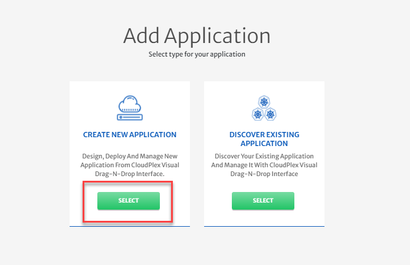

3. Click on the **Next** button.

   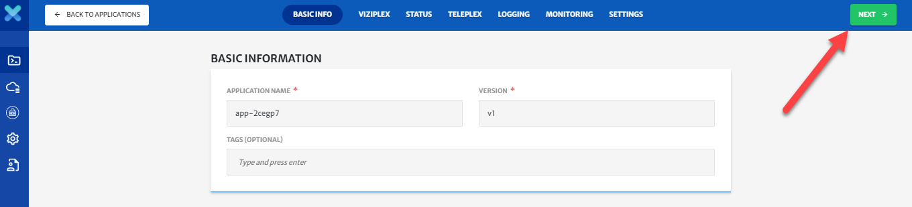

4. Before attaching a volume to the MySQL container, we need to first create and configure a CloudPlex secret service and a mysql container.

5. To create and configure a Mysql container, see our video **How to deploy a MySQL server with a Kubernetes Secret.**

   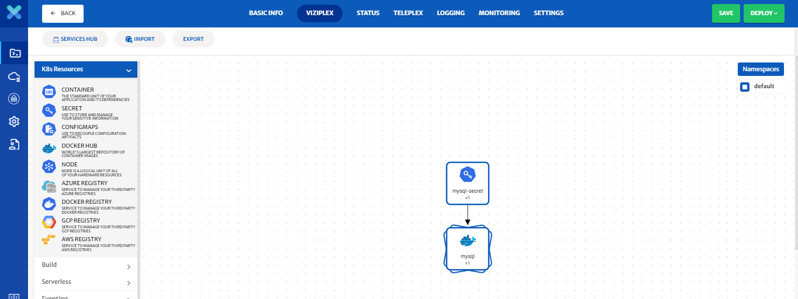

6. Now that you have created a MySQL container and a CloudPlex secret service, let’s attach persistent volume.

   > There are many types of volumes, such as persistentVolume, hostPath, and emptyDir. CloudPlex provides support for all these volume types and an easy to use interface to use all of them.

7. Click on the MySQL container and click on **Advanced Configurations**.

   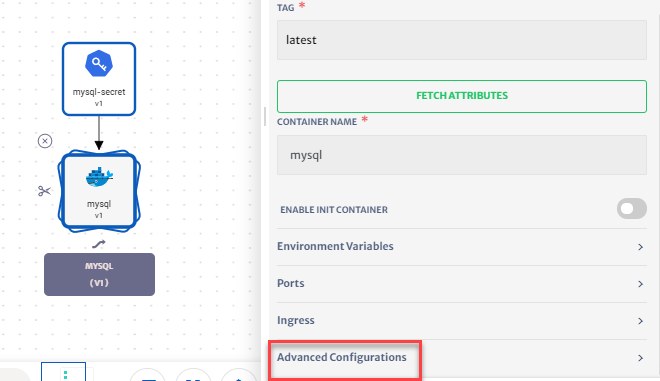

8. Select **Container Volumes.** For this video, let's select **Persistent Volume**. Click on new to create a new Persistent Volume. CloudPlex will take you to the volume configurations panel. 

   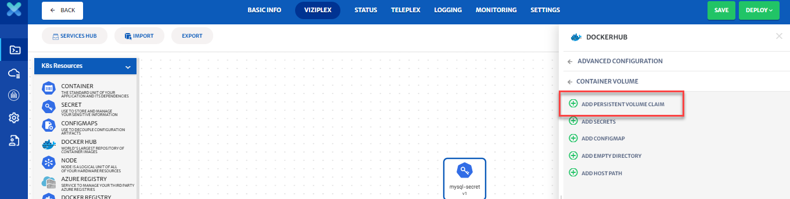

9. CloudPlex automatically populates default values for persistent volume. (Service Id, Service Name, Namespace)

10. Select **ReadWriteMany** from the Access Mode and enter **10Gi** in both the request and limit quantities.

    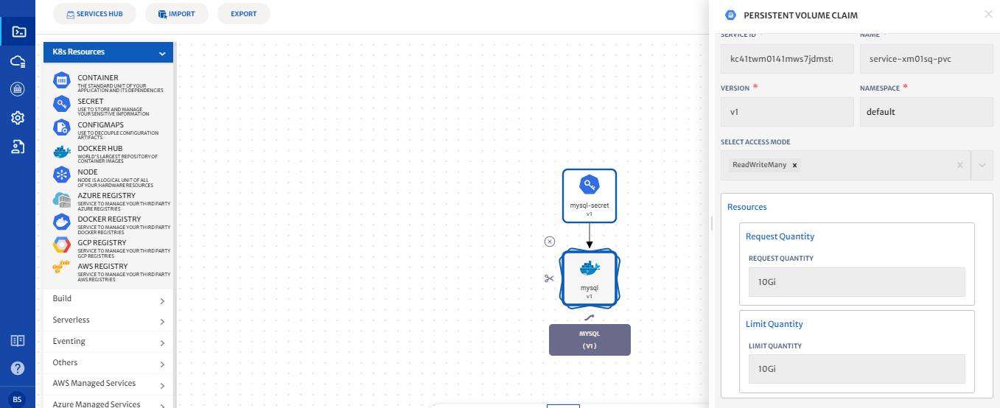

11. Click on the **Save** button to save the service.

12. Saving will take you back to container service configurations. Now, provide the volume mount path of **/var/lib/mysql**. 

    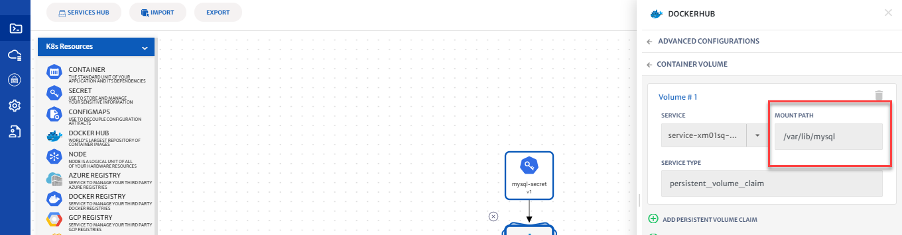

13. Click on the **Save** button to save the service.

    > All the Kubernetes manifests required to create a persistent volume (persistent volume claim, storageclass) are automatically created by the platform.

**Deploy MySQL on the Cluster**

1. Before you deploy your application, define and configure the Kubernetes cluster you want to deploy it on.

   > For detailed guide, click [here](/pages/user-guide/getting-started/deploy-infrastructure-using-kubeplex/deploy-infrastructure-using-kubeplex?id=deploy-infrastructure-using-kubeplex).

2. Click on the **Deploy** button and select infrastructure to start deploying the application on using the infrastructure you created with KubePlex.

   

3. You will see logs as the application deployment progresses.

   

4. Go the **KubePlex** tab from left bar, select the **Deployed** infrastructure and click on the **Cluster** tab to see the live status of your cluster.

   

5. “Cluster live status” is a complete dashboard that gives you the “live status” about the health and consumption of the nodes in your cluster.

   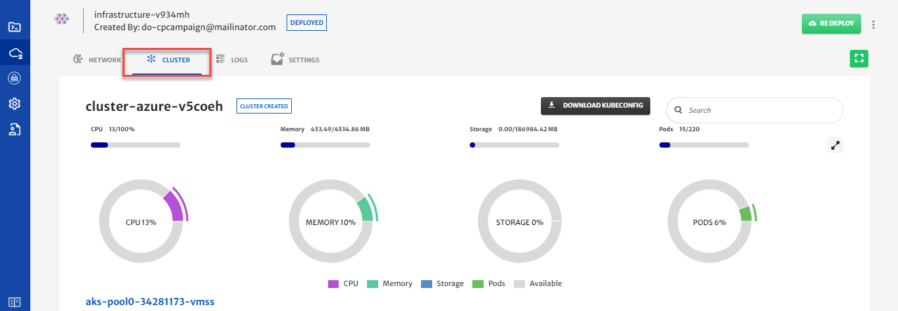

6. You can see the status of the application you just deployed by clicking on the **ViziPlex** tab from left bar, select the **Deployed** application and navigate to the status page to see the real time status of the MySQL service.

   

   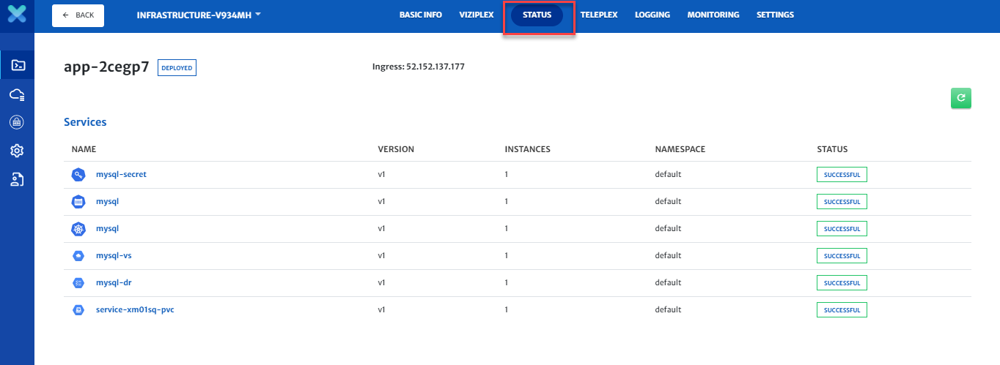

7. To avoid unnecessary costs, don’t forget to terminate your **Application** and then **Infrastructure** when you are done.

8. Click on the **ViziPlex** tab and then on the terminate button to delete all your resources from your infrastructure.

   

9. Do not forget to terminate your infrastructure as well when you are done with it.

   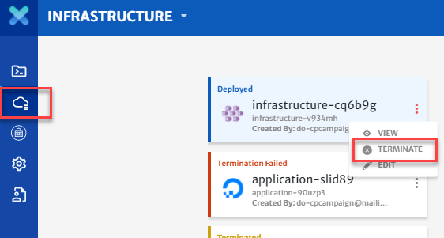

**Conclusion**

You just deployed MySQL server with a persistent volume using CloudPlex, the Kubernetes Application Platform for Developers. 