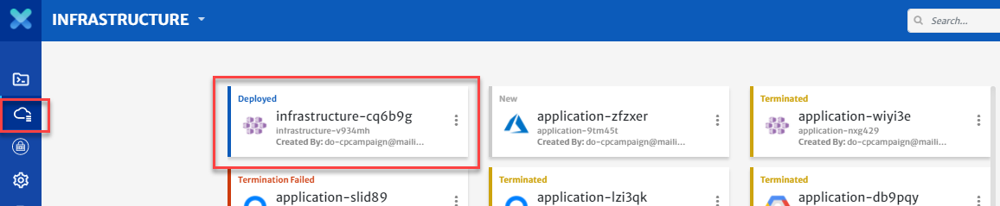

# Build Self-Healing Application

Kubernetes liveness and readiness probes can be used to make a service more robust and more resilient, by reducing operational issues and improving the quality of service. Kubernetes uses readiness probes to decide when the container is available for accepting traffic. A pod is considered ready when all of its containers are ready. Kubernetes uses liveness probes to know when to restart a container. If a container is unresponsive—due to some issue, restarting the container can make the application more available.

The purpose of this guide is to take user through the process of configuring Probing for an application to make the application self-healing. There are two kind of probes.

**Liveness:** The kubelet uses liveness probes to know when to restart a Container. For example, liveness probes could catch a deadlock, where an application is running, but unable to make progress. Restarting a Container in such a state can help to make the application more available despite bugs

**Readiness:** The kubelet uses readiness probes to know when a Container is ready to start accepting traffic. A Pod is considered ready when all of its Containers are ready. One use of this signal is to control which Pods are used as backends for Services.

Now lets move to the configuration process. For a video guide, please click [here](https://drive.google.com/file/d/1RP-MdLZGN5qCKnvLxsLZ1IPgDjcVojAr/view?usp=sharing).

**Configure Probing with your Application** 

1. Create and configure a sample application, called bookinfo. (To configure a sample application, please check out our Application guide [here](pages/user-guide/getting-started/build-application-with-cloudplex/build-application-with-cloudplex?id=build-application-with-cloudplex))

   

2. To configure readiness and liveness probes, click on the **productpage** container and click on **Advanced Configurations** and then select **Probing**.

   

3. Lets configure **Readiness** probe first as per the configurations mentioned below:

   - Handler --> Http Get

   - Path --> /health

   - Port --> 9080 

   - Host --> productpage

   - Initial Delay Seconds --> 5

   - Timeout Seconds --> 2 

   - Period Seconds --> 10 

   - Success Threshold --> 1 

   - Failure Threshold --> 1 

     > All field descriptions are available on the platform once you hover on the field.

     

4. Lets configure **Liveness** probe first as per the configurations mentioned below: 

   - Handler --> Http Get

   - Path --> /health

   - Port --> 9080 

   - Host --> productpage

   - Initial Delay Seconds --> 20

   - Timeout Seconds --> 5 

   - Period Seconds --> 30

   - Success Threshold --> 1 

   - Failure Threshold --> 3

     

5. Click on the **Save** button to save your service

**Deploy your Application on the Cluster**

1. Before you deploy your application, define and configure the Kubernetes cluster you want to deploy it on.

   > For detailed guide, click [here](/pages/user-guide/getting-started/deploy-infrastructure-using-kubeplex/deploy-infrastructure-using-kubeplex?id=deploy-infrastructure-using-kubeplex).

2. Click on the **Deploy** button and select infrastructure to start deploying the application on using the infrastructure you created with KubePlex.

   

3. You will see logs as the application deployment progresses.

   

4. Go the **KubePlex** tab from left bar, select the **Deployed** infrastructure and click on the **Cluster** tab to see the live status of your cluster.

   

5. “Cluster live status” is a complete dashboard that gives you the “live status” about the health and consumption of the nodes in your cluster.

   

6. You can see the status of the application you just deployed by clicking on the **ViziPlex** tab from left bar, select the **Deployed** application and navigate to the status page to see the real time status of the services.

   

7. To avoid unnecessary costs, don’t forget to terminate your **Application** and then **Infrastructure** when you are done.

8. Click on the **ViziPlex** tab and then on the terminate button to delete all your resources from your infrastructure.

   

9. Do not forget to terminate your infrastructure as well when you are done with it.

   

**Conclusion:**You just deployed the sample application with liveness and readiness probes to make a self-healing application using CloudPlex, the Kubernetes Application Platform for Developers. 