# Configure Circuit Breaking in Microservice

Please refer to our [video guide for a walkthrough](https://drive.google.com/file/d/1TP_KWGljRyOjfOPgxH4XabQVFSlsjHF_/view?usp=sharing) on how to perform the below mentioned operations in platform.

In this guide, we will show you how to configure Circuit Breaking in a microservice in 4 steps.

**Step 1: Create and Configure a Kubernetes cluster**

1. To configure a Kubernetes cluster, see our previous guide on [How to create and use a provider-managed Kubernetes cluster](pages/user-guide/getting-started/create-use-provider-managed-cluster/create-use-provider-managed-cluster?id=create-amp-use-provider-managed-cluster).

**Step 2: Configure the Httpbin Container**

1. Httpbin is a well-known HTTP testing service that can be used for experimenting with all kinds of APIs.

2. Drag-n-drop the **Docker Hub** service from pallet to the canvas.

   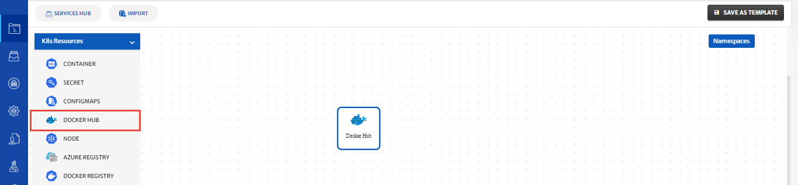

3. Click on the service to open the configuration panel on the right side.

4. Type **kennethreitz/httpbin** in the search bar, click on community and click on the **search** button.

   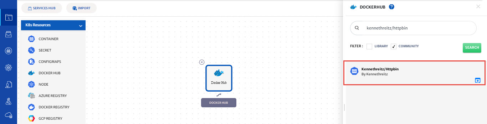

5. Select httpbin service.

6. CloudPlex automatically pulls all the tags and metadata of the image and populates default values of service (Service Id, Service Name, Namespace, Type)

   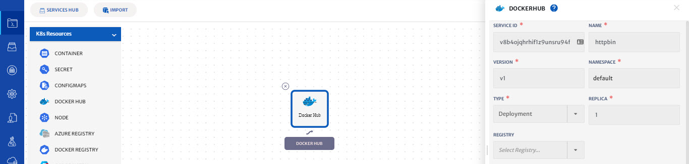

7. If you want to change the version of httpbin server, **select from Tags dropdown** and click on the **fetch attributes button** to fetch metadata of the image.

8. Cloudplex automatically discovers ports from Docker images and populates them in the **ports section** of the service.

9. Click on the **advanced settings** and select **Resiliency**.

10. Click on **Circuit Breaker** and provide circuit breaker options.

11. Circuit breaking is an important pattern for creating resilient microservice applications. Circuit breaking allows you to write applications that limit the impact of failures, latency spikes, and other undesirable effects of network peculiarities.

12. Type values in all the fields. **Max Request=1, MAX PENDING REQUESTS=1, MAX REQUESTS PER CONNECTION=1, MAX RETRIES=1**

    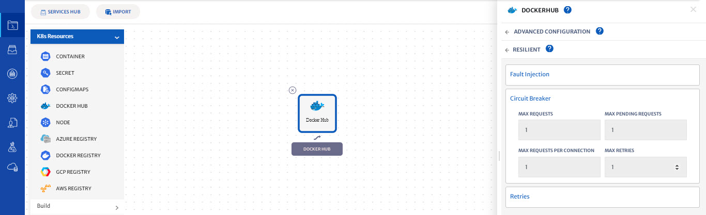

13. Click on the save button to save the service.

14. CloudPlex automatically generates the Kubernetes service manifest required for the service. If you want to modify any configuration, select the service and update it.

    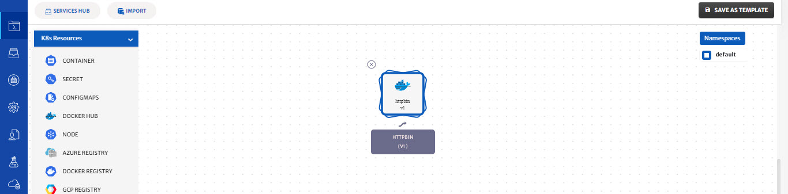

**Step 3: Configure the Fortio Container**

1. Fortio is a client to send traffic to the HTTP service. This is a simple load-testing client. It lets you control the number of connections, concurrency, and delays for outgoing HTTP calls. 

2. Drag-n-drop the **Docker Hub** service from pallet to the canvas.

3. Click on the service to open the configuration panel on the right side.

4. Type **fortio/fortio** in the search bar, click on community and click on the **search** button.

5. Select fortio service.

   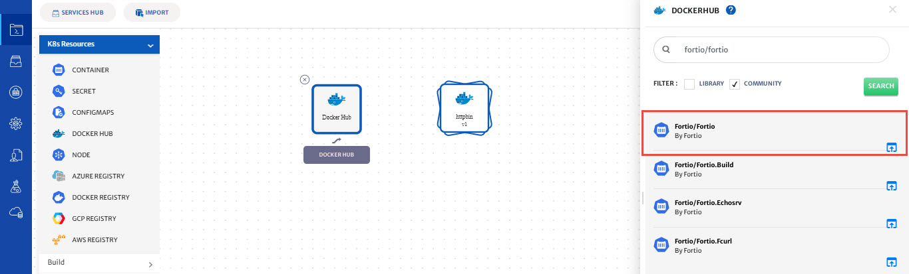

6. CloudPlex automatically pulls all the tags and metadata of the image and populates default values of service (Service Id, Service Name, Namespace, Type)

   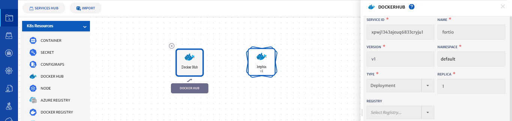

7. If you want to change the version of fortio server, select from Tags dropdown and click on the fetch attributes button to fetch metadata of the image.

8. Cloudplex automatically discovers ports from Docker images and populates them in the ports section of the service.

   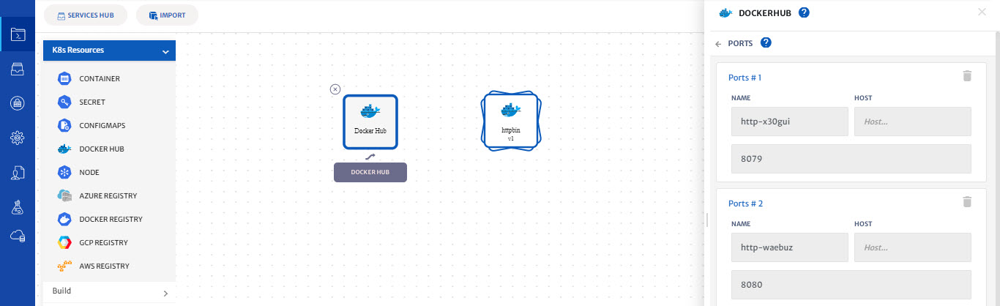

9. Click on the save button to save the service.

10. On saving the application, you will be taken to the status page

    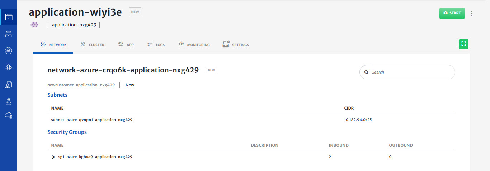

**Step 4: Deploy httpbin and fortio on the cluster**

1. Click on the Start button to start deploying the application on the cluster you have created

2. You will see logs as the application deployment progresses.

   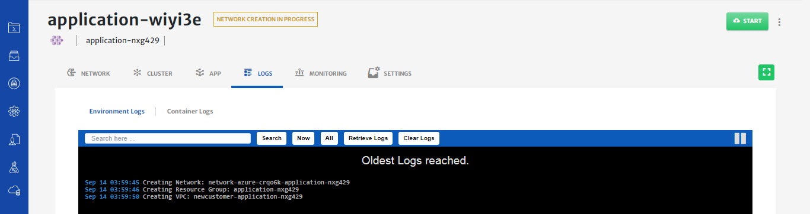

3. Click on the cluster tab to see the live status of your cluster.

4. “Cluster live status” is a complete dashboard that gives you the “live status” about the health and consumption of the nodes in your cluster.

   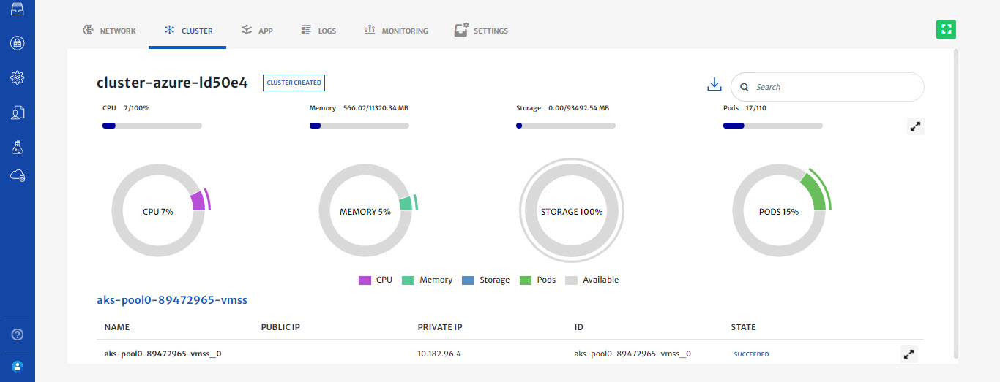

5. You can see the status of the application you just deployed by clicking on the app tab and click on Table view to see the realtime status of your services.

   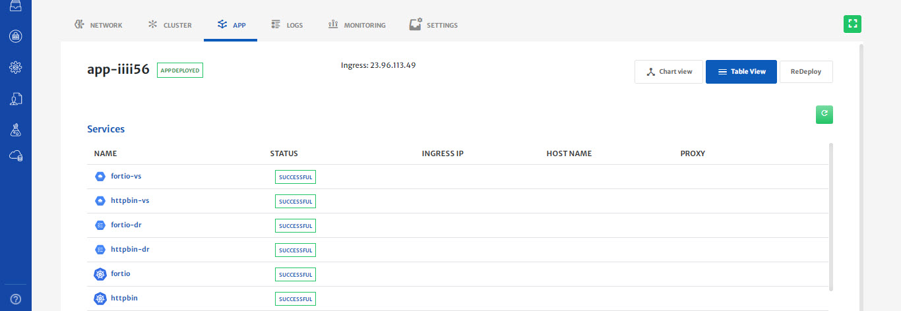

6. Download kubeconfig of your application and exec in fortio container container

   ***FORTIO_POD=$(kubectl get pods -lapp=fortio -o 'jsonpath={.items[0].metadata.name}')***

   ***kubectl exec -it "$FORTIO_POD"  -c fortio -- /usr/bin/fortio load -curl http://httpbin:80/get***

   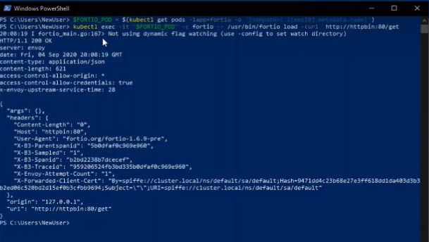

7. You can see the request succeeded! Now, it’s time to break requests.

8. Call the service with three concurrent connections (-c 3) and send 20 requests (-n 20):

   ***kubectl exec -it "$FORTIO_POD"  -c fortio -- /usr/bin/fortio load -c 3 -qps 0 -n 20 -loglevel Warning http://httpbin:80/get***

9. Now you start to see the expected circuit breaking behavior. 

   - Code 200 : 8 (40.0 %)
   - Code 503 : 12 (60.0 %)

   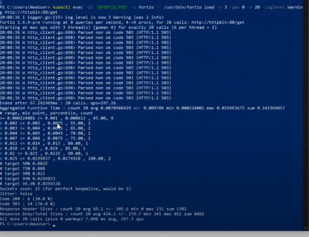

10. This is how you can limit the impact of failures, latency spikes, and other undesirable effects of network peculiarities.

11. To avoid unnecessary costs, don’t forget to terminate your application when you are done.

12. Click on the terminate button to delete all your resources from Cloud.

    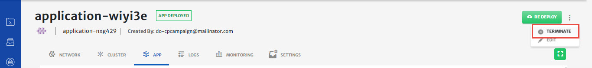

**Conclusion:**

1. You just deployed a sample microservice with circuit breaking configurations using CloudPlex, the Kubernetes Application Platform for Developers. 