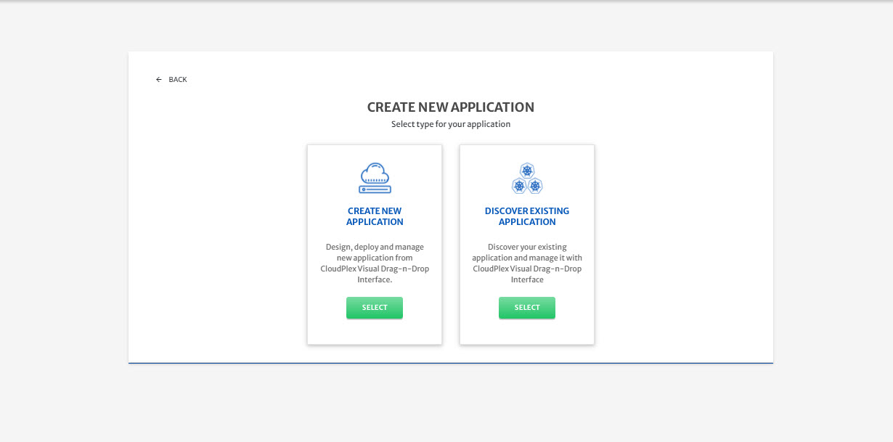
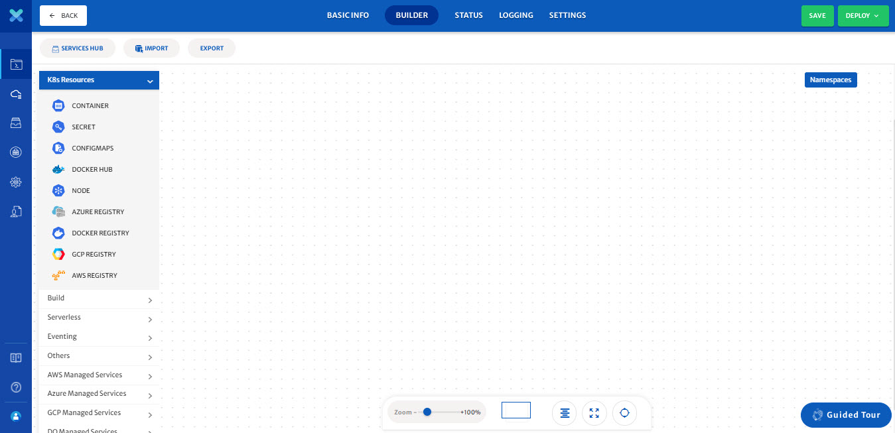

# Create New Application

In CloudPlex an intuitive drag and drop canvas can be used to design, configure, and deploy Kubernetes applications — without the pain of YAML manifest and config files. We understand that Kubernetes YAML configurations are complex so CloudPlex automatically generates and validates YAML manifest, and config files. 

Here is a step by step guide on how you can design new application from scratch application using CloudPlex drag and drop view. 

1. Click on the application icon from left pane and click **Create Application**.

   

2. **Select** create new application.

   

3. Configure the **Basic Info** tab and click **Next**.

   

4. Application builder view will open up.

   - You can drag any service from left pane and drop it into the canvas to configure it.

   > For detailed guide on how each service can be configured, please visit our Overview guide by clicking [here](/pages/user-guide/components/components?id=components). 

   

5. Using application designer, you can build an application and save it for future use or deploy it right away on an infrastructure. (To deploy, an existing infrastructure will be needed, click [here](/pages/user-guide/getting-started/how-to-configure-infrastructure/how-to-configure-infrastructure?id=how-to-configure-infrastructure) to learn more)