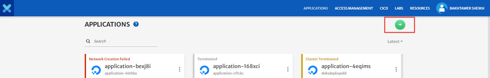
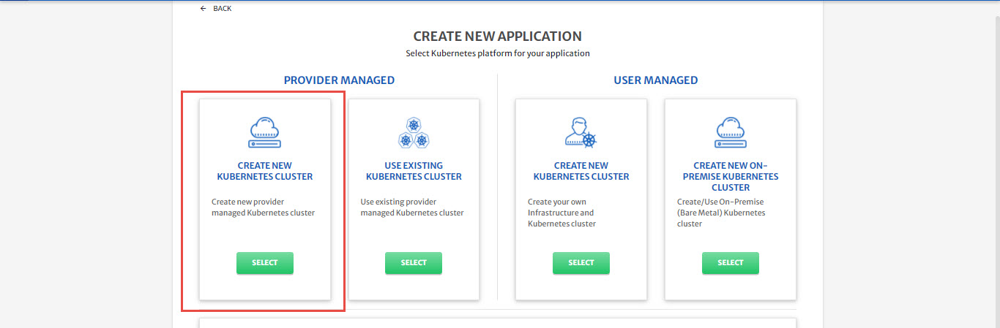
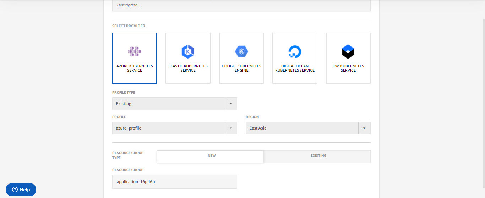
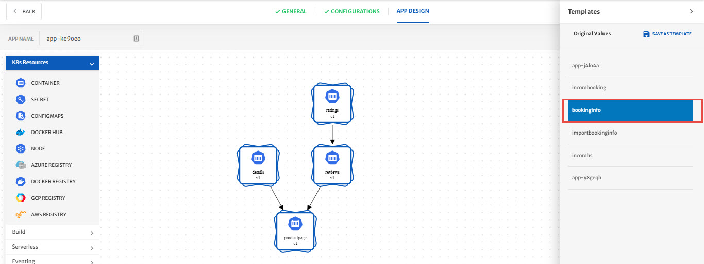
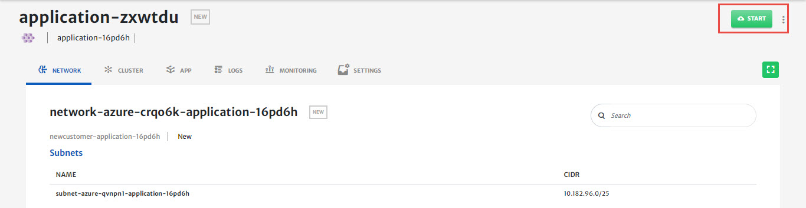
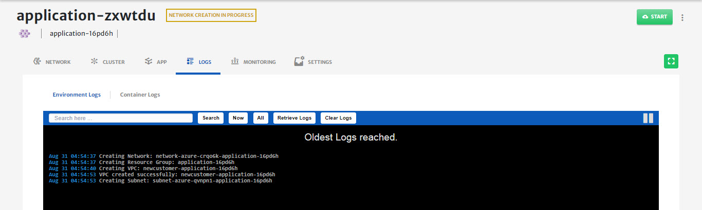
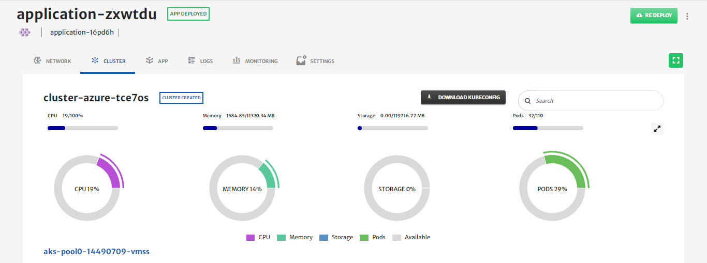
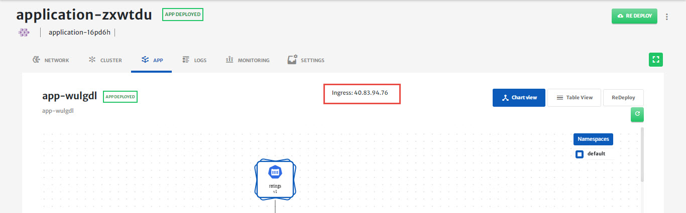
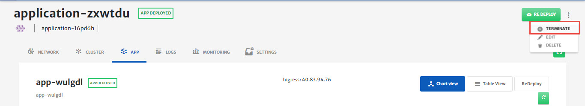

# Create & Use Provider Managed Cluster

Please refer to our [video guide for a walkthrough](https://www.youtube.com/watch?v=pt1cp0nQYc4) on how to perform the below mentioned operations in platform. 

In this guide, we will show you how to create and use a provider managed Kubernetes cluster in 3 easy steps.

**Step 1: Create and Configure a Kubernetes cluster**

1. To create a new provider managed Kubernetes cluster, click the “create new application” button.

   

2. Select “create new provider managed” Kubernetes cluster.

   

3. Provide basic information.

4. For this video, we will use Azure managed Kubernetes (AKS) as an example. You must have an account with Azure.

5. Provide your Azure credentials and save them as a profile for future use.

6. Select the region & zone where you want to deploy your application.

7. You can select either an existing resource group, if you have one; or create a new resource group. 

   

8. Click on the next button.

9. Cloudplex gives you three levels of configuration options, “simple”, “advanced”, and “expert”. 

10. 1. In simple mode, CloudPlex requires machine type and number of nodes from the user and the rest of the configuration will be populated by the platform.

    2. In advanced mode, you are able to customize your Kubernetes cluster including addition of multiple node pools, selection of Kubernetes version, and other features. Details vary from cloud to cloud.

    3. In expert mode, you are also able to customize networking and other complex features. Details vary from cloud to cloud.

    4. CloudPlex selects simple mode as the default option. We are using the default option for this guide.

    5. You have selected a Kubernetes cluster on Azure with the default configuration. This completes your cluster.

       

**Step 2: Configure the sample application** 

1. Let’s select an application to run on the cluster you have created.  

2. Click on the next button.

3. To configure your application, please select “bookinfo application” from the template section.

   

4. For this video, we are using default application configuration by the platform.

5. We will describe the “application configuration” process in a separate guide.

6. On saving the application, you will be taken to the status page

**Step 3: Deploy application on configured cluster**

1. Click on the Start button to start deploying the application on the Azure cluster you created above.

   

2. You will see the logs as the application deployment progresses.

   

3. Click on the cluster tab to see the live status of your cluster.

   

4. “Cluster live status” is a complete dashboard that gives you the “live status” about the health and consumption of the nodes in your cluster 

5. You can see the application you just deployed by clicking on the app tab and copying the Ingress IP address.

   

6. Open a new browser tab and paste the ingress IP address. You will see your application deployed on the Azure  Kubernetes cluster you just created.

7. To avoid unnecessary costs, don’t forget to terminate your application when you are done.

8. Click on the terminate button to delete all your resources from Azure.

   

**Conclusion:**

1. You just created a provider-managed kubernetes cluster and deployed an application on it using CloudPlex, the Kubernetes Application Platform for Developers. 