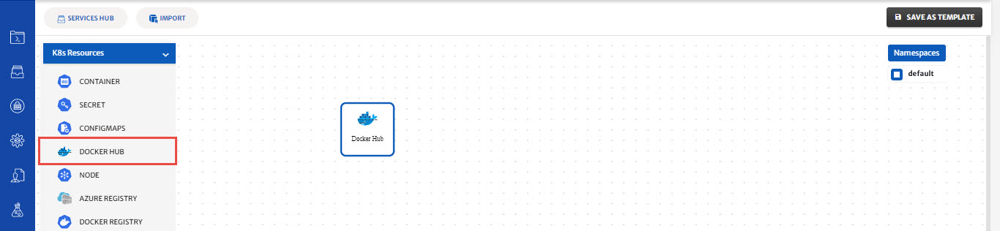
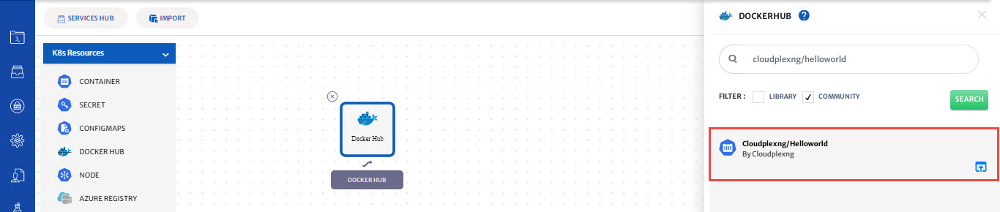
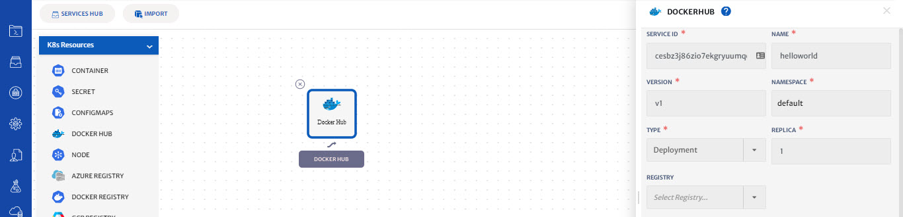
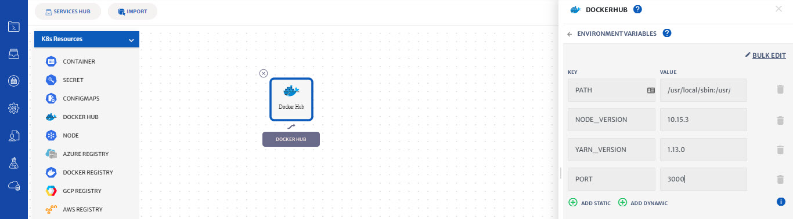
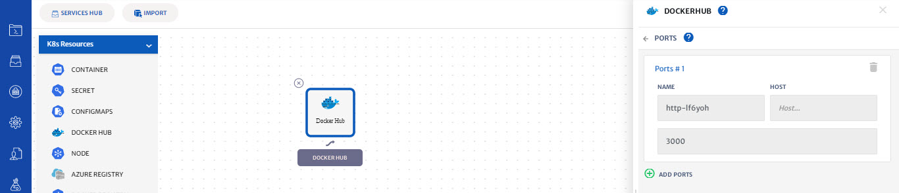
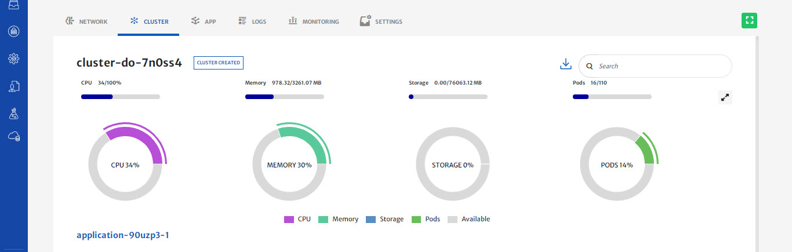
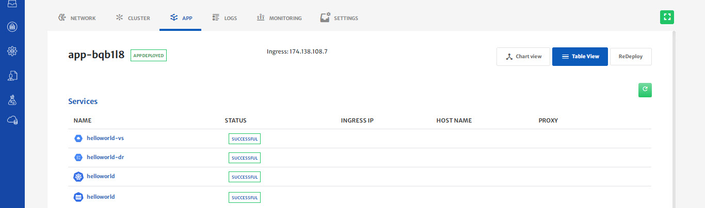

# Privileges And Security For Kubernetes

Please refer to our [video guide for a walkthrough](https://www.youtube.com/watch?v=jUuf4JEakRQ) on how to perform the below mentioned operations in platform.

In this guide, we will show you how to define privileges and security for your Kubernetes application in 3 easy steps.

**Step 1: Create and Configure a Kubernetes cluster**

1. To configure a Kubernetes cluster, see our previous guide on [How to create and use a provider-managed Kubernetes cluster](pages/user-guide/getting-started/create-use-provider-managed-cluster/create-use-provider-managed-cluster?id=create-amp-use-provider-managed-cluster).

**Step 2: Configure the privileges and security in the Kubernetes Application.**

1. A security context defines privilege and access control settings for a Pod or Container. Security context settings include, but are not limited to Discretionary Access Control: Permission to access an object, like a file, is based on user ID (UID) and group ID, and running as privileged or unprivileged.

2. Let’s see how to apply privileges and security in the security context in the example application HelloWorld.

3. We will use **helloworld** image from DockerHub.

4. Drag-n-drop the **Docker Hub** service from pallet to the canvas.

   

5. Click on the service to open the configuration panel on the right side.

6. Type **cloudplexng/helloworld** in the search bar and select community click on the **search** button.

7. Select **helloworld** service.

   

8. CloudPlex has populated default values of service (Service Id, Service Name, Namespace)

   

9. Click on the Environment variables and add a new environment variable.

10. Click on Static and provide your variables in **key-value pair** Key is PORT and value is 3000.

    

11. Click on the ports and add a new port. Type **3000** in the container port.

    

12. Click on the back button and click on Advance configurations.

13. Click on the Security context and type **2000 in run as user**.

14.  Toggle read-only root file system to enable the read-only file system.

    

15. Click on the back button of the security context.

16. Click on the save button to save the service.

17. CloudPlex automatically generates the Kubernetes service manifest required for the service. If you want to modify any configuration, select the service and update it.

18. On saving the application, you will be taken to the status page.

    

**Step 3: Deploy HelloWorld on the cluster**

1. Click on the Start button to start deploying the application on the cluster you have created

2. You will see logs as the application deployment progresses.

   

3. Click on the cluster tab to see the live status of your cluster.

4. “Cluster live status” is a complete dashboard that gives you the “live status” about the health and consumption of the nodes in your cluster 

   

5. You can see the status of the application you just deployed by clicking on the app tab and click on Table view to see the realtime status of the HelloWorld service.

   

6. Download kubeconfig of your application and exec in your container.

7. Run the following commands.

   ***kubectl exec -it $(kubectl get po |grep “helloworld| awk {‘print $1’}) -c hellowrold bash***

   ***ps aux***

8. The output shows that the processes are running as user 2000. This is the value of runAsUser specified for the Container. It overrides the value of 1000 that is specified for the Pod.

9. Exit your shell by running the ***exit*** command

10. To avoid unnecessary costs, don’t forget to terminate your application when you are done.

11. Click on the terminate button to delete all your resources from Cloud.

    

**Conclusion:**

1. You just deployed a Kubernetes Application with privileges and security using CloudPlex, the Kubernetes Application Platform for Developers.