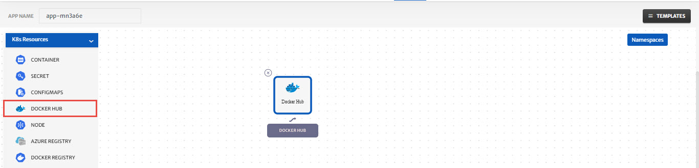
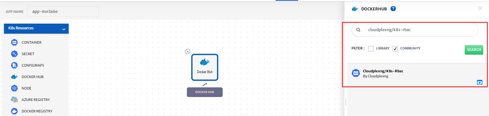
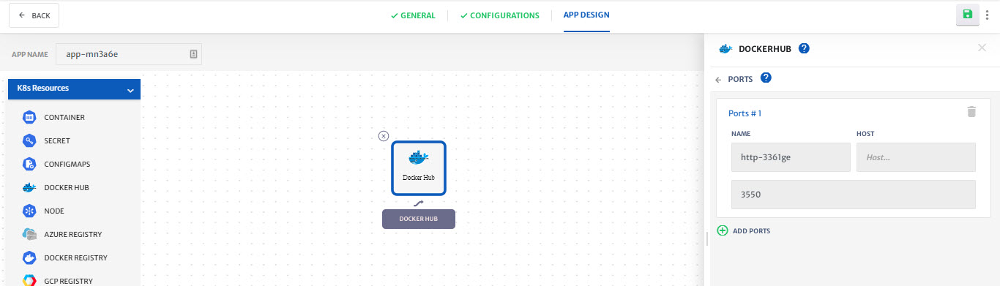
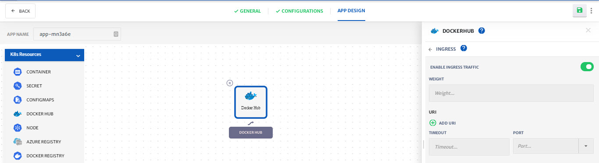
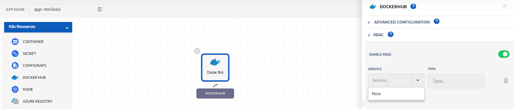
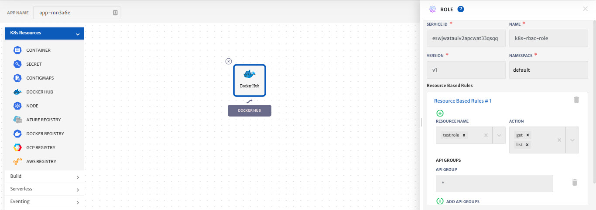
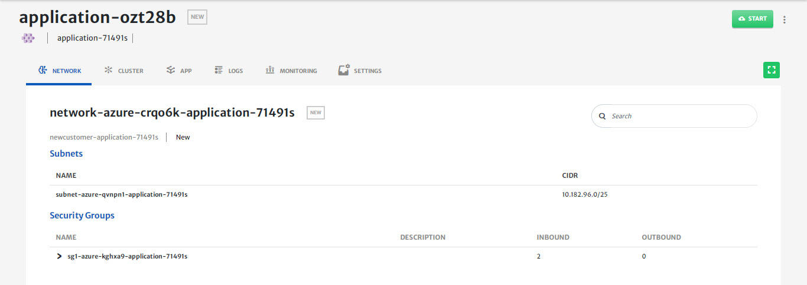
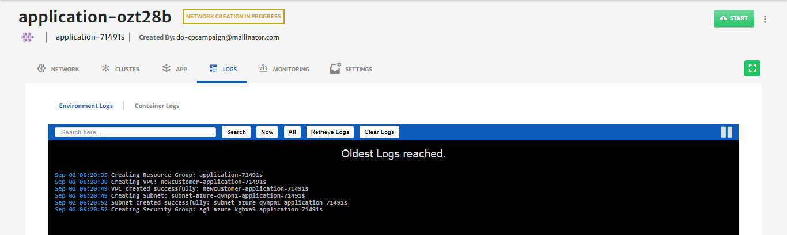
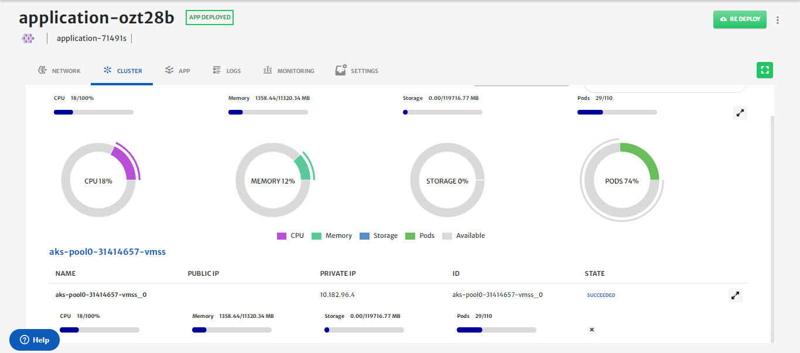
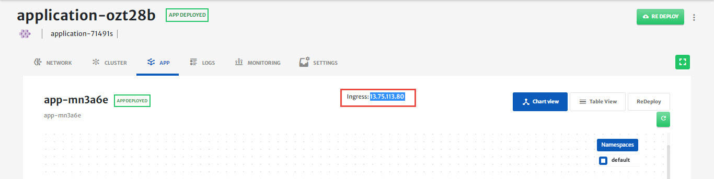

# Define RBAC for Kubernetes Application

Please refer to our [video guide for a walkthrough](https://www.youtube.com/watch?v=ZwEeNIAk1pI) on how to perform the below mentioned operations in platform. 

In this guide, we will show you how to define RBAC for your Kubernetes application in 3 easy steps.

**Step 1: Create and Configure a Kubernetes cluster**

1. To configure a Kubernetes cluster, see our previous guide on [How to create and use a provider-managed Kubernetes cluster](https://docs.cloudplex.io/#/pages/user-guide/getting-started/create-use-provider-managed-cluster/create-use-provider-managed-cluster?id=create-amp-use-provider-managed-cluster).

**Step 2: Configure the RBAC-Sample Application Container**

1. Role-based access control is an authorization mechanism for managing permissions around Kubernetes resources. It is an approach that is used for restricting access to users and applications on the system or network.

2. Let’s see how to implement  RBAC in a container-based application.

3. We will use **k8s-rbac** image from DockerHub.

4. Drag-n-drop the **Docker Hub** service from pallet to the canvas.

   

5. Click on the service to open the configuration panel on the right side.

6. Type **cloudplexng/k8s-rbac** in the search bar, select community and click on the **search** button.

7. Select the **k8s-rbac** service.

   

8. CloudPlex has populated default values of service (Service Id, Service Name, Namespace)

9. Click on the ports and add a new port. Type **3550** in the container port.

   

10. Click on Ingress and enable ingress traffic.

    

11. Click on the back button and click on Advance configurations.

12. Click on RBAC and enable RBAC.

    

13. CloudPlex supports Role, Role Binding, Cluster Role, and Cluster Role Binding.

14. For this video, let’s select Role.

15. Select an existing role available on the canvas from the dropdown, if you don’t have click on New.

    

16. CloudPlex has populated default values of service (Service Id, Service Name, Namespace). Let’s add **resources and actions.**

17. Select **Secrets** from resource and **GET and LIST** from actions.

18. Click on add New API group and add *.

    

19. Click on the save button to save the Role and then the save button again to save service.

20. CloudPlex automatically generates the Kubernetes service manifest required for the service. If you want to modify any configuration, select the service and update it.

21. On saving the application, you will be taken to the status page

    

**Step 3: Deploy  RBAC-Sample Application on the cluster**

1. Click on the Start button to start deploying the application on the cluster you have created

2. You will see logs as the application deployment progresses.

   

3. Click on the cluster tab to see the live status of your cluster.

4. “Cluster live status” is a complete dashboard that gives you the “live status” about the health and consumption of the nodes in your cluster.

   

5. You can see the application you just deployed by clicking on the app tab and copying the Ingress IP address.

   

6. Open a new browser tab and paste the ingress IP address and add the **/permissions** endpoint. You will see your application deployed on the Kubernetes cluster you just created.

7. To avoid unnecessary costs, don’t forget to terminate your application when you are done.

8. Click on the terminate button to delete all your resources from Cloud.

   

**Conclusion:**

1. You just deployed the Kubernetes application with RBAC using CloudPlex, the Kubernetes Application Platform for Developers.