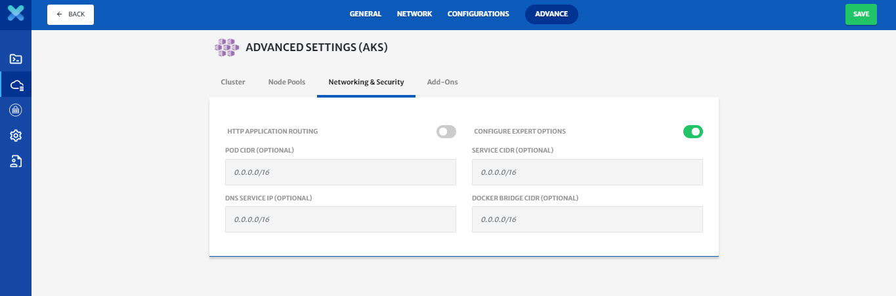

# Deploy Infrastructure using KubePlex

The purpose of this guide is to take user through the process of Infrastructure deployment using KubePlex. For a video guide, please click [here](https://drive.google.com/drive/u/1/folders/1QBTD2U07BuK1DeB9QzfcU4pIsp_g1dlI)

**Step 1: Create and Configure a Kubernetes Cluster**

1. To create a new provider managed Kubernetes cluster, click the **Create** new infrastructure button.

   

2. Select **Create New Provider Managed** Kubernetes cluster.

   

3. Provide basic information.
   For this video, we will use Azure managed Kubernetes (AKS) as an example. You must have an account with Azure.

4. Provide your Azure credentials and save them as a profile for future use

5. Select the Region & Zone where you want to deploy your infrastructure.

6. You can select either an existing resource group, if you have one; or create a new resource group. 

7. Click on the **Next** button.

   

8. CloudPlex automatically configures a complete network for you. 

9. One  VPC, Two subnets, One Security Group, One Route Table, and One Internet Gateway are added and configured by the platform. 

   

10. CloudPlex gives you the option to deploy a private cluster. 

    1. Nodes in a private cluster are allocated private IP addresses only. 
    2. To deploy a private cluster, enable the Private IP option. 
    3. Cloudplex will automatically configure route tables and an internet gateway.

    

11. You can further customize your network based on your requirements. Click on the plus button to add new subnets and security groups and configure them accordingly.

    

12. Cloudplex gives you three levels of configuration options, “simple”, “advanced”, and “expert”. 

    1. In simple mode, CloudPlex requires machine type and number of nodes from the user and the rest of the configuration will be populated by the platform.

       

    2. In advanced mode, you are able to customize your Kubernetes cluster including addition of multiple node pools, selection of Kubernetes version, and other features. Details vary from cloud to cloud.

       > For an in depth guide on this, click [here](/pages/user-guide/components/cluster/pm-new-cluster/aks-cluster/aks-cluster?id=aks-cluster).

       

    3. In expert mode, you are also able to customize networking and other complex features. Details vary from cloud to cloud.

       > For an in depth guide on this, click [here](/pages/user-guide/components/cluster/pm-new-cluster/aks-cluster/aks-cluster?id=aks-cluster).

       

13. CloudPlex selects simple mode as the default option. We are using the default option for this video,
    You have selected a Kubernetes cluster on Azure with the default configuration. This completes your cluster.

**Step 2: Provision your Infrastructure**

1. Click on the **Start** button to start deploying the infrastructure you have created on Azure.

   

2. You will see the **Logs** as the deployment progresses.

   

3. Click on the **Cluster** tab to see the live status of your cluster.
   Cluster live status is a complete dashboard that gives you the live status about the health and consumption of the nodes in your cluster.

   

4. To avoid unnecessary costs, don’t forget to terminate your infrastructure when you are done.
   Click on the terminate button to delete all your resources from Azure.

   

**Conclusion**
You just used KubePlex to deploy a provider managed kubernetes cluster with CloudPlex, the kubernetes application platform for developers 